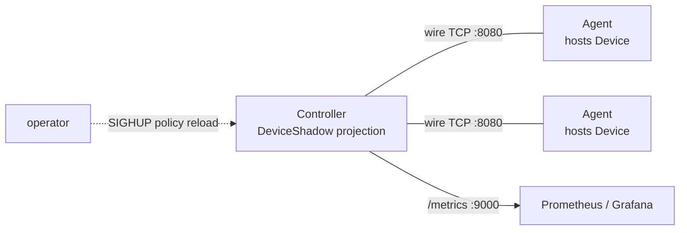

# Distributed Device Control System (DDCS)

DDCS는 정책에 따라 여러 가상 Device의 Mode를 자동으로 조정하는 분산 디바이스 제어 시스템 시뮬레이터이다.

DDCS에서 하나의 Controller는 여러 Agent와 통신하고, 각 Agent는 하나의 Device를 맡아 신원과 상태를 보고한다.
Controller는 보고된 상태를 DeviceShadow로 유지한 뒤 Group 정책을 평가해 필요한 Device에만 Mode 변경 명령을 보낸다.

## 목차

- [개요](#개요)
- [주요 기능](#주요-기능)
- [성능](#성능)
- [시스템 요구 사항](#시스템-요구-사항)
- [빠른 시작](#빠른-시작)
- [빌드 및 테스트](#빌드-및-테스트)
- [실행](#실행)
- [구조](#구조)
- [라이선스](#라이선스)

관련 문서는 다음과 같다:

| 문서                                 | 내용                                                                              |
| ------------------------------------ | --------------------------------------------------------------------------------- |
| [GLOSSARY](docs/GLOSSARY.md)         | 도메인 어휘 (ubiquitous language)                                                 |
| [ARCHITECTURE](docs/ARCHITECTURE.md) | 시스템 개관, 모듈 지도, 런타임 / 세션 / 정책 / 명령 / 재접속 / 관측성 + 설계 근거 |
| [PROTOCOL](docs/PROTOCOL.md)         | wire 프로토콜 (frame/message 레이아웃, message type, 의미론)                      |

## 개요

네트워크 너머의 여러 Device를 제어할 때 Controller는 Device 상태를 직접 소유할 수 없다. 연결은 끊길 수 있고, 수동 명령만으로는 여러 Device의 Mode를 일관되게 유지하기 어렵다. DDCS는 이런 조건에서 정책 기반 제어 루프를 검증하는 시뮬레이터이다.

Agent가 Device의 신원과 상태를 보고하면 Controller는 그 보고를 DeviceShadow로 투영하고, Group 단위 Policy가 DeviceShadow를 바탕으로 목표 Mode를 계산하면 Controller는 Mode가 바뀐 Device에만 명령을 보낸다. 한편 연결이 끊긴 Agent는 지수 backoff로 재접속해 이 루프에 다시 합류한다.

Controller는 kick-old로 Device당 세션 하나만 유지하는데, 이 규칙 덕에 Agent가 재접속해도 Device 신원과 명령 흐름은 언제나 한 세션으로 수렴한다.

DDCS는 의도적으로 좁은 구조를 유지한다. Controller/Agent는 단일 스레드 epoll 리액터로 동작하고, Controller는 in-memory DeviceShadow만 저장한다. 외부 명령 API는 없으므로 Mode를 바꾸는 주체는 정책 엔진뿐이다. Controller가 HTTP를 열긴 하지만 읽기 전용 Prometheus 메트릭(`:9000`)이 전부라, HTTP로 할 수 있는 일은 관측뿐이다.

다음 다이어그램은 핵심 액터와 경계를 요약한다:



_그림 1. Controller는 wire TCP로 Agent를 조율하고, Prometheus는 Controller의 메트릭만 읽는다._

권위 다이어그램과 각 관계의 상세는 [ARCHITECTURE 시스템 컨텍스트](docs/ARCHITECTURE.md#1-시스템-컨텍스트)에 있다.

## 주요 기능

DDCS의 주요 메커니즘은 다음과 같다:

- 단일 스레드 **edge-triggered epoll 리액터**(Controller/Agent 양쪽), [generation 토큰](docs/ARCHITECTURE.md#3-런타임-모델-단일-스레드-리액터) 핸들러 테이블
- 2계층 wire 프로토콜: `wire::frame`(프레이밍) + `wire::message`(메시지)
- 등록 **3-way 핸드셰이크** + 세션별 liveness + [kick-old](docs/GLOSSARY.md#세션) (new-wins)
- Agent **자동 재접속**: 지수 backoff + jitter, cap 30s; 등록 성공 시 리셋
- **양방향 명령 원격 프로시저 호출 (RPC)**: `(DeviceId, CommandId)` 상관 + supersede + 재전송/dedup
- **히스테리시스 정책 엔진**: Group 부하 밴드(집계) + Device별 온도 override로 Mode 자동 전환, 플래핑 방지
- **Prometheus** 메트릭 (Controller, HTTP `:9000`, `group` 라벨 포함) + **JSON Lines(JSONL) 구조화 로그**
- 역할별 단일 JSON 런타임 설정, ObjectPool zero-copy 버퍼, 자원 획득이 곧 초기화(RAII)인 fd
- ASan/UBSan preset, GoogleTest 단위 + 종단 간 (E2E) 테스트

## 성능

Controller는 단일 스레드 리액터라 한 코어로 돌며, 명령 재전송과 monitor sweep, 정책 평가를 주기 **sweep tick** 하나가 모두 처리한다. 따라서 **tick 작업 시간이 sweep 주기(기본 1s)에 근접하면 그 코어가 포화에 이른다**. Controller가 이 시간을 `ddcs_sweep_duration_us`(직전 / `_max` 피크)와 `ddcs_sweep_duration_us_sum` / `ddcs_sweep_ticks_total`(평균)로 노출하므로 포화까지 남은 여유는 운영 중에도 메트릭으로 읽을 수 있다.

`scripts/perf-ramp.sh`가 Agent 수를 늘려가며 레벨별로 이 지표와 왕복 지연 시간(RTT)을 캡처한다:

```sh
DDCS_PERF_LEVELS="30 60 120" DDCS_PERF_SOAK=25 scripts/perf-ramp.sh
```

로컬 측정 예시는 다음과 같다(컨테이너 Agent, 단일 호스트):

| agents | sweep_avg_us | sweep_max_us | cpu_pct | pending | rtt_ms |
| ------ | ------------ | ------------ | ------- | ------- | ------ |
| 30     | 189          | 343          | 0.6     | 0       | 3      |
| 60     | 472          | 770          | 1.4     | 0       | 3      |
| 120    | 902          | 1596         | 2.3     | 0       | 4      |

sweep 작업은 Agent 수에 거의 선형(약 8us/agent)이고, 120대에서도 1s 주기의 **0.1% 미만**(CPU ~2%)이다. 선형 외삽하면 sweep 포화는 코어당 10^4~10^5 대 규모라, 실제로는 그 전에 소켓 fd·메모리·네트워크 같은 다른 한계가 먼저 묶인다. 모든 레벨에서 `pending`/`evicted`가 0이고 RTT는 수 ms로, backpressure 없이 건강하다. Controller는 RTT를 평균뿐 아니라 `ddcs_command_rtt_ms` 히스토그램으로도 노출하므로, `histogram_quantile`로 p99 꼬리까지 볼 수 있다(평균만으론 꼬리가 안 드러난다).

> [!NOTE]
> 측정이 localhost loopback 위라 RTT는 실제보다 낮게 나온다. latency를 사실적으로 보려면 netem 등으로 지연을 주입한다. CPU-bound 확장성은 이 측정으로 충분하다.

## 시스템 요구 사항

- Ubuntu 24.04+ (x86_64)
- GCC 13+
- CMake 3.25+
- C++20

## 빠른 시작

```sh
# configure + build + test 한 번에
cmake --workflow --preset debug
```

로컬 실행은 기본 설정 파일 `config/controller.json`, `config/agent.json`을 사용한다:

```sh
./build/debug/bin/ctrl & # 8080 listen, 9000 메트릭
./build/debug/bin/agent  # 127.0.0.1:8080에 연결
```

## 빌드 및 테스트

빌드 및 테스트는 모두 CMake preset으로 구동한다.

### 빌드

`--workflow`는 configure + build + test를 한 번에 돌리며, 아래처럼 단계별로 나눠 실행할 수도 있다:

```sh
# configure + build + test 한 번에
cmake --workflow --preset debug

# 또는 단계별
cmake --preset debug
cmake --build build/debug
ctest --test-dir build/debug --output-on-failure
```

Workflow preset은 용도별로 나뉜다:

| Preset      | 용도      | 비고                                            |
| ----------- | --------- | ----------------------------------------------- |
| `debug`     | 개발      | 디버그 심볼                                     |
| `coverage`  | 커버리지  | gcov 계측 (`scripts/coverage-report.sh` 참고)   |
| `asan`      | 위생 검사 | ASan + UBSan (`RelWithDebInfo`)                 |
| `release`   | 배포      | `-O3`(CMake Release 기본), 경고 = 에러          |
| `benchmark` | 벤치마크  | Release + 벤치 옵션 (벤치 타깃은 아직 스캐폴딩) |

### 테스트

테스트는 두 계층이다:

- 모듈별 단위 테스트 (`lib/**/test/unit`)
  - 일부는 실제 소켓/Reactor를 쓰는 통합 성격이다.
- Controller ↔ Agent 왕복 E2E (`test/e2e`)

테스트 이름으로 필터링해서 개별 테스트를 돌리거나, 스크립트를 사용해서 커버리지 HTML을 만들 수 있다:

```sh
# 이름으로 필터 (예: wire 코덱만)
ctest --test-dir build/debug -R wire --output-on-failure

# 커버리지 HTML (gcovr 필요) → build/coverage/html/index.html
./scripts/coverage-report.sh
```

### 데모 시나리오

`scripts/demo.sh`는 다섯 가지 핵심 동작을 각각 격리해 띄우고, Controller의 원시 출력(메트릭 `:9000` + 이벤트 로그)으로 단언한 뒤 PASS/FAIL과 종료코드를 낸다. 각 시나리오는 자기 스택을 띄웠다 정리하며, 관측 스택 없이 돌아 CI 친화적이다.

```sh
scripts/demo.sh thermal   # per-device thermal: 같은 zone에서 과열된 Device만 safe로 빠지고, 식으면 회복
scripts/demo.sh eviction  # 재접속(리부트)한 device를 재명령 (stale 명령 belief 고착 방지)
scripts/demo.sh regime    # 부하 밴드 busy/idle 전환 (히스테리시스)
scripts/demo.sh fault     # docker pause로 liveness 축출 -> 재개 시 재접속
scripts/demo.sh reload    # SIGHUP 정책 핫리로드: 재명령 + malformed 거부(옛 정책 유지)
scripts/demo.sh all       # 다섯 시나리오 순차 실행
```

각 시나리오가 검증하는 동작은 ARCHITECTURE의 [정책 엔진](docs/ARCHITECTURE.md#6-정책-엔진)/[세션 생명주기](docs/ARCHITECTURE.md#5-세션-생명주기) 절과 1:1이며, 같은 동작을 Grafana로 눈으로 보려면 [Docker 배포](#docker-배포)의 compose 스택을 직접 띄운다.

설정 파일 경로는 `DDCS_CONFIG_PATH`(기본 controller `config/controller.json`, agent `config/agent.json`)로 바꾸고, Group은 agent의 `device.group` 키(환경변수 `DDCS_DEVICE_GROUP`, 기본 `zone_a`)로 선언한다. 한편 Agent는 신원을 `DDCS_DEVICE_ID` > `DDCS_DEVICE_ID_FILE`(기본 `data/agent.uuid`) 읽기 > 생성/기록 순으로 해석한다.

> [!NOTE]
> 신원은 Device의 것(**DeviceId**)이다. `DDCS_DEVICE_ID`는 그 DeviceId를 고정하는 수단일 뿐, agent 프로세스의 신원이 아니다.

정책은 `controller.json`의 `policy.groups`에 인라인되며, Group별 규칙은 load 히스테리시스(`high_load`/`low_load` + `high_load_mode`/`low_load_mode`)와 선택적 **온도 override**(`high_temp`/`resume_temp`/`high_temp_mode`)로 이루어진다. busy/idle은 부하 밴드의 regime이고 정책 엔진은 각 regime을 Group의 목표 Mode로 매핑하는데, **Device별** 온도가 `high_temp`를 넘으면 그 Device만 load와 무관하게 `high_temp_mode`로 빠진다. 자세한 동작은 [ARCHITECTURE 정책 엔진](docs/ARCHITECTURE.md#6-정책-엔진) 절을 본다.

한편 `kill -HUP <controller-pid>`를 보내면 Controller가 `controller.json`의 `policy`만 다시 읽어 정책을 **핫리로드**한다. 다른 설정은 부팅 시점에 고정되며, malformed 정책이 오면 Controller는 경고만 남기고 옛 정책을 유지한다.

## 실행

### Docker 배포

Controller 1 + Agent 3 + 관측 스택(Prometheus/Grafana)을 한 번에 띄우는데, compose가 각 Agent에 고정 `DDCS_DEVICE_ID`(= DeviceId)를 부여하므로 kick-old 검증에도 쓸 수 있다.

```sh
docker compose -f docker/docker-compose.yml up --build -d
docker compose -f docker/docker-compose.yml logs -f
docker compose -f docker/docker-compose.yml down
```

관측 주소는 다음과 같다:

- 원시 메트릭: `http://localhost:9000/metrics`.
- Prometheus: `http://localhost:9090`
- Grafana: `http://localhost:3000` (익명 Viewer)

멀티존 스케일 테스트는 별도 compose 파일로 실행한다:

```sh
docker compose -f docker/docker-compose.scale.yml up -d
```

스케일 스택에서는 Group별 부하/온도/모드 분포를 볼 수 있다. Device 거동(`DDCS_SIM_NOISE`/`DDCS_SIM_JITTER`)을 조절하려면 compose 파일의 agent `environment`에 해당 변수를 추가한다. 셸 환경변수는 컨테이너로 전달되지 않는다.

`docker/Dockerfile`은 멀티스테이지/멀티타깃으로, `builder` 스테이지가 release로 두 바이너리를 빌드하면 `controller`/`agent` 타깃이 각 바이너리만 담은 런타임 이미지를 만든다. 이 중 `controller` 이미지는 `config/`를 번들하고 `8080`(wire)/`9000`(메트릭)을 노출한다.

```sh
# 단일 이미지만 빌드
docker build -f docker/Dockerfile --target controller -t ddcs-controller .
```

### 설정

런타임 설정은 역할별 **단일 JSON 파일**이다:

- controller: `config/controller.json`
- agent: `config/agent.json`

키는 점 경로로 중첩 object를 가리키고(`session.heartbeat_interval_ms`), 값 우선순위는 **환경변수 > 파일 > 코드 기본값**이다. 다만 시간(ms) 키는 환경변수 override가 없다. 메커니즘 상세는 [ARCHITECTURE 설정](docs/ARCHITECTURE.md#10-설정) 절을 본다.

설정 키는 다음과 같다:

| 키                                  | 역할       | 기본값      | 환경변수               | 설명                                   |
| ----------------------------------- | ---------- | ----------- | ---------------------- | -------------------------------------- |
| `transport.host`                    | agent      | `127.0.0.1` | `DDCS_TRANSPORT_HOST`  | 연결할 Controller 호스트/IP            |
| `transport.port`                    | both       | `8080`      | `DDCS_TRANSPORT_PORT`  | Controller listen / Agent connect 포트 |
| `transport.bind_address`            | controller | `0.0.0.0`   | -                      | wire listen 바인드 주소                |
| `transport.accept_backlog`          | controller | `128`       | -                      | listen backlog                         |
| `transport.reconnect_base_delay_ms` | agent      | `1000`      | -                      | 재연결 backoff 시작값(지수 증가)       |
| `transport.reconnect_max_delay_ms`  | agent      | `30000`     | -                      | 재연결 backoff 상한(cap)               |
| `prometheus.port`                   | controller | `9000`      | `DDCS_PROMETHEUS_PORT` | 메트릭 포트                            |
| `prometheus.bind_address`           | controller | `0.0.0.0`   | -                      | 메트릭 listen 바인드 주소              |
| `controller.sweep_interval_ms`      | controller | `1000`      | -                      | 주기 sweep(재전송/축출/정책 평가) 간격 |
| `session.handshake_timeout_ms`      | controller | `3000`      | -                      | 핸드셰이크 단계별 시한                 |
| `session.liveness_timeout_ms`       | controller | `3000`      | -                      | active 세션 liveness 시한              |
| `command.timeout_ms`                | controller | `5000`      | -                      | 명령 응답 대기 시한                    |
| `command.max_attempts`              | controller | `3`         | -                      | 명령 전송 시도 횟수(1이면 무재전송)    |
| `command.backoff_base_ms`           | controller | `500`       | -                      | 명령 재전송 backoff base               |
| `session.heartbeat_interval_ms`     | agent      | `1000`      | -                      | heartbeat 주기                         |
| `session.status_report_interval_ms` | agent      | `5000`      | -                      | status 보고 주기                       |
| `session.registration_timeout_ms`   | agent      | `2000`      | -                      | register_outcome 대기 시한             |
| `device.group`                      | agent      | `zone_a`    | `DDCS_DEVICE_GROUP`    | Device의 Group 선언                    |
| `log.level`                         | both       | `info`      | `DDCS_LOG_LEVEL`       | debug / info / warn / error            |

> [!NOTE]
> 배포 `config/*.json`은 데모가 빨리 반응하도록 일부 시간 키를 코드 기본값과 다르게 싣는다:
>
> - 예: liveness 1500ms, heartbeat 500ms

> [!NOTE]
> `transport.bind_address` / `prometheus.bind_address`는 현재 미배선이라, 파일에 값을 적어도 읽지 않고 두 리스너는 항상 모든 인터페이스(`0.0.0.0`, `INADDR_ANY`)에서 수신 대기한다.

### 운영 및 문제 해결

자주 겪는 증상과 원인, 대응은 다음과 같다:

| 증상                                  | 원인                                             | 동작                                                                                           |
| ------------------------------------- | ------------------------------------------------ | ---------------------------------------------------------------------------------------------- |
| Controller 즉시 종료                  | listen/메트릭 포트 점유(EADDRINUSE) 등 기동 실패 | stderr에 `fatal` 한 줄 + `exit 1` (SIGABRT 아님 - `main`이 예외를 잡음)                        |
| 프로세스 `exit 1`                     | 설정 JSON malformed                              | 로드 중 throw -> `main`이 잡아 종료                                                            |
| `session.register.unknown_group` 경고 | Agent가 정책에 없는 Group으로 등록               | 등록은 허용되나 정책 명령 대상에서 제외(soft)                                                  |
| `agent.device_id_ephemeral` 경고      | UUID가 env/파일로 고정되지 않음                  | 동작하나 재시작 시 새 DeviceId(kick-old 검증 깨짐)                                             |
| Agent 연결 반복 실패                  | Controller 부재/미기동                           | 지수 backoff로 재시도(코드 기본 1->30s, 배포 `config/agent.json`은 0.2->5s), 등록 성공 시 리셋 |
| Agent가 갑자기 끊김                   | Controller liveness 타임아웃 축출                | Agent가 hangup으로 관측 → 재접속                                                               |

관측 지점은 다음과 같다:

- 메트릭:
  - `ddcs_agents_evicted_total`
  - `ddcs_handshake_expired_total`
  - `ddcs_commands_gave_up_total`
  - `ddcs_commands_stale_total`
- Group 별:
  - `ddcs_group_load_avg`
  - `ddcs_group_temp_avg`
  - `ddcs_group_devices`
- 로그: `event` 키
  - 예: `session.kick_old`, `policy.hot`, `device.status.non_finite` 등

메트릭 전체 목록은 [ARCHITECTURE 관측성](docs/ARCHITECTURE.md#9-관측성) 절을 본다.

## 구조

코드는 `lib/`의 라이브러리 모듈과 `apps/`의 두 실행 파일(`ctrl`, `agent`)로 나뉘고, 각 측은 domain -> app -> infra -> facade로 계층화되어 의존이 한 방향으로만 흐른다. 모듈별 레이어/책임과 그 근거는 [ARCHITECTURE 코드 구조](docs/ARCHITECTURE.md#2-코드-구조-모듈-지도)에 있다.

최상위 디렉터리 구성은 다음과 같다:

```
apps/     # 실행 파일 (ctrl, agent)
lib/      # 라이브러리 모듈 (common, json, logger, config, io, net, device, wire, ctrl, agent)
cmake/    # 빌드 옵션 / sanitizer / coverage / testing 모듈
config/   # 런타임 JSON 설정 (controller / agent, 정책 인라인)
scripts/  # coverage-report.sh, demo.sh (데모), perf-ramp.sh (성능 램프)
docker/   # Dockerfile + compose (core / scale / 관측 스택)
docs/     # ARCHITECTURE / PROTOCOL / GLOSSARY
test/e2e/ # Controller <-> Agent E2E
data/     # agent UUID persist (런타임 생성, git 미추적)
```

## 라이선스

[MIT License](LICENSE)
