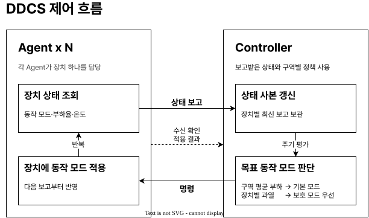
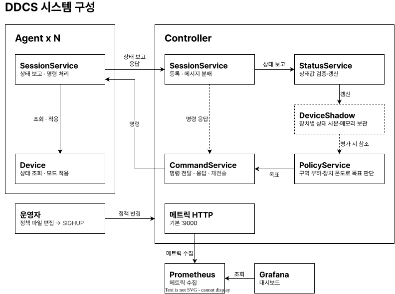
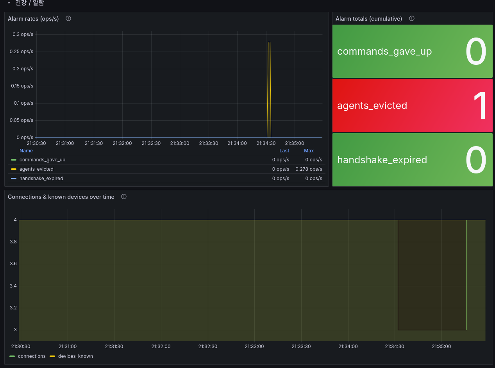
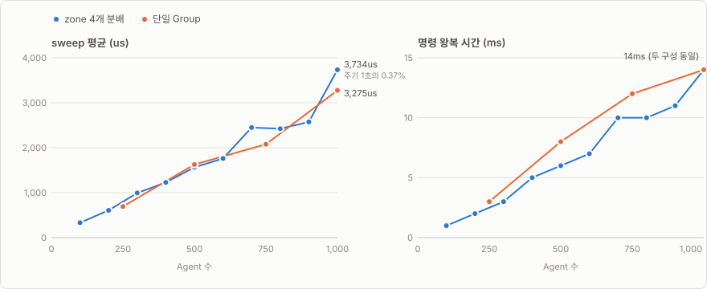
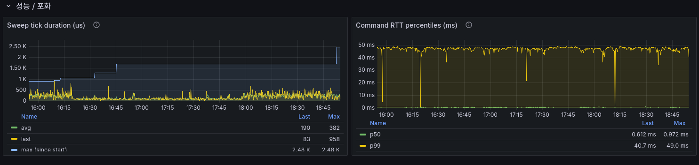

# Distributed Device Control System (DDCS)

여러 가상 Device의 Mode를 자동으로 조정하는 **정책 기반 분산 디바이스 제어 시스템 시뮬레이터**

## 목차

- [개요](#개요)
- [주요 기능](#주요-기능)
- [실행](#실행)
  - [요구 사항](#요구-사항)
  - [빠른 시작](#빠른-시작)
  - [빌드](#빌드)
  - [테스트](#테스트)
  - [검증 시나리오](#검증-시나리오)
  - [Docker 배포](#docker-배포)
  - [문제 해결](#문제-해결)
- [성능](#성능)
  - [측정 환경](#측정-환경)
  - [측정 방법](#측정-방법)
  - [측정 결과](#측정-결과)
    - [Agent 수에 따른 변화](#agent-수에-따른-변화)
    - [지연 시간](#지연-시간)
    - [유실과 복구](#유실과-복구)
- [라이선스](#라이선스)

## 개요

네트워크 너머의 Device를 제어할 때 Controller는 Device의 상태를 직접 소유할 수 없고, 연결은 언제든 끊길 수 있습니다.
DDCS는 이런 조건에서 정책 기반 제어 루프가 성립하는지 검증하는 시뮬레이터입니다.

각 Agent는 하나의 Device를 맡아 신원과 상태를 Controller에 보고하고, Controller는 보고받은 상태를 DeviceShadow로 유지하며, 정책 엔진이 DeviceShadow를 Group 단위로 평가해 Mode 변경이 필요한 Device에게만 명령을 보냅니다.
연결이 끊기면 Agent가 지수 백오프 간격으로 다시 접속해 루프에 합류하고, Controller는 같은 Device의 새 연결이 들어오면 기존 연결을 끊어(kick-old) Device당 Session을 하나만 유지합니다.



_그림 1. 상태 보고에서 명령까지의 제어 루프_

Controller와 Agent는 각각 싱글 스레드 epoll 리액터로 동작하고, Controller는 Device 상태를 메모리 위의 DeviceShadow로만 저장하며, HTTP로는 읽기 전용 Prometheus 메트릭(`:9000`)만 노출합니다.
각 결정의 배경은 [설계 결정](docs/ARCHITECTURE.md#9-설계-결정)에서, 현재 구조를 택하며 감수한 제약은 [한계점](docs/ARCHITECTURE.md#102-제약과-개선-방향)에서 다룹니다.



_그림 2. 구성 요소와 통신 경로_

Controller는 wire TCP(`:8080`)로 Agent를 제어하고, Prometheus가 Controller의 메트릭(`:9000`)을 주기적으로 수집하며, Grafana(`:3000`)가 그 데이터를 시각화합니다.

## 주요 기능

- [싱글 스레드 edge-triggered (ET) epoll 리액터](docs/ARCHITECTURE.md#3-런타임-모델):
  락 없이 모든 상태를 한 스레드가 처리
- [3계층 wire 프로토콜](docs/PROTOCOL.md):
  `frame`(프레이밍) / `message`(메시지) / `command`(명령)
- [Agent 등록과 Session 관리](docs/ARCHITECTURE.md#5-session-생명주기):
  3-way 핸드셰이크, Device당 연결 하나만 유지 (kick-old)
- [Agent 자동 재접속](docs/ARCHITECTURE.md#8-agent-재접속):
  지수 백오프 + jitter, 등록 성공 시 리셋
- [명령 전달 보장](docs/ARCHITECTURE.md#7-명령-rpc):
  명령마다 ID로 응답을 짝짓고, 유실 시 재전송하며, 중복은 한 번만 적용
- [정책 기반 Mode 자동 제어](docs/ARCHITECTURE.md#6-정책-엔진):
  Group 부하에 따라 Mode 전환(히스테리시스로 잦은 전환 억제), 과열 Device는 개별 보호, SIGHUP으로 정책 리로드
- [관측성](docs/METRICS.md):
  Prometheus 메트릭 + Grafana 대시보드 + JSON Lines (JSONL) 로그
- [역할별 단일 JSON 런타임 설정](docs/CONFIG.md):
  환경변수, 파일, 코드 기본값 순으로 우선

## 실행

### 요구 사항

빌드에는 Ubuntu 24.04+ (x86_64), GCC 13+, CMake 3.25+, C++20이 필요합니다.
실행에는 docker와 docker compose v2, curl이 필요합니다.

### 빠른 시작

```sh
# configure + build + test 한 번에
cmake --workflow --preset debug
```

실행은 `scripts/run.sh`가 맡습니다. Controller와 Agent, 관측 스택을 컨테이너로 한 번에 띄우고 로그를 따라가며, `Ctrl+C`를 받으면 스택을 정리합니다.

```sh
scripts/run.sh      # Agent 4대 (zone당 1대, 고정 DeviceId)
scripts/run.sh 100  # zone 4개에 25대씩 (4의 배수)
```

- Controller 메트릭: `http://localhost:9000/metrics`
- Prometheus: `http://localhost:9090`
- Grafana: `http://localhost:3000` (로그인 없이 열람)

Controller가 Agent를 받아들였는지는 메트릭으로 확인합니다.

```sh
curl -s localhost:9000/metrics | grep '^ddcs_connections'
```

```output
# 4면 Agent 네 대가 등록을 마친 것입니다.
ddcs_connections 4
```

compose 명령을 직접 쓰거나 백그라운드로 띄우는 방법은 [Docker 배포](#docker-배포)에서 다룹니다.

### 빌드

`--workflow`는 configure + build + test를 한 번에 실행하며, `cmake --preset debug`, `cmake --build build/debug`, `ctest --test-dir build/debug --output-on-failure`로 나눠 실행할 수도 있습니다.

|Preset|용도|명령|
|---|---|---|
|`debug`|개발 (디버그 심볼)|`cmake --workflow --preset debug`|
|`asan`|ASan + UBSan 검사 (`RelWithDebInfo`)|`cmake --workflow --preset asan`|
|`coverage`|커버리지 측정 (gcov 계측)|`./scripts/coverage-report.sh`|
|`release`|배포 (`-O3`, `-Werror`)|`cmake --workflow --preset release`|

`coverage`는 계측 빌드 후 gcovr로 HTML 리포트까지 생성하므로 스크립트로 실행하며(gcovr 필요), 리포트는 `build/coverage/html/index.html`에 생성됩니다.

### 테스트

테스트는 두 종류입니다:

- 모듈별 단위 테스트 (`lib/**/test/unit`): 각 모듈이 지키는 계약을 검증합니다.
- Controller와 Agent 간 왕복 E2E (`test/e2e`): 두 리액터를 한 스레드에서 번갈아 구동해, 등록부터 응답까지의 왕복과 재접속이 실제 소켓 위에서 동작함을 검증합니다.

```sh
# 테스트 이름으로 필터 (예: wire 코덱만)
ctest --test-dir build/debug -R wire --output-on-failure
```

### 검증 시나리오

`scripts/scenario.sh`는 다섯 가지 핵심 동작을 각각 격리해 검증합니다.
시나리오마다 독립된 docker 스택을 기동하고, Controller의 실제 출력(메트릭 `:9000` + 이벤트 로그)만 보고 PASS/FAIL을 판정하며, 어떤 경로로 끝나든 종료 시 스택을 정리합니다.
각 시나리오의 검증 대상과 판정 기준은 [docs/SCENARIO.md](docs/SCENARIO.md)에 정리했습니다.

```sh
scripts/scenario.sh thermal            # 같은 zone에서 과열된 Device만 보호 Mode로 진입하고, 식으면 복귀
scripts/scenario.sh agent-reconnect    # 재시작한 Device가 현재 Mode를 다시 전달받음
scripts/scenario.sh regime-transition  # Group 부하가 오르내리면 busy/idle 전환 (임계 근처에서 잦은 전환 없음)
scripts/scenario.sh liveness-eviction  # docker pause로 장애 주입: 끊김을 감지해 Session을 정리하고, 해제하면 재접속
scripts/scenario.sh policy-reload      # SIGHUP으로 정책 교체: 잘못된 정책은 거부하고 기존 정책 유지
scripts/scenario.sh all                # 다섯 시나리오 순차 실행
```

### Docker 배포

Controller 1대 + Agent 4대(zone당 1대) + 관측 스택(Prometheus/Grafana)을 한 번에 기동합니다.
compose가 각 Agent에 고정 `DDCS_DEVICE_ID`(= DeviceId)를 부여하므로, 컨테이너를 재시작해도 같은 Device로 다시 등록됩니다.

```sh
docker compose -f docker/docker-compose.yml up --build -d # 기동
docker compose -f docker/docker-compose.yml logs -f       # 로그 따라가기
docker compose -f docker/docker-compose.yml down          # 정리
```

- Controller 메트릭: `http://localhost:9000/metrics`
- Prometheus: `http://localhost:9090`
- Grafana: `http://localhost:3000` (로그인 없이 열람)

다중 zone 구성(zone 4개 × Device 25대, 총 100대)은 별도 compose 파일로 실행합니다:

```sh
docker compose -f docker/docker-compose.scale.yml up -d
```

실행 중인 스택에는 `scripts/fault.sh`로 장애를 주입합니다.
`docker pause`로 Agent 하나를 멈춰 축출을 확인하고, 해제해 복구까지 본 뒤, 그 구간의 Grafana 시간 범위를 출력합니다.

```sh
scripts/fault.sh                  # agent-01에 한 사이클
scripts/fault.sh pause agent-02   # 멈춰만 두기
scripts/fault.sh resume agent-02  # 해제
```



_그림 3. pause 구간의 축출과 복구_

Agent 4대 구성에서 `agent-01`을 멈춘 구간입니다.
축출(`agents_evicted`)이 한 번 오르고 연결 수가 4에서 3으로 줄었다가, 해제 후 4로 복구됩니다.
고정 DeviceId를 쓰므로 `ddcs_devices_known`은 4에서 움직이지 않습니다.

Device 동작(`DDCS_SIM_NOISE`/`DDCS_SIM_JITTER`)은 compose 파일의 agent `environment`에 적어야 컨테이너로 전달됩니다(셸 export는 전달되지 않습니다).
`docker/Dockerfile`은 멀티스테이지 빌드로, `builder` 스테이지가 release 설정으로 두 바이너리를 빌드하고 `controller`/`agent` 타깃(`docker build --target <이름>`)이 각 바이너리만 담은 런타임 이미지를 만듭니다.

### 문제 해결

|증상|원인|시스템 반응|조치|
|---|---|---|---|
|stderr에 `transport listen port 8080: Address already in use`|listen/메트릭 포트 점유|`exit 1` (`main`이 예외를 잡으므로 SIGABRT 없이 종료)|`lsof -i :8080`, `:9000`으로 점유 프로세스 확인|
|stderr에 `config: malformed JSON in <경로>`|설정 JSON 문법 오류|로드 중 throw를 `main`이 잡아 `exit 1`|`jq . config/controller.json`으로 검증|
|`device.group.unknown` 경고|Agent가 정책에 없는 Group으로 등록|등록은 허용되나 정책 명령 대상에서 제외|`policy.groups`에 해당 Group 추가 후 SIGHUP|
|`device.id.not_persisted` 경고|`DDCS_DEVICE_ID_FILE`을 지정했으나 그 경로에 기록하지 못함|동작하나 재시작 시 새 DeviceId로 등록|해당 경로의 쓰기 권한 확인, 또는 `DDCS_DEVICE_ID`로 고정|
|Agent 연결 반복 실패|Controller가 실행 중이 아님|지수 백오프로 재시도(코드 기본 1~30초, `config/agent.json`은 0.2~5초), 등록 성공 시 리셋|Controller 기동 여부와 `transport.host`/`port` 확인|
|Agent 연결이 끊김|Controller가 liveness 제한 시간 초과로 축출|Agent가 연결 종료를 감지해 재접속|heartbeat 주기와 `session.liveness_timeout_ms` 비율 확인|

문제를 추적할 때는 메트릭(`ddcs_agents_evicted_total`, `ddcs_commands_gave_up_total`, `ddcs_group_*` 등)과 로그 각 줄의 `event` 키(예: `session.connection.register.accept`)를 함께 봅니다.
전체 메트릭 목록은 [METRICS.md](docs/METRICS.md), 이벤트 이름은 [LOG.md](docs/LOG.md)에 있습니다.

## 성능

Agent 1,000대가 접속한 상태에서 Controller의 sweep은 한 번에 평균 3.7ms를 사용합니다.

### 측정 환경

|항목|값|
|---|---|
|CPU|Intel i7-9750H (6코어 12스레드)|
|RAM|16GB|
|OS|Ubuntu 24.04 (x86_64)|
|컴파일러|GCC 13 (C++20)|
|빌드|release preset (`-O3`)|
|CPU 클럭 정책|performance governor + turbo 비활성 (전 코어 2.6GHz 고정)|

### 측정 방법

부하는 실제 운영 경로를 그대로 사용합니다.
Agent마다 heartbeat를 0.5초, Status 보고를 1초 간격으로 보내므로(배포 설정 기준), Agent가 N대면 Controller는 초당 약 3N건을 수신하고, 여기에 정책이 발행하는 명령과 응답 왕복이 더해집니다.

지표는 세 가지입니다:

- `sweep_avg_us` / `sweep_max_us`: sweep tick(명령 재전송, liveness 검사, 정책 평가) 한 번의 소요 시간.
  이 값이 sweep 주기(기본 1초)에 근접하면 코어 하나로 감당할 수 있는 한계이며, 같은 값을 `ddcs_sweep_duration_us` 계열 메트릭으로 운영 중에도 확인할 수 있습니다.
- `in_msgs_s`: 초당 수신 메시지.
  유입이 기대치(약 3N)에 못 미치면 병목이 Controller가 아니라 부하 생성 쪽이므로, 그 레벨의 다른 열도 재해석해야 합니다.
- `rtt_ms`: 정책 명령 발행부터 Agent 응답까지의 왕복 시간(측정 창에서 완료된 명령의 평균).

`scripts/perf-ramp.sh`가 Agent 수를 단계별로 늘려가며 레벨마다 30초씩 지표를 수집합니다(누적 카운터는 측정 창 양끝의 델타).
500대 이상은 호스트 전제(ARP 이웃 테이블 상한)가 있으므로 스크립트 머리말을 먼저 읽으십시오:

```sh
DDCS_PERF_LEVELS="100 200 400 600 800 1000" DDCS_PERF_SOAK=30 scripts/perf-ramp.sh
```

같은 총 대수에서 가장 적대적인 케이스는 Group 하나에 몰아넣는 구성입니다.
밴드 교차가 한 번 일어나면 정책 엔진이 Group 전체에 한 tick 안에 다시 명령하므로, burst 크기가 Group 크기와 같아집니다:

```sh
# 단일 Group 1000대: 최악 burst 측정 (rtt 분포 꼬리와 sweep_max_us를 본다)
DDCS_PERF_SINGLE_GROUP=1 DDCS_PERF_LEVELS="1000" DDCS_PERF_SOAK=120 scripts/perf-ramp.sh
```

### 측정 결과

Agent 수, 지연, 유실 세 축으로 나눠 싣습니다.

#### Agent 수에 따른 변화

zone 4개 균등 분배, 레벨당 30초 측정 창이며, `scripts/perf-preflight.sh`를 통과한 고정 클럭 상태에서 측정했습니다.

|agents|sweep_avg_us|sweep_max_cum_us|cpu_pct|in_msgs_s|rtt_ms|
|---|---|---|---|---|---|
|100|333|9,491|0.8|356|1|
|200|607|9,491|1.3|706|2|
|300|993|9,491|1.9|1,073|3|
|400|1,228|9,491|2.5|1,411|5|
|500|1,564|9,491|3.2|1,780|6|
|600|1,760|9,491|3.2|2,107|7|
|700|2,449|9,491|4.2|2,532|10|
|800|2,423|16,140|4.7|2,842|10|
|900|2,574|16,140|4.2|3,143|11|
|1000|3,734|16,140|5.4|3,593|14|

sweep은 Agent 수에 선형이며(한 대당 약 3.4us), 1,000대에서 평균 3.7ms로 sweep 주기(1초)의 0.37%입니다.
모든 레벨에서 미결 명령(`pending`)과 축출(`evicted`)은 0이었고, `in_msgs_s`가 기대 유입(약 3N + 명령 응답)과 일치하므로 부하가 실제로 걸렸음을 표에서 그대로 확인할 수 있습니다.
램프 전체에서 완료된 명령 74,789건 중 50ms를 넘긴 것은 0건입니다.
`sweep_max_cum_us`는 시작 후 누적 최대라 레벨 전이(수백 컨테이너 생성 폭풍)를 포함한 값이고, 상위 레벨의 `rtt_ms`에는 Agent 프로세스 1,000개와 코어를 나눠 쓰는 호스트 경합 몫이 섞입니다.

**단일 Group(burst 최악 케이스).** zone_a 하나에 250대부터 1,000대까지 단계 상승시키며 레벨당 60초씩, 같은 고정 클럭 환경에서 측정했습니다:

|agents (단일 Group)|sweep_avg_us|cpu_pct|in_msgs_s|rtt_ms|
|---|---|---|---|---|
|250|691|1.6|870|3|
|500|1,626|3.1|1,785|8|
|750|2,077|3.8|2,606|12|
|1000|3,275|5.1|3,587|14|

전 구간에서 Regime 전환은 11회 일어났습니다.
1,000대 레벨에서는 전환 한 번이 최대 1,000건의 동시 dispatch가 되는데, 그 tick을 포함해도 sweep 최대 누적은 11.2ms로 sweep 주기(1초)의 1.2%입니다.
완료 84,171건 중 50ms 초과는 0.9%, 100ms 초과는 0건이었고, pending과 evicted는 전부 0이었습니다.
같은 대수를 zone 4개에 나눈 구성보다 rtt가 0~3ms 높은 것이 burst의 비용입니다.
이 차이는 모든 명령에 고르게 퍼지지 않고 느린 쪽 명령에 몰리지만, 가장 느린 명령도 100ms 안에 끝납니다.



_그림 4. sweep 평균과 명령 왕복 시간 (zone 4개 분배와 단일 Group)_

이 비례는 sweep이 매 tick 등록된 항목 전부를 훑기 때문에 나타납니다.
단순 외삽으로는 한 코어가 수만 대까지 감당하지만 그 전에 소켓 fd, 메모리, 네트워크가 먼저 한계에 도달하며, 만료된 항목만 골라 처리하는 구조가 다음 개선 과제입니다([한계점과 확장 방향](docs/ARCHITECTURE.md#102-제약과-개선-방향)).

#### 지연 시간

Controller는 명령 왕복 시간을 히스토그램(`ddcs_command_rtt_ms`)으로 기록하므로 평균뿐 아니라 p50, p99 같은 분위수를 뽑을 수 있습니다.
아래는 그 분포 덕에 잡은 결함의 진단 기록이며, **Agent 소켓의 `TCP_NODELAY` 수정 전 값입니다.**

Agent 30대를 3시간 운영했을 때 평균은 약 5.2ms로 무난해 보였지만, 히스토그램은 완료 76,634건 중 84%가 1ms 이내, 12%가 21~50ms 구간에 몰린 이봉 분포였습니다.
그 사이 5~20ms 구간은 2건뿐이므로 이 꼬리는 부하가 만드는 연속적인 꼬리가 아니라 별개의 현상이고, 위치가 Linux delayed-ACK 타이머(최대 40ms)와 정확히 겹칩니다.
원인은 네트워크가 아니라 코드에 있었는데, Agent는 명령 하나에 ack와 outcome을 중간 read 없이 연달아 보내면서도 connect하는 소켓에 `TCP_NODELAY`가 빠져 있어, Nagle이 두 번째 write를 상대 ACK까지 붙잡았습니다.
Agent 소켓에도 같은 옵션을 걸어 수정했고([설계 결정](docs/ARCHITECTURE.md#9-설계-결정)), 평균만 노출했다면 5.2ms 하나로 지나쳤을 문제를 분포를 노출한 덕에 잡았습니다.



_그림 5. 3시간 연속 운영 구간의 rtt와 sweep (`TCP_NODELAY` 수정 전)_

오른쪽이 명령 왕복 시간(p50/p99), 왼쪽이 sweep 시간이며, sweep 시간은 3시간 내내 증가 추세 없이 일정합니다.

> [!NOTE]
> 위 측정은 단일 호스트(loopback)라 실제 네트워크의 전파 지연이 빠져 있습니다.
> 다만 p99 40ms처럼 자기 코드가 만든 지연은 loopback에서 오히려 선명하게 드러나며, "Agent 수가 늘어날 때 CPU가 감당하는가"라는 질문에는 이 측정으로 충분합니다.

#### 유실과 복구

Agent 30대를 3시간 운영한 구간에서 명령 76,635건을 처리했고, 유실과 포기는 0건이었습니다.
`docker pause`로 장애를 주입했을 때 축출까지 약 2.0초가 걸렸고(liveness 1.5초 설정 + sweep 1초 해상도), `unpause` 후 재접속으로 연결이 복구되기까지는 0.23초였습니다(2026-07-31 실측).

## 라이선스

[MIT License](LICENSE)
