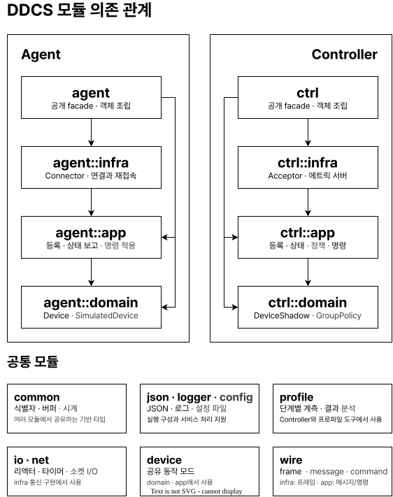
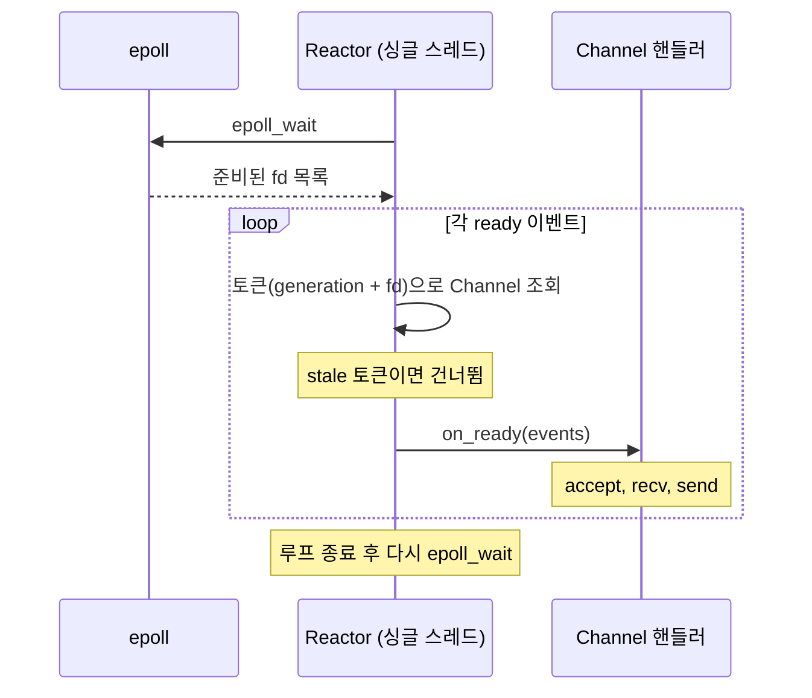
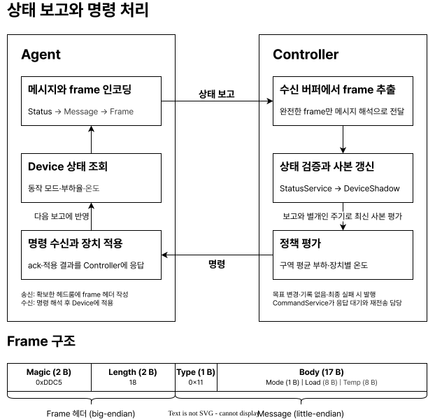
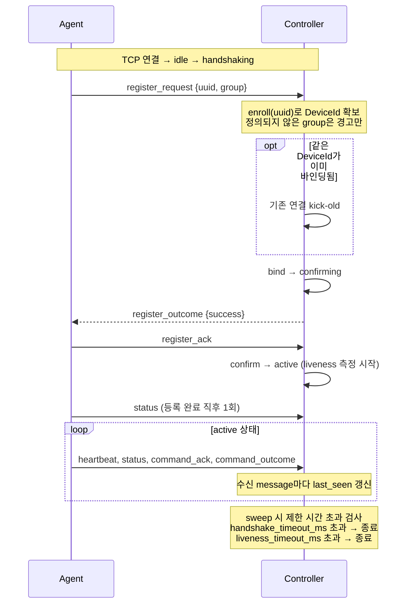
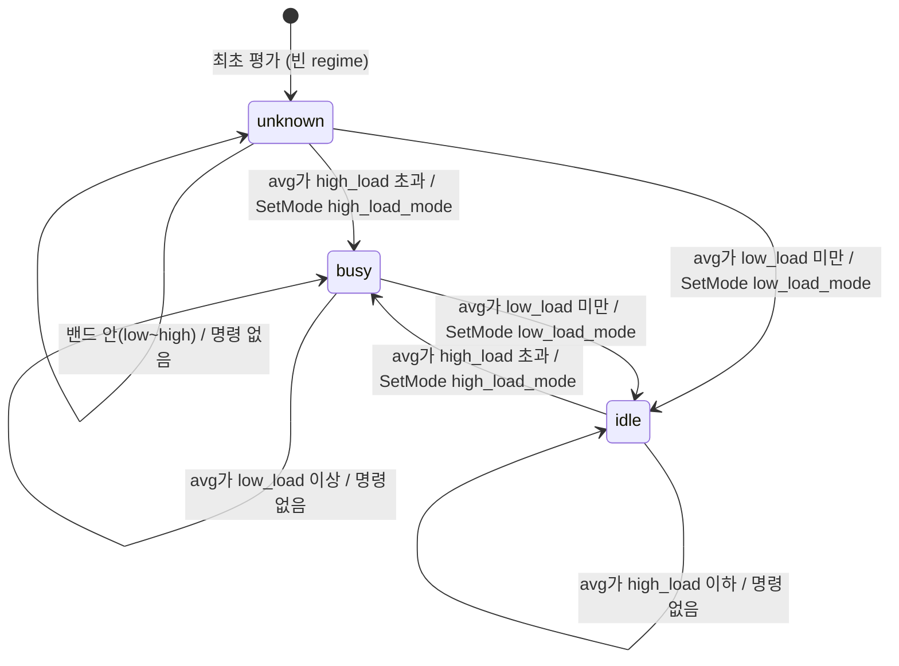
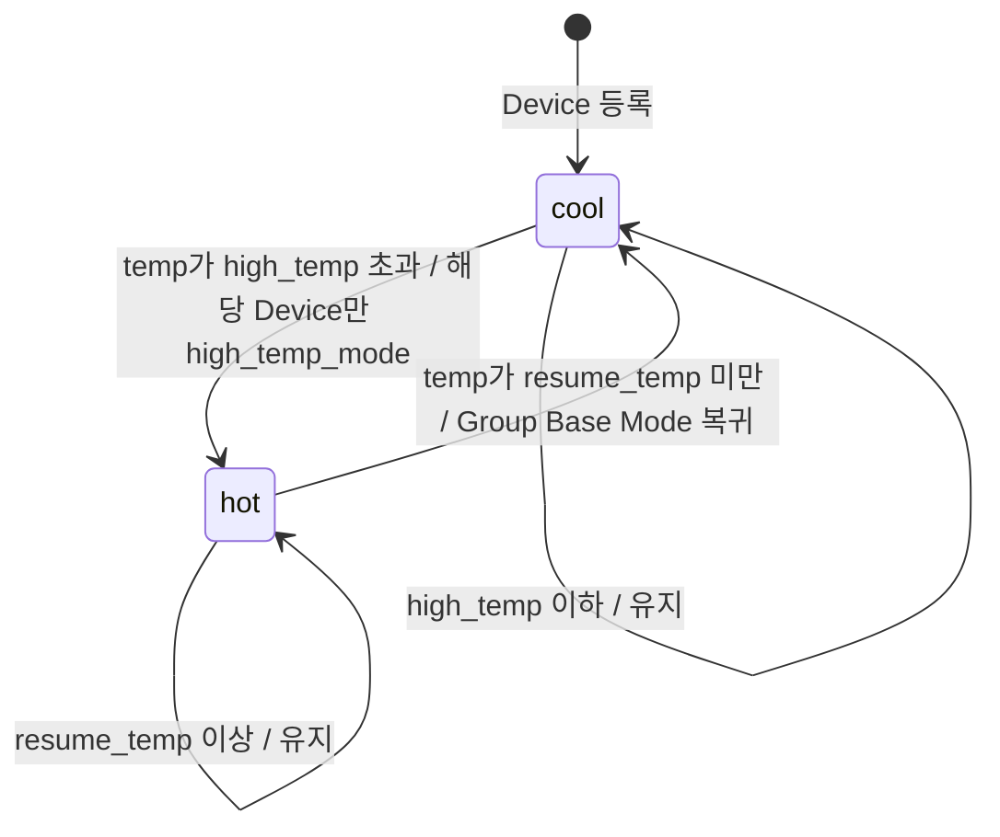
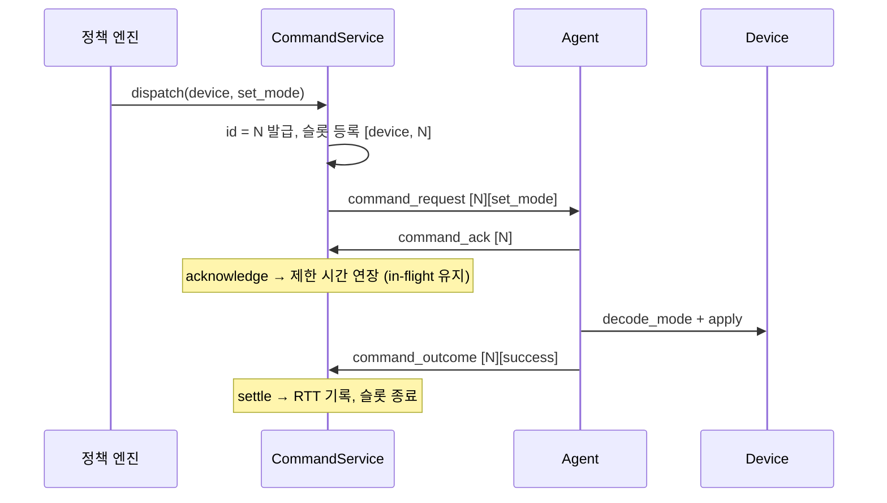
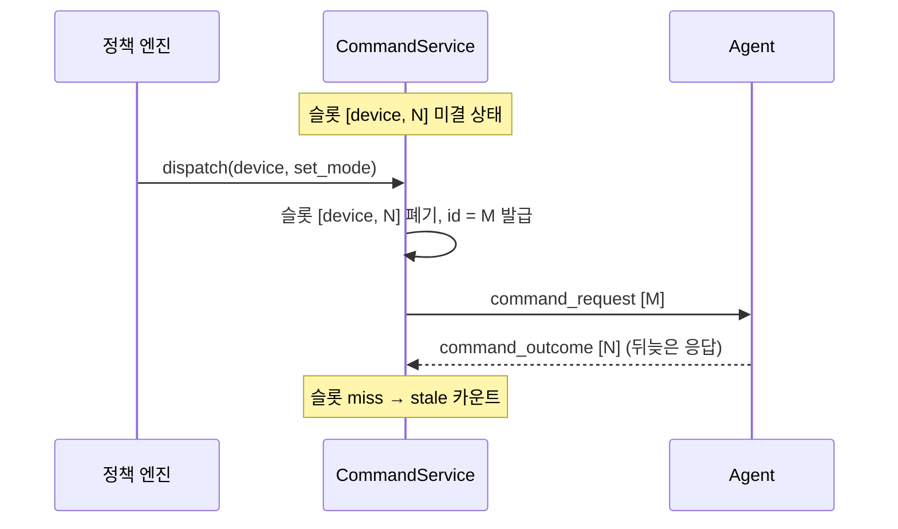
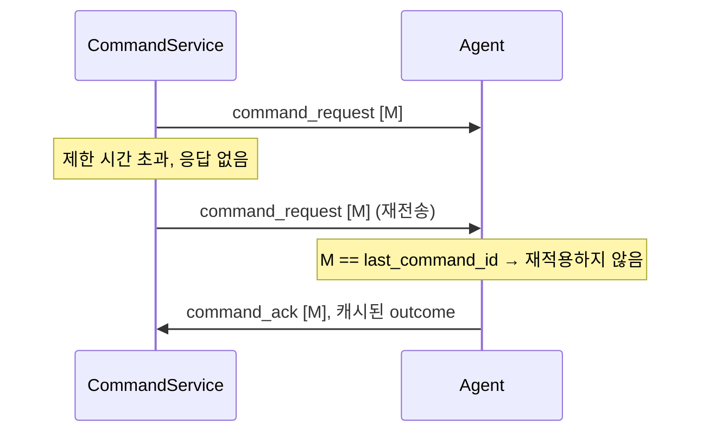

# DDCS 아키텍처

단일 **Controller**가 다수의 **Agent**를 제어하고, 각 Agent는 정확히 하나의 **Device**를 맡습니다(1 agent : 1 device : 1 session).
상태와 신원의 원본은 Agent 쪽 Device에 있고, Controller는 그 사본인 **DeviceShadow**만 유지하며, 각 Device를 Group 단위 **Policy**로 자동 제어합니다.
사람이 직접 명령을 발행하는 API는 없으며, 명령은 정책 엔진만 발행합니다.

## 목차

1. [시스템 컨텍스트](#1-시스템-컨텍스트): 구성 요소와 통신 경로
2. [코드 구조](#2-코드-구조): 계층별 단방향 의존
3. [런타임 모델](#3-런타임-모델): 스레드 하나가 모든 상태를 소유
4. [전송과 프로토콜](#4-전송과-프로토콜): 프레이밍 불변식과 버퍼 관리
5. [Session 생명주기](#5-session-생명주기): 등록, liveness, 축출
6. [정책 엔진](#6-정책-엔진): 부하와 온도 두 축의 히스테리시스
7. [명령 RPC](#7-명령-rpc): 유실과 중복 하에서의 멱등 적용
8. [Agent 재접속](#8-agent-재접속): 지수 백오프와 jitter
9. [설계 결정](#9-설계-결정): 기각한 대안과 감수한 비용
10. [한계점](#10-한계점): 신뢰 경계와 알려진 제약

## 1. 시스템 컨텍스트


_그림 1. Controller 내부 구조와 외부 인터페이스_

|구성 요소|역할|
|---|---|
|**Controller**|다수 Device의 집합적 Mode를 Group 단위 Policy로 제어하는 단일 서버. Agent를 통해 각 Device를 Status로 관측하고 Command로 조작합니다.|
|**Agent**|하나의 Device를 맡아 Controller에 등록하고 Status를 보고하며 명령을 적용하는 클라이언트.|
|**Device**|Agent가 제어하는 실제 장치. 상태와 신원의 원본.|
|**DeviceShadow**|Controller가 DeviceId로 유지하는 Device 상태의 사본. Session이 끝나도 남아 재접속 후에도 유지됩니다.|

시스템 경계 밖에서는 운영자가 `config/controller.json`에 인라인 정책을 작성하고(런타임 명령 API는 없습니다), Prometheus가 메트릭(`:9000`)을 수집합니다.

Controller 쪽에는 Agent라는 엔티티가 따로 없습니다.
Controller는 상대를 **Session**(휘발성 연결 관계)과 **DeviceShadow**(DeviceId로 지속되는 사본)로만 모델링하며, "Agent"라는 이름은 클라이언트 액터와 agent 측 코드에만 존재합니다.

## 2. 코드 구조

코드는 `lib/`의 라이브러리 모듈과 `apps/`의 두 실행 파일(`ctrl`, `agent`)로 나뉘며, 의존은 아래 표의 위에서 아래 방향으로만 발생합니다.

|모듈|계층|책임|
|---|---|---|
|`common`|기반|순수 C++ 값 타입 (strong id, uuid, 버퍼, object pool, 시계, endian)|
|`json` / `logger` / `config`|기반|JSON 파싱/쓰기, JSONL 구조화 로깅(싱글턴), 단일 파일 JSON 설정 로더|
|`io` / `net`|OS|epoll 리액터, timerfd/signalfd, `Fd` RAII 래퍼 / 저수준 소켓(`stream_io`, `socket`)|
|`device`|공유 도메인|양쪽이 공유하는 `Mode`(safe/normal/performance)와 wire 매핑|
|`wire::frame` / `wire::message` / `wire::command`|프로토콜|프레이밍(4 byte 헤더, payload는 opaque) / message(`[type][body]`) 코덱 / command 타입과 body 코덱|
|`ctrl::domain` / `agent::domain`|domain|순수 도메인. `DeviceShadow`/`DeviceRegistry`/`GroupPolicy` / `Device` 구현(시뮬레이션·더미)|
|`ctrl::app` / `agent::app`|app|use-case 서비스. Session/Command/Policy/Status/Registration/Metrics / Session 로직과 메시지 버퍼 관리|
|`ctrl::infra` / `agent::infra`|infra|어댑터. Acceptor/Server와 Prometheus HTTP 서버 / Connector(연결·백오프)|
|`ctrl` / `agent`|facade|공개 파사드. infra를 CMake PRIVATE 의존으로 숨깁니다|
|`apps/ctrl`, `apps/agent`|실행|설정 로드, 의존성 조립, `run()` 호출|

디렉터리 배치는 이렇습니다.

```text
apps/       # 실행 파일 (ctrl, agent)
lib/
├── common/ # 공용 유틸리티: strong id, uuid, 버퍼, object pool, 시계, endian
├── json/   # JSON 파싱/쓰기
├── logger/ # JSON Lines(JSONL) 구조화 로깅
├── config/ # 단일 파일 JSON 설정 로더
├── io/     # epoll 리액터, timerfd/signalfd, RAII fd
├── net/    # 저수준 소켓 (stream_io, socket)
├── device/ # 양쪽이 공유하는 Mode(safe/normal/performance)와 wire 매핑
├── wire/   # 3계층 프로토콜: frame(프레이밍), message(메시지), command(명령)
├── ctrl/   # Controller 측: domain -> app -> infra -> facade
└── agent/  # Agent 측: domain -> app -> infra -> facade
cmake/      # 빌드 옵션 / sanitizer / coverage / testing 모듈
config/     # 런타임 JSON 설정 (controller / agent, 정책 포함)
scripts/    # 로컬 실행(run.sh), 검증 시나리오(scenario.sh), 단계별 성능 측정(perf-ramp.sh), 커버리지(coverage-report.sh)
docker/     # Dockerfile + compose (core / scale / 관측 스택)
docs/       # ARCHITECTURE / DECISION / PROTOCOL / SCENARIO / CONFIG / METRICS / LOG
test/e2e/   # Controller <-> Agent E2E
data/       # DDCS_DEVICE_ID_FILE을 지정했을 때의 agent UUID 저장 위치 (런타임 생성, gitignore 대상)
```



_그림 2. 모듈 의존 그래프_

각 측(`ctrl`/`agent`)은 동일하게 domain, app, infra, facade 순서로 계층화되며, 의존은 상위에서 하위로만 향합니다.
의존이 향하는 지점은 app의 port 계약입니다.

> 피어를 Connection 단위로 잇고, 그 위에서 크기가 유한한 typed Message를 주고받는다.

wire 프로토콜은 이 계약을 충족하는 메커니즘이므로, 계약 안의 내부 변경은 port와 app에 영향을 주지 않으며, namespace도 메커니즘(`sfp`)이 아니라 계약의 관심사(`transport`)로 명명합니다.
같은 이유로 wire 코덱은 `device`에 의존하지 않습니다.
`Mode`는 wire에서 raw `u8`로만 다니고, 바이트 매핑(`device::encode_mode`/`decode_mode`)은 `device` 모듈이 소유하며, 변환은 app 계층이 수행합니다.

## 3. 런타임 모델

각 프로세스(`ctrl`, `agent`)는 **싱글 스레드 edge-triggered epoll 리액터** 하나로 동작하며, `lib/`와 `apps/` 어디에도 스레드, 뮤텍스, atomic이 없습니다.
모든 콜백이 한 OS 스레드에서 실행되므로 락 경합과 데이터 레이스가 구조적으로 발생하지 않는 대신, 콜백 하나가 오래 점유하면 전체가 지연됩니다.
그래서 기동 시 정책 파일 읽기와 Agent의 1회 DNS 조회를 제외한 주요 경로는 전부 논블로킹입니다.

`io::Reactor`가 `epoll_wait`에서 대기하고, 준비된 fd마다 그 fd를 소유한 `Channel`의 핸들러를 호출합니다.
timerfd(`TimerScheduler`, 하나의 fd로 다수의 논리 타이머를 deadline 최소힙으로 관리), signalfd(`SignalSource`, 양쪽의 SIGINT/SIGTERM과 Controller의 SIGHUP), 전송 서버/커넥터, Prometheus HTTP 서버가 모두 같은 `Channel` 디스패치 경로를 거칩니다.



_그림 3. 리액터 이벤트 루프_

edge-triggered 모드에서는 상태 변화 시점에만 통지가 오므로, 각 핸들러는 깨어날 때마다 `EAGAIN`이 반환될 때까지 읽고 씁니다.
중간에 멈추면 남은 데이터에 대한 통지가 다시 오지 않습니다.

Controller의 주기 도메인 작업은 단일 **sweep 타이머**가 실행합니다.
매 tick마다 명령 재전송, 만료 Session 축출, 정책 평가를 순서대로 수행하며, sweep 한 번의 소요 시간이 주기에 근접하면 코어 하나로 감당할 수 있는 한계입니다(실측은 [README 성능 절](../README.md#성능)).

싱글 스레드라도 fd 재사용과 콜백 재진입은 여전히 위험이므로, 세 가지 안전장치로 대응합니다:

- **토큰 generation**: epoll 토큰에 raw 포인터 대신 `(generation << 32 | fd)`를 담고, fd가 닫혀 재사용되면 generation을 올립니다.
  close 직전에 큐에 남은 stale 이벤트가 재사용된 fd의 다른 Channel로 오배달되는 use-after-free를 막습니다.
- **deferred-reap**: 콜백(`on_message`)이 전송을 재진입해 `send()`나 `disconnect()`를 호출할 수 있으므로, 연결 해체는 reap 큐에 넣어 콜백이 끝난 안전 지점으로 미룹니다.
  frame 추출 루프는 매 반복 rx 버퍼를 다시 조회해, 콜백 안에서 해제된 연결을 만나면 정상 종료합니다.
- **RAII 규약**: `io::Channel`은 리액터에 등록된 상태로 close되면, `common::ObjectPool`은 발급한 핸들보다 먼저 파괴되면 `std::terminate`를 호출합니다.
  그래서 닫기 전에 반드시 등록을 해제하고, 풀은 핸들을 쥔 연결이나 큐보다 먼저 선언합니다.

## 4. 전송과 프로토콜

wire 포맷과 의미론은 [PROTOCOL.md](PROTOCOL.md)가 기준이며, 이 절은 구현이 지키는 불변식만 다룹니다.



_그림 4. 상태 보고에서 명령까지의 데이터 파이프라인_

프레이밍은 `wire::frame`이 단독으로 구현하고, 양측 transport가 이를 공유합니다.
수신 루프(`dispatch_frames`)는 rx 링버퍼에서 완전한 frame을 풀에서 확보한 버퍼로 디코딩하고, 송신 조립(`encode_frame`)은 미리 확보한 헤더 헤드룸에 길이 헤더를 제자리에서 써넣으므로 복사가 발생하지 않습니다.

- **rx 버퍼 ≥ 최대 frame**: rx 링 용량은 2의 거듭제곱이면서 최대 frame(헤더 4 + payload 상한 1024 = 1028) 이상이어야 합니다.
  링이 최대 frame을 통째로 담지 못하면 부분 frame 대기가 끝나지 않아 프레이밍 교착이 발생합니다.
  두 조건을 함께 만족시키는 지점은 `wire::frame::fit_rx_capacity()` 하나이며, 양측 transport가 설정값을 이 함수에 통과시킨 뒤 링을 생성하고, 보정이 발생하면 같은 이벤트(`transport.rx_buffer.adjust`)로 요청값과 실효값을 기록합니다.
- **Mode ↔ wire 변환은 한 곳에서만**: 네 wire 경계(양측의 명령·`status_report` 인코딩/디코딩)가 전부 `device::encode_mode`/`decode_mode`를 거칩니다.
  경계에 raw `static_cast<Mode>`를 재도입하면 컴파일은 통과하지만 enum 재정렬 시 진단 없이 어긋납니다.

## 5. Session 생명주기

**Session**은 Controller가 하나의 TCP 연결을 하나의 DeviceId에 바인딩한 관계입니다.
Session의 수명은 연결과 같아 연결이 끊기면 Session도 사라지며, 재접속 이후에도 유지되는 신원은 `register_request.uuid`(= DeviceId)가 담당합니다.

|상태|의미|
|---|---|
|`idle`|연결 수립 직후, 아직 등록이 시작되지 않음|
|`handshaking`|`register_request` 대기|
|`confirming`|`register_ack` 대기|
|`active`|등록 완료, liveness 측정 시작|

핸드셰이크의 message 교환 절차는 [PROTOCOL.md](PROTOCOL.md#등록-3-way-핸드셰이크)에서 다루며, 이 절은 Controller 내부의 상태 표현과 제한 시간 관리를 다룹니다.



_그림 5. Session 상태 전이와 message 교환_

핵심 규약은 다음과 같습니다:

- **bind는 요청 시점, liveness는 ack 시점**: Controller는 `register_request`를 디코딩하는 즉시 Device 슬롯을 선점(bind)하지만, liveness 측정은 `register_ack`를 받아 `active`가 된 뒤부터 시작합니다.
- **단계별 제한 시간**: `handshaking`과 `confirming`의 `last_seen`은 단계 전이에서만 갱신하고 임의 message로는 연장하지 않으므로, 지연되거나 중단된 핸드셰이크를 단계별로 검출합니다.
- **모든 수신 message가 liveness를 갱신**: `heartbeat`(body 없는 keepalive), `status_report`, `command_ack`, `command_outcome` 어느 것이든 `last_seen`을 갱신하며, 제한 시간을 초과한 Session은 sweep이 축출합니다.
- **상태별 허용 message**: `handshaking`은 `register_request`만, `confirming`은 `register_ack`만 받습니다.
  타입이나 방향이 어긋나거나 디코딩에 실패하면 프로토콜 위반으로 연결을 종료합니다.

상태 결정은 `SessionRegistry`가 전담합니다.
연결을 1차 키로 두고 Device를 역색인(Device 기준으로 연결을 찾는 색인)으로 관리하며, **"Device당 바인딩된 연결은 최대 1개"** 불변식을 보장합니다.
같은 uuid로 새 `register_request`가 오면 기존 연결을 동기적으로 종료하고 새 연결을 바인딩합니다(kick-old).

### 5.1. non-finite status 처리

`active` 상태의 `status_report`는 디코딩에 성공하면 `update_seen(now)`를 먼저 호출하고, 그다음 `StatusService::update_status`로 Shadow를 갱신합니다.
`update_status`는 `load`와 `temp`가 유한한지(`std::isfinite`)만 검사하며, 비유한 값(NaN/Inf)이면 Shadow를 갱신하지 않고 직전 유효값을 유지합니다.
non-finite는 liveness 실패가 아니라 유효하지 않은 샘플이므로 해당 값만 버리고, 연결 종료는 wire 디코딩 실패에만 적용합니다.
finiteness 검증은 수신 경로가 `StatusService` 하나인 동안 서비스 경계에 두고, 경로가 둘 이상 생기면 도메인 계층으로 옮깁니다.

## 6. 정책 엔진

Controller는 각 Device의 Mode를 **Group 단위로 자동** 제어합니다.

- **Group**: 하나의 Policy를 공유하는 Device의 논리적 묶음(예: `zone_a`~`zone_d`). Agent가 등록 시 지정하며, 정의되지 않은 Group도 경고만 남기고 받아들입니다.
- **Mode**: `safe`/`normal`/`performance`. 정책의 출력이자 Device와 Controller가 공유하는 값입니다.
- **Policy(`GroupRule`)**: Group별 규칙. load 히스테리시스(`high_load`/`low_load`와 각각의 목표 Mode)와 선택적 온도 예외(`high_temp`/`resume_temp`/`high_temp_mode`)로 구성됩니다.

정책은 두 축을 합성하되 적용 단위가 다릅니다.
load는 **Group 단위**(집합 부하), 온도는 **Device 단위**(개별 안전)입니다.
`PolicyService::evaluate`는 매 sweep tick마다 두 패스로 수행합니다:

1. Group별로 active Device의 평균 load를 집계해, 히스테리시스 밴드로 Regime(busy/idle)과 그 Group의 **Base Mode**를 결정합니다.
2. 각 active Device의 Shadow 온도로 thermal(hot/cool)을 개별 판정합니다.

Device의 **Effective Mode**는 thermal이 hot이면 `high_temp_mode`, 아니면 Group의 Base Mode이며, 정책 엔진은 이 값이 **바뀐 Device에만** `set_mode`를 발행합니다.
등록 직후라 아직 Status를 보고하지 않은 Device는 판단 근거가 없으므로 두 패스 모두에서 제외하고, 첫 보고부터 제어에 포함합니다.



_그림 6. Group Regime 상태 기계_

**busy/idle은 Mode 값이 아니라 Regime입니다**(밴드 상단 초과 / 하단 미만).
어느 Regime이 어느 Mode를 목표로 할지는 Group마다 운영자가 지정합니다.
`config/controller.json`의 기본값(시연용)은 다음과 같으며, 네 Group이 Mode 매핑(`performance`/`normal`/`safe`)과 온도 임계(`high_temp = 65`, `resume_temp = 50`)를 공유하고 부하 임계만 달라, 같은 부하 곡선에도 Group마다 다른 시점에 전환합니다:

|Group|high_load|low_load|high_load_mode|low_load_mode|
|---|---|---|---|---|
|zone_a|70|30|performance|normal|
|zone_b|60|45|performance|normal|
|zone_c|80|20|performance|normal|
|zone_d|75|40|performance|normal|

**온도 보호**는 load 축과 무관하게 Device별로 동작하는 단방향 과열 보호입니다.
Shadow 온도가 `high_temp`를 넘으면 그 Device만 `high_temp_mode`로 전환되고, `resume_temp` 아래로 내려가면 Group Base Mode로 복귀합니다(`resume_temp < high_temp`인 데드밴드).
Group Regime이 미확정이면 `low_load_mode`를 기준값으로 사용해 thermal 상태를 해제합니다.



_그림 7. Device thermal 상태 기계_

밴드 조건 `low < high`는 입력 경로와 무관한 불변식이므로 `GroupRule::create`가 도메인에서 검증합니다(역전되거나 동일하면 생성을 거부합니다).

이 제어 루프의 반대편 절반은 Agent 쪽 `SimulatedDevice`가 담당합니다.
Mode별 초당 변화율을 매 보고 주기에 적분해 load와 temp를 변화시키며(performance는 부하를 줄이는 대신 발열이 증가하고, safe는 냉각), Device마다 초기값과 noise가 달라 같은 Group 안에서도 thermal이 서로 다른 시점에 발생합니다.

집계와 명령의 대상은 active 집합뿐이므로 끊긴 Device의 stale Shadow는 평균에 반영되지 않고, 아직 보고하지 않은 active Device는 기본 `load = 0`으로 포함되며, Group 없는 Device와 빈 Group은 집계에서 제외합니다.

정책은 Device별로 마지막에 발행한 Effective Mode의 기억(코드의 commanded belief)과 thermal 상태를 보관해, 변경이 없으면 명령을 생략합니다.
Session이 끝나면(정상 종료, kick-old, liveness 축출) `SessionService`의 통지(`DeviceReleaseSink::on_device_released`)로 이 명령 기억을 폐기해, 다시 접속한 Device가 다음 평가에서 반드시 현재 Effective Mode를 다시 명령받게 합니다.

명령의 전달 신뢰성(재전송, 제한 시간, supersede)은 정책 엔진이 아니라 `CommandService`가 담당하며(7절), 정책 엔진의 책임은 전환마다 1회 발행까지입니다.

## 7. 명령 RPC

명령 RPC는 정책의 결정을 Device까지 전달하고 결과를 회수하며, 유실과 중복, 재접속 상황에서도 명령이 멱등하게 적용되도록 보장합니다.
message 교환 규칙(대응 키, 재전송, 중복 제거)은 [PROTOCOL.md](PROTOCOL.md#명령-rpc)가 기준이며, 이 절은 그 규칙을 택한 근거와 Controller 내부 처리를 다룹니다.

전송은 Device당 하나의 TCP 연결이며 full-duplex입니다.
같은 소켓으로 Controller가 `command_request`(C→A)를 보내고 Agent가 `command_ack`/`command_outcome`(A→C)으로 응답하며, 호출자는 Controller 자신의 정책 엔진입니다.



_그림 8. 정상 왕복 (`command_id` = N)_

예외 경로는 supersede와 재전송 두 가지입니다.



_그림 9. supersede: 같은 (device, type)에 새 명령 발행_



_그림 10. 재전송과 중복 제거 (동일 `command_id` 유지)_

### 7.1. 설계 근거

- **`command_id`는 Controller 전역 단조 u64입니다**: Device별이나 연결별로 발급하면 재접속 후 id가 재사용되어 이전 연결의 늦은 응답이 새 명령의 응답으로 오인될 수 있습니다.
  전역 단조 id는 재접속으로 리셋되지 않으므로 새 연결로 도착한 늦은 응답도 정확히 매칭되고, 그래서 Session이 끝나도 미결 슬롯(`CommandService::pending_`)은 비우지 않습니다.
- **ack와 outcome을 분리합니다**: ack만 받고 outcome을 기다리는 동안 명령은 미결(in-flight) 상태로 유지되고 제한 시간이 연장됩니다.
  둘을 합쳤다면 적용이 오래 걸리는 Device를 유실로 판단해 불필요한 재전송이 발생합니다.
  ack는 요청이 디코딩됐다는 뜻일 뿐이므로, 정의되지 않은 `command_type`도 ack를 받은 뒤 실패 outcome으로 처리됩니다.
- **중복 제거 깊이는 1입니다**: 현재 명령 타입(`set_mode`)은 목표 상태를 지정하는 멱등 연산이라 중복 제거는 정확성 요건이 아니라 불필요한 Device 조작을 줄이는 최적화입니다.
  supersede가 계열당 미결 명령을 하나로 제한하고 TCP가 순서를 보장하므로, 중복은 직전 명령의 재전송 형태로만 도착합니다.
  비멱등 명령 타입을 추가한다면 타입별 중복 제거와 outcome 재전송이 필요합니다.
- **supersede 범위는 `(device, command_type)`입니다**: 같은 계열의 명령은 나중 것이 이전 것을 무효화하므로 계열당 미결 슬롯은 하나면 충분합니다.
  대체된 `command_id`로 오는 응답은 프로토콜 위반이 아니라 supersede의 정상적인 부산물이므로, `ddcs_commands_stale_total`로 집계만 하고 무시합니다.

### 7.2. 재전송 설정

재전송은 기본 활성화이며, 코드 기본값과 배포 설정이 모두 `max_attempts = 3`, `backoff_base_ms = 500`입니다.
`max_attempts = 1`이면 재전송 경로가 비활성화되어 첫 실패에서 바로 포기합니다.

## 8. Agent 재접속

Agent는 단일 Controller 연결을 유지하며, 연결이 끊기면 jitter를 섞은 지수 백오프로 재접속을 예약합니다.
모든 재접속 경로가 `Connector::disconnect_and_reconnect()` 한 곳을 거칩니다.


_그림 11. Agent 재접속 상태 기계_

- **재접속 트리거**: TCP 연결 수립 실패, 연결이나 등록 중의 error/hangup, peer_closed, 프레이밍 위반, app이 호출한 `disconnect()`(등록 제한 시간 초과, 실패 outcome, 예기치 못한 message)가 모두 재접속을 예약합니다.
  liveness 상실 판단은 Controller의 몫이며, Agent에는 자체 liveness 타이머가 없고 Controller가 연결을 끊으면 hangup으로 감지합니다.
- **백오프 계산**: `BackoffSchedule`이 `base * 2^attempt`를 상한으로 제한한 뒤 ±25% jitter를 적용합니다.
  기본값(base 1초, 상한 30초)이면 1, 2, 4, 8, 16, 30, 30, ...초가 되고, jitter가 상한 적용 후에 붙으므로 실제 최댓값은 약 37.5초입니다(배포 `config/agent.json`은 0.2~5초).
  jitter는 여러 Agent의 동시 재시도(thundering herd)를 분산시키며, 난수원이 결정적 xorshift32라 같은 seed에서 같은 수열이 나와 테스트에서 재현할 수 있습니다.
- **리셋 시점은 TCP 연결이 아니라 등록 성공**: 성공 `register_outcome`을 받은 뒤에만 `notify_registered()`가 백오프를 리셋하므로, TCP 연결은 수락하지만 등록을 완료하지 못하는 Controller를 상대로도 백오프가 계속 증가합니다.
- **재접속 시 전체 재등록**: 연결이 끊기면 fd를 닫아 FIN을 보내고 버퍼와 타이머를 정리해 idle로 복귀하며, 다시 연결한 뒤 등록 핸드셰이크를 처음부터 수행합니다.
  같은 DeviceId의 재등록은 Controller가 kick-old로 처리합니다(5절).

## 9. 설계 결정

여러 절에 걸쳐 영향을 주는 결정 8개를 기각한 대안, 감수한 비용과 함께 [DECISION.md](DECISION.md)에 정리했습니다.

## 10. 한계점

범위 밖으로 둔 것과 만들었으되 여기까지인 것을 함께 적습니다. 앞은 안 만들기로 한 결정이고, 뒤는 알려진 제약입니다.

### 10.1. 신뢰 경계

DDCS는 폐쇄망에서 정책 제어 루프를 검증하는 시뮬레이터이므로, wire 포트(`:8080`)에 접근하는 프로세스를 신뢰한다는 가정 위에서 동작합니다.
등록 신원(`register_request.uuid`)은 Agent가 신고한 값이고 인증과 암호화 계층이 없으므로, 포트에 접근할 수 있는 임의의 클라이언트가 다른 Device의 uuid로 등록해 kick-old로 정상 Session을 대체할 수 있습니다.
읽기 전용인 메트릭 포트(`:9000`)도 같은 신뢰 가정을 공유합니다.

시뮬레이터의 목표는 적대적 환경의 방어가 아니라 제어 루프의 정합성 검증이므로, 인증과 인가는 구현 누락이 아니라 범위 밖입니다.
실제 환경에 배포한다면 전송에는 mTLS, 등록에는 사전 발급 토큰, 메트릭 포트에는 접근 제어가 필요합니다.

### 10.2. 제약과 개선 방향

|한계|현재 동작|개선 방향|
|---|---|---|
|Controller 단일 장애점|프로세스가 종료되면 제어 루프 전체가 멈추고 Agent는 백오프로 재시도|리액터 샤딩 + Device 파티셔닝. 한 Group이 여러 샤드에 흩어지면 load 집계에 샤드 간 동기화 필요|
|상태 비영속|재시작 시 Shadow와 미결 명령이 사라지고 재보고로 수 초 안에 수렴|이 수 초까지 없애려면 스냅샷 또는 이벤트 로그 재생|
|sweep 전체 순회|비용이 Session·미결 명령 수에 비례해 규모가 커지면 tick 소요가 지연 스파이크로 나타남|만료 시각 최소힙으로 만료 항목만 처리|
|송신 큐 무제한|소비가 멈춘 Agent 하나가 Controller 메모리를 계속 차지. `ddcs_tx_queued_messages`가 유일한 계기|상한 초과 시 연결 종료 (liveness와 동일한 결말)|
|메트릭 포트 자원 가드 없음|접속마다 전체 텍스트를 조립해 반환|외부 노출 전에 접속 제한 + 응답 캐시|
|프로토콜 버전 협상 없음|스키마 변경 시 양측 동시 배포 필요|frame 헤더 버전 필드 + 등록 단계 협상|
|Agent 자체 liveness 없음|Controller 호스트가 응답 없이 중단되면 TCP 재전송 한도까지 감지하지 못함|Agent에도 응답 제한 시간 타이머|
