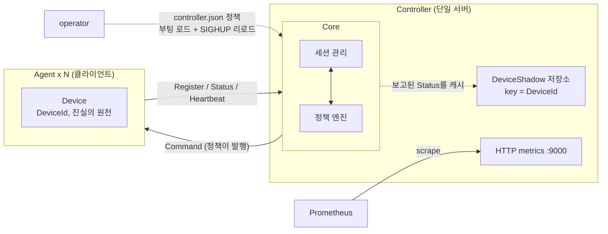
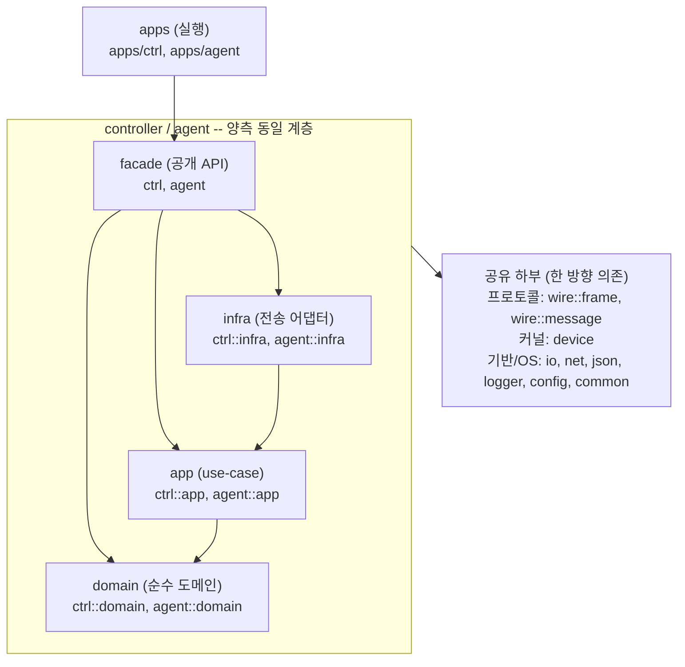
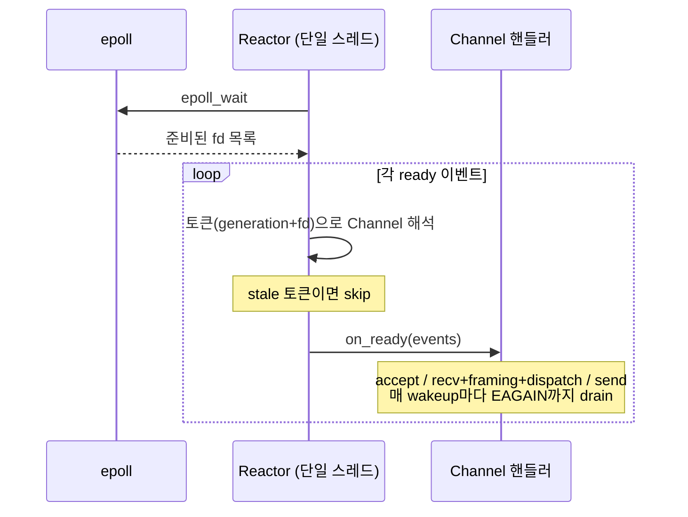
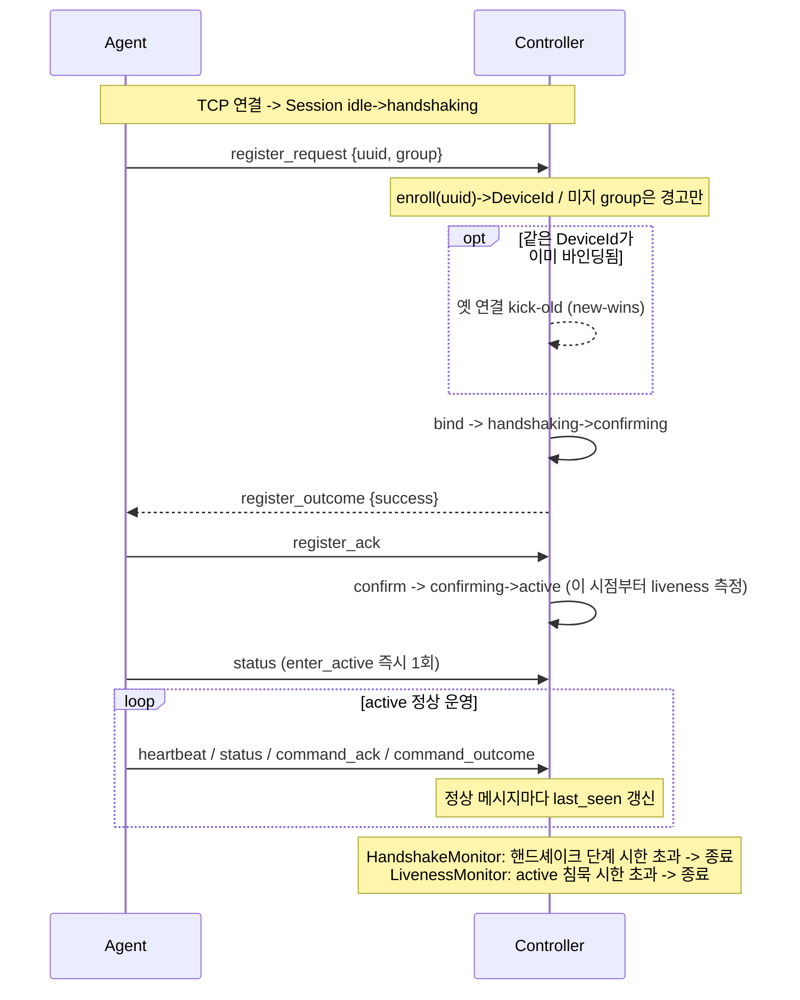
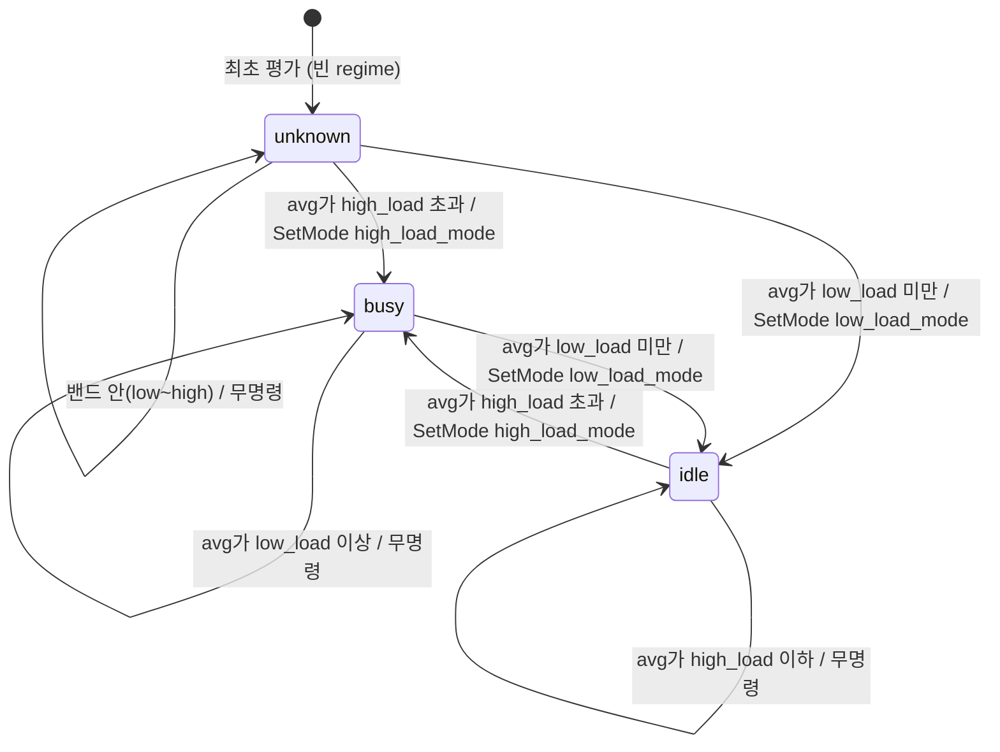
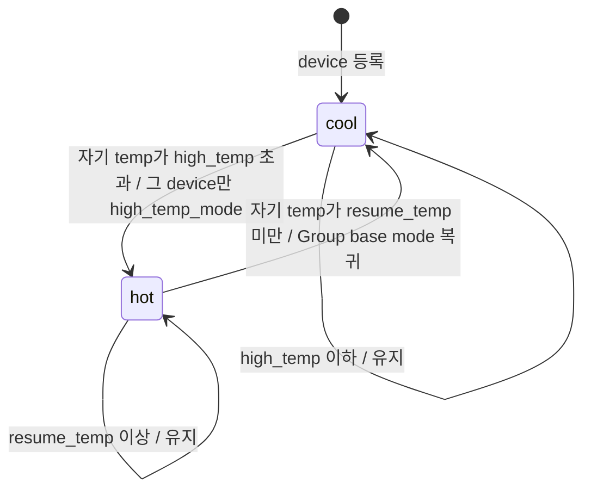
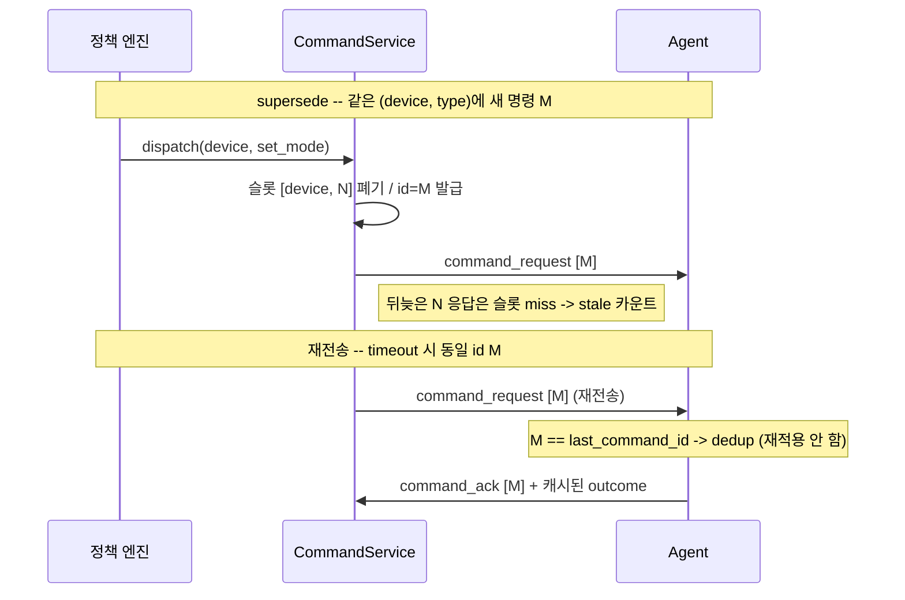
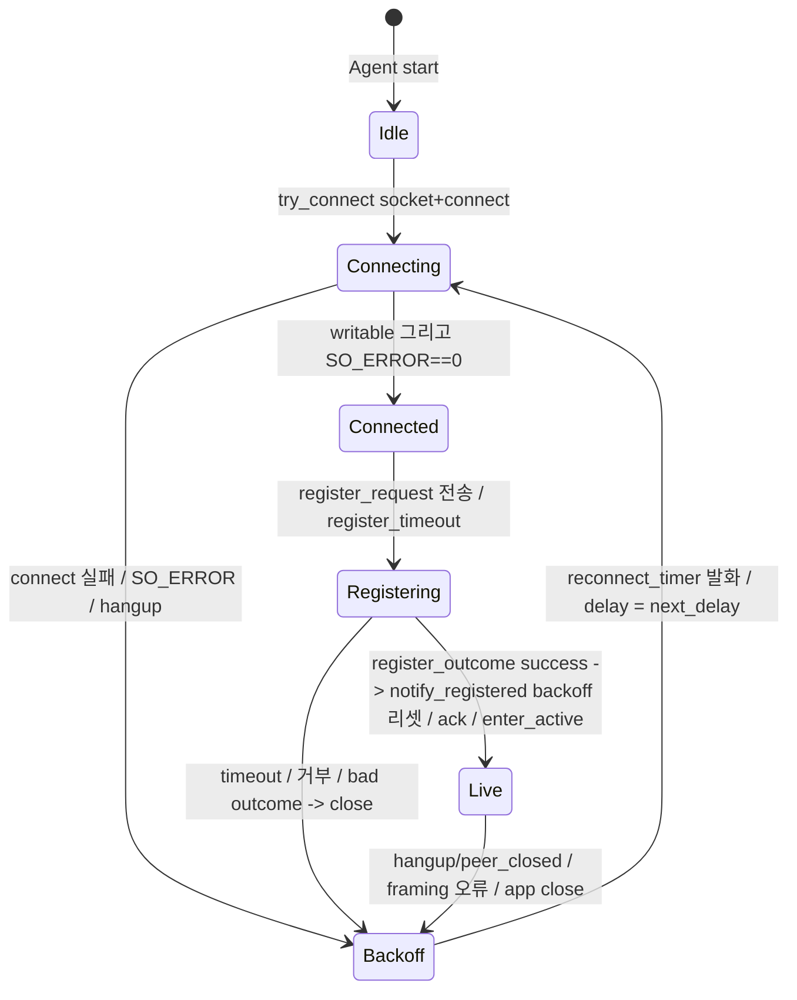
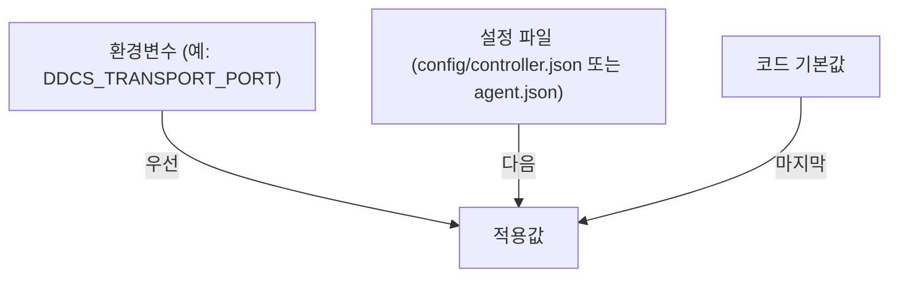

# DDCS 아키텍처

DDCS(Distributed Device Control System)는 분산 장치 제어 시스템이다.
단일 **Controller**가 다수의 **Agent**를 조율하고, 각 Agent는 정확히 하나의 **Device**를 호스팅한다(1 agent : 1 device : 1 session).
상태와 신원의 진실의 원천은 Agent 쪽 Device에 있고, Controller는 그 투영인 **DeviceShadow**만 보관한다.
Controller는 각 Device를 Group 단위 **Policy**로 자동 조율하며, 사람이 직접 명령을 내리는 API는 없다 --- 명령은 정책 엔진이 발행한다.

이 문서는 시스템의 **구조와 동작을 개관**한다. 세부 권위는 다음 문서에 위임한다.

- 도메인 어휘(누가 무엇인가): [GLOSSARY.md](GLOSSARY.md)
- 와이어 프로토콜(바이트 레이아웃, 메시지 타입, 의미론): [PROTOCOL.md](PROTOCOL.md)

각 절의 `> **왜 ...:**` 블록은 그 설계를 택한 이유다.

## 목차

1. [시스템 컨텍스트](#1-시스템-컨텍스트)
2. [코드 구조 (모듈 지도)](#2-코드-구조-모듈-지도)
3. [런타임 모델: 단일 스레드 리액터](#3-런타임-모델-단일-스레드-리액터)
4. [전송과 프로토콜](#4-전송과-프로토콜)
5. [세션 생명주기](#5-세션-생명주기)
6. [정책 엔진](#6-정책-엔진)
7. [명령 RPC와 상관](#7-명령-rpc와-상관)
8. [에이전트 재접속](#8-에이전트-재접속)
9. [관측성과 설정](#9-관측성과-설정)

---

## 1. 시스템 컨텍스트

| 행위자           | 역할                                                                                                                             |
| ---------------- | -------------------------------------------------------------------------------------------------------------------------------- |
| **Controller**   | 다수 Device의 집합적 Mode를 Group 단위 Policy로 조율하는 단일 서버. Agent를 통해 각 Device를 관측(Status)하고 구동(Command)한다. |
| **Agent**        | 하나의 Device를 호스팅해 Controller에 등록하고 Status를 보고하며 명령을 적용하는 클라이언트.                                     |
| **Device**       | Agent가 제어하는 실제 장치. 상태와 신원의 진실의 원천.                                                                           |
| **DeviceShadow** | Controller가 DeviceId로 보관하는 Device의 캐시 투영. 재접속을 가로질러 지속된다(Session보다 오래 산다).                          |
| operator         | `config/controller.json`의 인라인 정책을 주입한다. 런타임 명령 API는 없다. (어휘 밖 외부 행위자)                                 |
| Prometheus       | Controller의 HTTP 메트릭 엔드포인트(`:9000`)를 긁는다. (어휘 밖 외부 행위자)                                                     |

> **왜 Controller에 Agent 엔티티가 없는가:** ddcs는 1 agent : 1 device : 1 session이라 별도의 Agent 집합체가 불필요하다. Controller는 상대를 **Session**(휘발성 연결 관계)과 **DeviceShadow**(DeviceId로 지속되는 캐시)로만 모델링한다. "Agent"라는 이름은 클라이언트 액터와 agent-side 코드에만 존재한다.

---

## 2. 코드 구조 (모듈 지도)

코드는 `lib/`의 라이브러리 모듈과 `apps/`의 두 실행 파일(`ctrl`, `agent`)로 나뉜다. 의존은 위에서 아래로 한 방향으로만 흐른다.

| 모듈                      | 레이어      | 책임                                                                 |
| ------------------------- | ----------- | -------------------------------------------------------------------- |
| `common`                  | 기반        | 순수 C++ 값 타입 (strong id, uuid, 버퍼, object pool, 시계, endian)  |
| `json`                    | 직렬화      | JSON 파싱/쓰기                                                       |
| `logger`                  | 관측        | NDJSON 구조화 로깅 (싱글턴)                                          |
| `config`                  | 설정        | 단일 파일 JSON 설정 로더                                             |
| `io`                      | OS          | epoll 리액터, timerfd/signalfd, `Fd` RAII, `throw_errno`             |
| `net`                     | OS          | 소켓 프리미티브 (`stream_io`, `socket`)                              |
| `device`                  | 도메인 커널 | 공유 어휘 `Mode`(safe/normal/performance)와 그 wire 매핑             |
| `wire::frame`             | 프로토콜    | 프레이밍(4B 헤더: magic+length). payload는 opaque                    |
| `wire::message`           | 프로토콜    | 메시지(`[type][body]`)와 command 코덱                                |
| `ctrl::domain`            | controller  | `DeviceShadow`/`DeviceRegistry`/`GroupPolicy` 등 순수 도메인         |
| `ctrl::app`               | controller  | Session/Command/Policy/Status/Registration/Metrics 서비스 (use-case) |
| `ctrl::infra`             | controller  | Acceptor/Server, Prometheus HTTP 서버 (어댑터)                       |
| `ctrl`                    | controller  | 컨트롤러 공개 파사드                                                 |
| `agent::domain`           | agent       | `Device` 구현 (시뮬레이션/더미)                                      |
| `agent::app`              | agent       | 세션 로직, 메시지 버퍼 관리 (use-case)                               |
| `agent::infra`            | agent       | Connector(연결/백오프) 어댑터                                        |
| `agent`                   | agent       | 에이전트 공개 파사드                                                 |
| `apps/ctrl`, `apps/agent` | 실행        | 설정 로드 + 조립 + run()                                             |

각 측(`ctrl`/`agent`)은 동일하게 **domain -> app -> infra -> facade** 로 계층화되고, 의존은 한 방향(아래로)으로만 흐른다. (위 그래프는 계층 요약이다 -- 모듈 목록과 책임은 위 표를, 한 방향 의존 원칙과 그 이유는 아래 설명을 본다.)

- **domain**: 순수 도메인 상태/규칙(`common`/`device`에만 의존).
- **app**: use-case 서비스. `<side>::app::transport::port`(계약)와 `<side>::app::session`(세션 로직)을 포함한다.
- **infra**: 계약을 충족하는 어댑터(`<side>::infra::transport`). `io`/`net`/`wire::frame`을 알지만 상대(peer)는 모른다.
- **facade**: 공개 API. infra를 PRIVATE로 숨긴다.

> **왜 port 계약이 의존 루트인가:** 의존은 **계약(port) -> 메커니즘(wire) -> 어댑터(infra/app)** 한 방향으로만 전파된다. port 계약은 "피어를 Connection 단위로 잇고 그 위에서 크기-유한한 typed Message를 주고받는다"이며, wire 프로토콜은 이 계약을 충족하는 *메커니즘*일 뿐이다. port가 바뀌면 wire가 따라 바뀌지만, wire 내부가 계약 안에서 바뀌면 port와 app은 무영향이다. 그래서 namespace는 메커니즘(`sfp`)이 아니라 계약 concern(`transport`)으로 명명한다.

> **왜 wire 코덱이 `device`에 의존하지 않는가:** `wire::message`는 `Mode`를 raw `u8`로만 싣는다. 어휘<->바이트 매핑(`device::encode_mode`/`decode_mode`)은 `device` 커널이 소유하고, 번역은 app 어댑터 경계에서 일어난다. 덕분에 wire는 "멍청한 봉투"로 남고 도메인 어휘 변경이 코덱을 오염시키지 않는다.

---

## 3. 런타임 모델: 단일 스레드 리액터

각 프로세스(controller, agent)는 **단일 스레드 edge-triggered epoll 리액터** 하나로 동작한다. `lib/` / `apps/` 어디에도 스레드/뮤텍스/atomic이 없다 -- 동시성은 한 OS 스레드 위의 협력적 I/O 멀티플렉싱이고, 모든 콜백이 그 스레드에서 실행된다.

`io::Reactor`가 `epoll_wait`로 블록하고, 준비된 fd마다 소유 `Channel`의 핸들러를 호출한다. 리액터에는 여러 **게스트**가 등록된다.

- `io::TimerScheduler` -- 하나의 timerfd에 다수 논리 타이머를 deadline 최소힙으로 멀티플렉싱.
- `io::SignalSource` -- signalfd로 SIGINT/SIGTERM(=`stop()`)을 reactor 콜백으로 변환. controller는 추가로 SIGHUP(=정책 핫리로드)을 등록한다(agent는 SIGINT/SIGTERM만).
- 전송 서버/커넥터 -- controller는 `Acceptor` + N개 Connection, agent는 단일 Connection.
- (controller만) Prometheus HTTP 서버 -- 같은 리액터의 "두 번째 게스트".

Controller의 주기 도메인 작업은 단일 자기재무장 **sweep 타이머**가 구동한다: 매 tick마다 명령 재전송 sweep, 핸드셰이크/liveness 만료 축출, 정책 평가를 순서대로 수행한다.

리액터는 게스트 종류를 구분하지 않는다 -- timerfd(타이머)/signalfd(시그널)/소켓이 모두 같은 `Channel` 디스패치 경로(위 `H`)를 탄다.

> **왜 단일 스레드인가:** 공유 상태에 락이 전혀 필요 없다. 세션 레지스트리, 명령 장부, 정책 상태가 모두 한 스레드에서만 만져지므로 동기화 비용과 그에 따르는 버그 부류가 통째로 사라진다. 대가는 "콜백 안에서 블로킹/CPU 바운드 작업을 하면 루프 전체가 멈춘다"는 것 -- 부팅 시 정책 파일 읽기, agent의 1회 DNS 조회 정도만 동기이고 핫패스는 모두 논블로킹이다.

> **왜 epoll 토큰에 raw 포인터 대신 generation 토큰을 쓰는가:** `data.u64`에 `(generation<<32 | fd)`를 싣고, fd가 닫혀 재사용되면 generation을 올린다. 커널이 close 직전에 큐잉한 stale 이벤트가 재사용된 fd의 다른 Channel로 오배달되는 use-after-free를 막는다 -- fd를 끊임없이 여닫는 단일 리액터의 핵심 안전장치다.

> **왜 deferred-reap인가:** 콜백(`on_message`)이 전송을 재진입해 `send()`/`disconnect()`를 부를 수 있어서, controller 서버는 연결을 즉시 해체하지 않고 reap 큐에 넣은 뒤 콜백 종료 후 안전 지점에서 처리한다. 프레임 추출 루프는 매 반복 rx 버퍼를 재조회해, 콜백 안에서 해제된 연결을 만나면 깨끗이 끝난다. 이것이 락을 대신하는 협력적 동시성 패턴이다.

리소스 안전을 위한 RAII 규약 두 가지가 load-bearing이다.

- `io::Fd`는 이동 전용 소유자이고, `io::Channel`은 **여전히 리액터에 등록된 채 close되면 `std::terminate`** 한다(닫기 전에 반드시 등록 해제). 게스트는 리액터보다 먼저 파괴되어야 한다.
- `common::ObjectPool`은 발급한 핸들보다 오래 살아야 한다(아니면 terminate). 그래서 풀은 그것을 쥔 연결/큐보다 먼저 선언된다.

---

## 4. 전송과 프로토콜

agent와 controller는 TCP 위의 자체 wire protocol로 통신한다. 와이어는 두 계층이다(상세는 [PROTOCOL.md](PROTOCOL.md)).

- **`wire::frame`** -- 4바이트 헤더(`magic=0xDDC5` + `length`, big-endian) + 가변 payload. frame은 payload를 opaque로 다룬다(magic 검증, length 추출만).
- **`wire::message`** -- payload 선두 1바이트가 message type, 나머지가 body(`[type][body]`, body 정수는 little-endian).

메시지 타입은 고위 nibble로 묶인다: `0x0x` Register, `0x1x` Telemetry(heartbeat/status), `0x2x` Command. 응답은 **ack**(수신 확인)과 **outcome**(판정 code) 두 어휘만 쓰며, 판정 사유는 wire에 싣지 않고 로컬 로그로만 남긴다.

프레이밍 루프(`wire::frame::extract_frames`)는 양측이 공유한다: rx 링버퍼에서 완전한 프레임을 풀링된 버퍼로 뽑아낸다. 송신 버퍼는 헤더 헤드룸을 미리 확보해 길이 헤더를 제자리에서 prepend하므로 복사가 없다.

> **불변식 -- rx 버퍼 >= 최대 프레임:** rx 링 용량은 2의 거듭제곱이면서 최대 프레임(헤더 4 + payload 상한 1024 = 1028) 이상이어야 한다(현재 양측 4096). 양측 모두 `static_assert`로 컴파일 차단한다. 링을 1028 밑으로 줄이면 -- 클램프가 아니라 -- 프레이밍 교착이 난다.

> **불변식 -- Mode<->wire 단일 출처:** 네 wire 경계(ctrl 정책 encode / agent command decode / agent status encode / ctrl status decode)가 전부 `device::encode_mode`/`decode_mode`를 경유한다. 경계에 raw `static_cast<Mode>`를 재도입하면 컴파일은 통과하지만 enum 재정렬 시 조용히 어긋난다.

---

## 5. 세션 생명주기

**Session**은 Controller가 한 TCP 연결을 한 DeviceId에 바인딩한 관계다. 수명은 연결의 수명과 같다 -- 끊기면 사라지고, 재접속은 완전히 새로운 Session이다. 재접속을 가로지르는 신원은 `register_request.uuid`(= DeviceId)가 운반한다.

세션 상태는 **idle -> handshaking -> confirming -> active** 로 진행한다. 등록은 3-way 핸드셰이크다.

핵심 규약:

- **bind는 요청 시점, liveness는 ack 시점.** Controller는 피어를 식별(`register_request` 디코드)하는 즉시 device 슬롯을 선점(bind)하지만, 운영 시계(liveness)는 `register_ack`를 받아 `active`가 된 뒤부터 돈다.
- **단계별 시한.** handshaking/confirming의 `last_seen`은 단계 전이에서만 갱신된다(임의 메시지로 연장되지 않음). 각 등록 단계가 독립 budget을 받아 느린/침묵 핸드셰이크를 잡는다. `HandshakeMonitor`가 감시한다.
- **active liveness는 모든 정상 트래픽의 합집합.** heartbeat/status/command_ack/command_outcome 어느 것이든 `last_seen`을 갱신한다. heartbeat는 body 없는 keepalive다. `LivenessMonitor`가 침묵 시한 초과 세션을 축출한다.
- **상태별 수용.** handshaking은 `register_request`만, confirming은 `register_ack`만 받는다. 타입/방향이 어긋나거나 디코드 실패면 프로토콜 위반으로 연결을 끊는다.

상태 결정의 단일 출처는 `SessionRegistry`다: 연결을 1차 키로, device를 역인덱스로 들고 **"device당 바인딩 세션 1개"** 를 봉인한다.

> **왜 3-way 핸드셰이크인가:** `register_outcome` 전달 + `register_ack` 회신의 왕복 지연이 liveness 시한을 잠식하지 않게 하려는 것. Controller는 ack 수신(confirm)부터 liveness를 측정하고, 등록 구간은 별도 핸드셰이크 budget을 받는다.

> **왜 kick-old(new-wins)인가:** 같은 uuid로 재접속한 연결은, Controller가 아직 liveness sweep으로 정리하지 못한 stale 연결을 이겨야 device가 잠기지 않는다. 새 `register_request`가 오면 옛 연결을 동기적으로 끊고 새 연결을 바인딩한다 -- "device당 live 세션 1개" 불변식을 보장한다.

### Status와 liveness -- non-finite 정책

active 상태의 status 처리 순서는 의도적이다: 디코드 성공 시 **`update_seen(now)`를 먼저** 부르고, 그다음 `StatusService::update_status`로 Shadow를 갱신한다. `update_status`는 `load`/`temp`가 유한한지(`std::isfinite`)만 검사하고, **비유한(NaN/Inf)이면 Shadow를 건드리지 않고 last-good을 보존**한다.

> **왜 non-finite를 liveness 실패로 보지 않는가:** 프레임 디코드가 성공했다는 건 agent가 살아있다는 뜻이다. 나쁜 텔레메트리 한 건과 죽은 agent를 혼동하면 안 된다. 오직 **wire 디코드 실패만** kick한다. NaN 한 건이 그룹 load 평균 비교를 마비시키는 것만 막으면 되므로(NaN 비교는 항상 false), 나쁜 샘플은 버리고 직전 Shadow를 유지한다. 이 finiteness 검증은 status ingress가 단일(StatusService)이라 서비스 경계에 둔다 -- ingress가 둘 이상 생기면 도메인으로 격상한다.

---

## 6. 정책 엔진

Controller는 각 Device의 Mode를 **Group 단위로 자동** 제어한다. 사람 명령 API는 없다.

- **Group** - 하나의 Policy를 공유하는 Device들의 논리적 묶음(예: zone_a/zone_b/zone_c). Agent가 등록 시 선언한다. 미지 그룹은 등록을 막지 않고 경고만 한다(soft).
- **Mode** -- 공유 어휘 `safe`/`normal`/`performance`. 정책의 출력이자 Device와 Controller가 공유하는 커널 어휘.
- **Policy(GroupRule)** --- Group별 규칙: load 히스테리시스(`high_load`/`low_load` + `high_load_mode`/`low_load_mode`)와 선택적 **온도 override**(`high_temp`/`resume_temp`/`high_temp_mode`).

정책은 두 축을 합성하되 **적용 단위가 다르다**: load는 **Group 단위**(집합 부하), 온도는 **device 단위**(개별 안전)다.

`PolicyService::evaluate`는 매 sweep tick마다 두 패스로 돈다. (1) Group별로 active device의 평균 load(`avg = sum/count`)를 집계해 히스테리시스 밴드로 regime(busy/idle)과 그 Group의 **base mode**를 정한다. (2) 각 active device가 **자기 Shadow 온도**로 thermal(hot/cool)을 따로 판정한다. device의 **effective mode**는 "자기 thermal이 hot이면 `high_temp_mode`, 아니면 Group base mode"이고, 이 값이 **바뀐 device에게만** `SetMode`를 발행한다 -- 과열된 device만 안전 모드로 빠지고 같은 Group의 나머지는 base mode를 유지한다.

아래는 부하 축(Group regime)의 상태기계다.

**busy/idle은 Mode 값이 아니라 regime(밴드 상단 초과 / 하단 미만)** 이다. 어느 regime이 어느 Mode를 목표로 할지는 Group마다 operator가 정한다. `config/controller.json`의 `policy.groups` 기본값(데모):

| Group  | high_load | low_load | high_load_mode | low_load_mode |
| ------ | --------- | -------- | -------------- | ------------- |
| zone_a | 70        | 30       | performance    | normal        |
| zone_b | 60        | 45       | performance    | normal        |
| zone_c | 80        | 20       | performance    | normal        |

세 Group의 모드 매핑은 동일(`high_load_mode=performance`/`low_load_mode=normal`/`high_temp_mode=safe`)하고 온도 override(`high_temp=65`/`resume_temp=50`)도 공유한다. 차이는 부하 임계(`high_load`/`low_load`)뿐이라, 같은 부하 곡선에도 Group마다 다른 시점에 전환한다.

**온도 override**는 load 축과 독립인 **device별** 단방향 안전 트립이다. 어떤 active device의 Shadow 온도가 `high_temp`를 넘으면 그 device의 thermal=hot이 되어 load regime과 무관하게 그 device만 `high_temp_mode`로 가고, `resume_temp` 아래로 식으면 해제돼 Group base mode로 복귀한다(`resume_temp < high_temp` 데드밴드; 단 group regime이 아직 미확정이면 base mode가 없어 `low_load_mode`를 baseline으로 써 비상모드 latch를 푼다). thermal이 load를 이기므로 과열된 device는 안전 모드가 우선한다 -- Group 전체가 아니라 그 device만.

> **참고 -- 닫힌 루프 시뮬레이션:** agent의 `SimulatedDevice`는 load/temp를 **현재 Mode가 구동**하는 상태로 만든다(Mode별 초당 변화율을 매 보고 주기에 적분). 정책이 Mode를 바꾸면 그게 다시 load/temp를 움직이는 폐루프다 -- performance는 부하를 빼며 발열하고, safe는 식힌다. device마다 초기값과 미세 noise(`DDCS_SIM_NOISE`/`DDCS_SIM_JITTER`)가 달라 같은 Group이라도 서로 다른 시점에 `high_temp`에 닿고, 그래서 per-device thermal이 "한 Group 안에 performance와 safe가 섞인" 모습으로 나타난다.

> **왜 히스테리시스(밴드)인가:** 단일 임계면 load가 그 근처에서 떨릴 때 매 tick 모드 명령이 발진(flapping)한다. `[low_load, high_load]` 밴드 + 전환 시에만 1회 발신으로 채터링과 명령 스팸을 막는다. 밴드 안에서 진동하는 load는 0개의 명령을 만든다.

> **왜 밴드 불변식 `low < high`만 도메인으로 격상했나:** 역전/동일 임계는 매 평가마다 busy<->idle을 번갈아 발진시키는 결함이라 ingress와 무관하게 항상 막아야 한다. 그래서 `GroupRule::try_make`가 도메인에서 강제한다(역전/동일이면 생성 거부). 반면 status finiteness는 ingress 단일이라 서비스에 남겼다 -- 불변식을 "어디"에 둘지는 ingress 수가 결정한다.

> **왜 active만 집계/명령하나:** 끊긴 device의 stale Shadow load가 평균을 오염시키거나 미연결 대상에 헛 명령을 보내지 않도록, roster active 집합만 평균과 발신 대상으로 삼는다. 미보고 active device는 기본 `load=0`으로 들어간다(단 group을 선언한 경우만 -- 빈 group은 집계에서 아예 제외).

> **왜 세션 종료 시 per-device 제어 상태를 버리나:** 정책은 device별로 "마지막에 보낸 effective mode"와 thermal 상태를 기억해, 안 바뀌면 명령을 생략한다(스팸 방지). device의 Session이 끝나면(정상 종료/kick-old/liveness 축출) `SessionService`가 그 device를 폐기하라고 정책에 통지한다(`DeviceReleaseSink::on_device_left`). 같은 DeviceId로 재접속한 agent는 `normal`로 리부트된 상태인데 옛 기억이 남아 있으면, 컨트롤러가 "이미 그 mode를 보냈다"고 착각해 재명령을 생략하고 device가 엉뚱한 Mode에 갇힌다. 폐기하면 재접속 device는 다음 평가에서 반드시 현재 effective로 재명령되고, 덤으로 per-device 장부가 끊긴 device들로 무한히 자라지 않는다.

명령의 전달 신뢰성(재전송/타임아웃/supersede)은 정책 엔진이 아니라 `CommandService`의 몫이다(다음 절). 정책은 "전환마다 1회"만 책임진다.

---

## 7. 명령 RPC와 상관

전송은 device당 하나의 TCP 연결이고 full-duplex다 -- 같은 소켓으로 Controller가 `command_request`(C->A)를 밀고 Agent가 `command_ack`/`command_outcome`(A->C)를 돌려보낸다. 별도 응답 채널은 없다. 외부 RPC 호출자도 없다: "발행자"는 Controller 자신의 정책 엔진이다.

왕복: 정책 엔진이 결정 -> `CommandService`가 추적/발신 -> agent가 적용 -> `CommandService`가 정산.

**정상 왕복** (command_id = N):

**경합과 실패** (supersede / 재전송 dedup):

- **상관 키는 `(device, command_id)`** -- 연결 단위가 아니다. `command_id`는 Controller 전역 단조 `u64`(1부터, 0은 invalid)라 모든 device/모든 명령 타입에 걸쳐 유일하고, 재접속으로 리셋되지 않는다.
- **supersede** -- 범위는 `(device, command_type)` 계열. 같은 계열에 새 명령이 나면 옛 미결 슬롯을 폐기하고 새 `command_id`로 교체한다(계열당 미결 1개). TCP 순서 보장으로 agent는 최신을 마지막에 적용한다.
- **재전송 = 동일 `command_id`** -- timeout/실패 시 지수 backoff 후 같은 id로 재전송한다. agent는 depth-1 dedup(직전 `command_id`만 기억)으로 중복을 흡수해, 재적용 없이 캐시된 ack/outcome를 회신한다(재적용은 dedup miss에서만).
- **ACK-before-apply** -- agent는 `command_request` 디코드 성공 시 먼저 ack를 보내고(이때 `command_type` 검증 전이라 ack는 "요청 디코드됨"을 뜻한다 -- 미지 command_type도 ack 후 failed outcome), 그다음 적용 후 outcome을 보낸다. Controller는 ack로 "수신"과 "완료"를 분리해 느린 적용을 명령 유실로 오인하지 않는다.
- **stale 응답** -- 닫힌/대체된/미지의 `(device, command_id)`로 오는 응답은 위반이 아니라 supersede/재전송의 정상 부산물이다. 카운트만 하고 무시한다.

> **왜 `(device, command_id)`로 상관하나:** 명령이 재접속을 견디게 하려는 것. 재접속 후 새 연결로 도착한 늦은 `command_outcome`도 같은 device면 유효하게 수용해 중복 실행을 막는다.

> **왜 동일 id + depth-1 dedup인가:** 현재 명령 어휘(`set_mode`)가 멱등 상태 선언이라 at-least-once 전달이 안전하고, 동일 id 재전송은 depth-1 dedup이 흡수한다(재적용 없이 캐시된 ack/outcome 회신). **비멱등 명령 타입을 추가하려면** -- 동시에 미결인 타입이 둘 이상이면 `command_id`-only dedup이 어긋나므로 -- 그 타입은 수신측 dedup + outcome 재송신으로 격상해야 한다. [PROTOCOL.md](PROTOCOL.md) 참고.

> **참고 -- 재전송 설정:** 조립 시 코드 폴백(`Controller::Config`)이 `max_attempts = 3`이라 config 없이도 재전송이 켜진다(저수준 `CommandService`의 default 1은 조립에서 항상 덮어써져 running controller엔 도달하지 않는다). 배포 설정 `config/controller.json`도 `max_attempts = 3` / `backoff_base_ms = 500`을 명시한다. `max_attempts`를 명시적으로 `1`로 낮추면 보관 사본도 재전송 경로도 비활성이 된다(`if (max_attempts > 1)` 게이트).

---

## 8. 에이전트 재접속

Agent는 단일 Controller 연결을 유지하고, 연결이 끊기면 jitter가 섞인 지수 backoff로 재접속을 예약한다. 모든 경로가 `Connector::disconnect_and_reconnect()` 한 곳으로 모인다.

- **트리거** -- TCP 셋업 실패, 연결/등록 중 error/hangup, `receive`/`transmit`의 peer_closed/error, 프레이밍 위반, app이 부른 `close()`(등록 timeout, bad outcome, 예기치 못한 메시지 등). **liveness 상실은 Controller가 구동한다** -- agent에는 자체 liveness 타이머가 없고, Controller의 `LivenessMonitor`가 끊으면 agent가 hangup으로 관측한다.
- **backoff** -- `base`/`cap`은 `BackoffSchedule` 코드 기본 `1s`/`30s`(설정 `transport.reconnect_base_delay_ms`/`reconnect_max_delay_ms`로 튜닝; 배포 `config/agent.json`은 `200ms`/`5000ms`로 낮춘다), jitter `+/-25%`. delay = `base * 2^attempt`를 `cap`으로 클램프(코드 기본값이면 1, 2, 4, 8, 16, 30, 30, ...) 후 jitter 적용. jitter는 결정적 xorshift32(테스트 가능).
- **리셋 시점 -- TCP 연결이 아니라 등록 성공.** `notify_registered()`가 `backoff.reset()`을 부르고, 이는 성공 `register_outcome` 이후에만 호출된다.
- **재접속 시 전체 3-way 재등록.** 끊기면 연결은 idle로 복귀(fd FIN, rx 클리어, tx drain, app 타이머 취소)하고, 재연결 후 `register_request -> outcome -> ack`를 다시 밟는다. 돌아온 DeviceId는 Controller가 kick-old로 처리한다(7절/5절).

> **왜 등록 성공 시점에 리셋하나(연결 성공이 아니라):** TCP는 accept하지만 등록을 끝내지 못하는 반쯤 고장난 Controller를 상대로도 backoff가 자라야 한다. TCP-connect에서 리셋하면 그런 Controller를 매 사이클 두들기게 된다.

> **왜 jitter인가:** 다수 agent가 동시에 끊겼다 재연결할 때 재시도가 동기화되는 thundering-herd를 막으려 재시도 시점을 비상관화한다. cap은 복구된 Controller의 worst-case 재발견 지연을 bound한다(jitter가 cap 클램프 _후_ 적용되므로 코드 기본 cap 30s면 실제 상한은 `+/-25%`인 ~37.5s).

---

## 9. 관측성과 설정

### 로깅 (`lib/logger`)

프로세스 전역 싱글턴이 한 줄에 하나의 NDJSON 객체를 쓴다. 필드 순서는 고정이다: `ts`(ISO8601 UTC, ms) / `level`(대문자 DEBUG/INFO/WARN/ERROR) / `event`(점으로 구분된 토큰, 예: `session.kick_old`) / 사용자 필드(`logger::kv` 순서대로) / `file`(basename) / `line`. 레벨 임계 기본은 info, 비활성 레벨 인자는 매크로에서 평가조차 되지 않는다. 싱크는 단일 `Sink*`이고, `clear_sink(expected)`는 현재 싱크가 expected와 같을 때만 분리한다(컴포넌트가 남의 싱크를 떼지 못하게).

### 메트릭 (controller 전용)

Controller만 Prometheus 텍스트 익스포지션을 `:9000`(기본)에 노출한다. HTTP 서버는 리액터의 두 번째 게스트로 돌고 pull-only다. 집계 메트릭은 라벨 없는 `uint64`이고, group별 메트릭은 `group`(+`mode`) 라벨을 단다. 요청 라인을 파싱하지 않아 어떤 경로로 와도 전체 scrape를 반환한다.

- **게이지**: `ddcs_connections`, `ddcs_devices_known`, `ddcs_commands_pending`
- **카운터**: `ddcs_commands_dispatched_total`, `ddcs_commands_completed_total`, `ddcs_commands_timed_out_total`, `ddcs_commands_retried_total`, `ddcs_commands_superseded_total`, `ddcs_commands_stale_total`, `ddcs_commands_gave_up_total`, `ddcs_agents_evicted_total`, `ddcs_handshake_expired_total`
- **히스토그램**: `ddcs_command_rtt_ms`(명령 dispatch->outcome 지연; `_bucket{le}` 누적 + `_sum` + `_count`). 평균 = sum/count, 꼬리 백분위 = `histogram_quantile(0.99, rate(..._bucket[5m]))`.
- **sweep(단일 스레드 포화)**: `ddcs_sweep_duration_us`(직전 tick) / `ddcs_sweep_duration_us_max`(피크) 게이지, `ddcs_sweep_duration_us_sum` + `ddcs_sweep_ticks_total`(평균 = sum/ticks) 카운터. tick 작업 시간이 sweep 주기에 근접하면 한 코어가 포화 -- 루트 README "성능" 절 참고.
- **group별(라벨)**: `ddcs_group_load_avg{group}`(평균 load), `ddcs_group_temp_avg{group}`(평균 온도), `ddcs_group_devices{group,mode}`(모드별 active device 수). 정책에 있는 group만 노출해 라벨 cardinality를 config로 한정한다.

Agent는 메트릭 엔드포인트가 없다.

### 설정 (`lib/config`)

역할별 단일 JSON 파일 로더. 키는 점 경로(`session.handshake_timeout_ms`)로 중첩 object를 가리키고, 값 우선순위는 **환경변수(설정/유효 시) > 파일 > 코드 기본값**이다.

각 main은 `DDCS_CONFIG_PATH`(기본 `config/controller.json` / `config/agent.json`) 한 파일을 읽는다. 파일 없음은 비치명(기본값으로 가동 + stderr 경고), malformed JSON은 치명(throw -> `EXIT_FAILURE`), 타입 불일치는 키 기본값 + 경고다. 시간(ms) 키는 의도적으로 환경변수 override가 없다. 정책은 controller 파일의 `policy` 객체에 인라인되어 같은 파일에서 함께 로드된다.

agent의 device 신원(`DDCS_DEVICE_ID` / `DDCS_DEVICE_ID_FILE`)은 Config가 아니라 main에서 직접 해석한다: env > 파일 읽기 > 생성+파일 기록(자가발급, persist 성공 시 비-ephemeral). **정책은 `SIGHUP`으로 핫리로드된다**: controller 프로세스에 SIGHUP을 보내면 `load_policy`가 controller.json의 `policy`를 다시 읽어 `set_policy`로 재적용한다(malformed/없음이면 경고 후 옛 정책 유지 -- validate-before-apply). 재적용 시 발신 belief(commanded)만 비워 다음 sweep이 새 정책으로 재명령하고, regime/thermal 히스테리시스 latch는 reload를 넘어 보존한다(안 그러면 과열 보호가 조기 해제되거나 데드밴드 group의 mode 변경이 미적용된다). 나머지 설정(포트/타임아웃 등)은 부팅 시 1회만 읽는다. 전체 설정 키 레퍼런스(파일/기본값/환경변수)는 루트 `README.md`의 "설정" 절에 있다.
