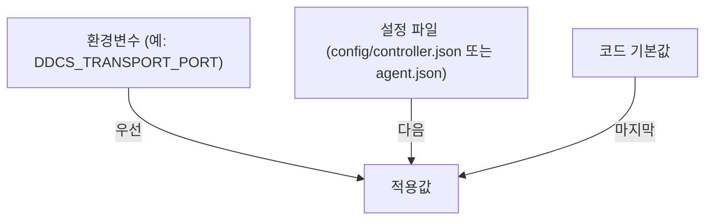

# DDCS 설정 레퍼런스

런타임 설정의 해석 규칙과 키 목록에 대한 문서입니다.

## 목차

- [해석 규칙](#해석-규칙)
- [신원과 Group](#신원과-group)
- [키 목록](#키-목록)
- [정책](#정책)

## 해석 규칙

런타임 설정은 역할별 단일 JSON 파일(`config/controller.json`, `config/agent.json`)이며, `lib/config`의 로더가 읽습니다.
키는 점 경로(`session.handshake_timeout_ms`)로 중첩 object를 가리키고, 값 우선순위는 **환경변수(설정되어 있고 값이 유효한 경우) > 파일 > 코드 기본값**입니다.

_그림 1. 설정값 우선순위_

- 각 `main`은 `DDCS_CONFIG_PATH`(기본 `config/controller.json`, `config/agent.json`) 한 파일을 읽습니다.
- 파일이 없으면 기본값으로 기동하고 경고를 남기며, JSON 문법 오류는 치명적이라 `EXIT_FAILURE`로 종료하고, 타입 불일치는 해당 키만 기본값으로 두고 경고합니다.
- 시간(ms) 키는 환경변수로 덮어쓸 수 없습니다.
- 정책은 controller 파일의 `policy` 객체에 인라인으로 포함됩니다.
- Agent의 Device 신원(`DDCS_DEVICE_ID`, `DDCS_DEVICE_ID_FILE`)은 설정 로더가 아니라 `main`이 직접 결정합니다(환경변수, 파일, 새로 발급 순). 둘 다 지정하지 않으면 기동할 때마다 새로 발급하고 어디에도 기록하지 않으므로, 신원을 남기는 것은 기본값이 아니라 선택입니다.

wire(`:8080`)와 메트릭(`:9000`) 리스너는 항상 모든 인터페이스(`0.0.0.0`)에서 수신 대기하며, 바인드 주소는 설정으로 제한할 수 없습니다([보안 가정](ARCHITECTURE.md#101-신뢰-경계)).

## 신원과 Group

Group은 agent의 `device.group` 키(환경변수 `DDCS_DEVICE_GROUP`, 기본 `zone_a`)로 지정합니다.
DeviceId는 `DDCS_DEVICE_ID` 환경변수, `DDCS_DEVICE_ID_FILE`이 가리키는 파일, 둘 다 없으면 새로 발급 순으로 결정합니다.
둘 다 지정하지 않으면 어디에도 기록하지 않으므로 기동할 때마다 새 Device가 됩니다. 재시작한 뒤에도 같은 Device로 남으려면 둘 중 하나를 지정해야 합니다.

파일로 신원을 남길 경우 프로젝트의 표준 위치는 `var/state/agent/<agent-name>.uuid`입니다. 이 경로는
git에서 제외되는 runtime state이며, Agent마다 **서로 다른 파일 하나씩**을 지정해야 합니다.

> [!TIP]
> 한 디렉터리에서 Agent를 여러 대 띄울 때는 아무것도 지정하지 않는 편이 맞습니다.
> 같은 `DDCS_DEVICE_ID_FILE`을 공유하면 전부 같은 DeviceId로 등록해, Controller가 Device당 연결 하나만 남기며(kick-old) 서로를 끊어냅니다.

## 키 목록

**`config/controller.json`**

|키|파일 값|코드 기본값|환경변수|설명|
|---|---|---|---|---|
|`log.level`|`info`|`info`|`DDCS_LOG_LEVEL`|debug / info / warn / error|
|`controller.sweep_interval_ms`|`1000`|`1000`|-|sweep 간격 (재전송/축출/정책 평가)|
|`prometheus.port`|`9000`|`9000`|`DDCS_PROMETHEUS_PORT`|메트릭 포트|
|`transport.port`|`8080`|`8080`|`DDCS_TRANSPORT_PORT`|wire listen 포트|
|`transport.accept_backlog`|`128`|`128`|-|listen backlog|
|`transport.rx_buffer_size`|`4096`|`4096`|-|연결별 rx ring 용량(byte). frame 최대 크기 이상인 2의 거듭제곱으로 올림 보정|
|`session.handshake_timeout_ms`|`3000`|`3000`|-|핸드셰이크 단계별 제한 시간|
|`session.liveness_timeout_ms`|`1500`|`3000`|-|active Session liveness 제한 시간|
|`command.timeout_ms`|`5000`|`5000`|-|명령 응답 대기 제한 시간|
|`command.max_attempts`|`3`|`3`|-|명령 전송 시도 횟수 (1이면 재전송 없음)|
|`command.backoff_base_ms`|`500`|`500`|-|명령 재전송 백오프 시작값|

**`config/agent.json`**

|키|파일 값|코드 기본값|환경변수|설명|
|---|---|---|---|---|
|`log.level`|`info`|`info`|`DDCS_LOG_LEVEL`|debug / info / warn / error|
|`transport.host`|`127.0.0.1`|`127.0.0.1`|`DDCS_TRANSPORT_HOST`|연결할 Controller 호스트/IP|
|`transport.port`|`8080`|`8080`|`DDCS_TRANSPORT_PORT`|Controller 연결 포트|
|`transport.rx_buffer_size`|`4096`|`4096`|-|연결 rx ring 용량(byte). frame 최대 크기 이상인 2의 거듭제곱으로 올림 보정|
|`transport.reconnect_base_delay_ms`|`200`|`1000`|-|재접속 백오프 시작값 (지수 증가)|
|`transport.reconnect_max_delay_ms`|`5000`|`30000`|-|재접속 백오프 상한|
|`session.registration_timeout_ms`|`5000`|`2000`|-|register_outcome 대기 제한 시간|
|`session.heartbeat_interval_ms`|`500`|`1000`|-|heartbeat 주기|
|`session.status_report_interval_ms`|`1000`|`5000`|-|Status 보고 주기|
|`device.group`|-|`zone_a`|`DDCS_DEVICE_GROUP`|Device가 속한 Group (기본 파일에는 없음, compose가 환경변수로 지정)|

- 환경변수 칸의 `-`는 해당 환경변수가 없다는 뜻입니다.
- 기본 설정 파일은 짧은 시연에서 동작을 빨리 관찰하려고 대부분 코드 기본값보다 짧은 주기를 씁니다.
  운영 환경에서는 코드 기본값에 가까운 값을 쓰는 편이 안전합니다.

## 정책

정책은 별도 파일이 아니라 `controller.json`의 `policy.groups`에 있습니다.
Group별 규칙은 부하 임계 두 개(`busy_load`/`idle_load`)와 각각의 목표 Mode, 그리고 선택적 온도 보호(`hot_temp`/`cool_temp`/`hot_mode`)로 이루어지며, 동작은 [ARCHITECTURE 정책 엔진](ARCHITECTURE.md#6-정책-엔진) 절에서 다룹니다.
`kill -HUP <controller-pid>`를 보내면 Controller가 `policy`만 다시 읽어 적용하고, 유효하지 않은 정책은 경고만 남긴 채 기존 정책을 유지합니다.

**Controller는 정책을 `SIGHUP`으로 리로드합니다.**
`load_policy`가 `controller.json`의 `policy`를 다시 읽고 검증을 통과한 정책만 적용하므로(validate-before-apply), 파일이 없거나 문법 오류가 있으면 경고만 남기고 기존 정책을 유지합니다.
재적용 시 Device별 명령 기억만 폐기해 다음 sweep이 새 정책으로 다시 명령하게 하고, Regime과 thermal 히스테리시스 상태는 유지해 과열 보호와 데드밴드 판정을 이어갑니다.
`policy` 외의 설정(포트, 제한 시간 등)은 기동 시 1회만 읽습니다.
