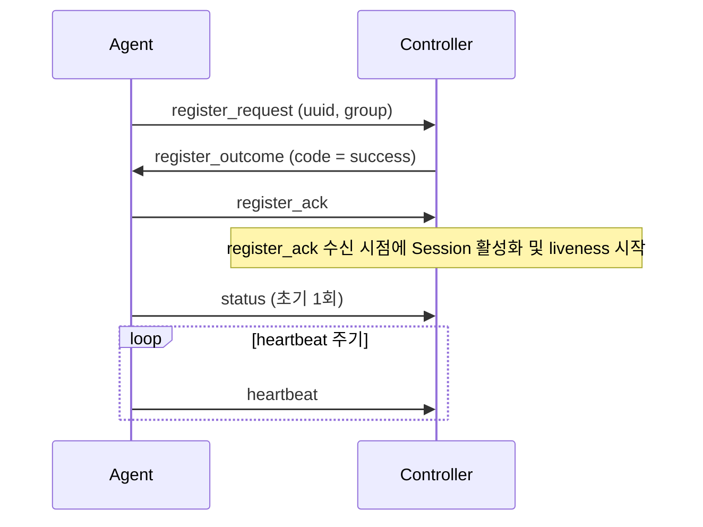

# DDCS Wire Protocol

DDCS는 Controller와 Agent 사이 TCP 위에서 동작하는 자체 wire protocol로 통신하며, 프로토콜은 frame(`wire::frame`)과 message(`wire::message`) 두 계층으로 나뉜다.

## Frame (`wire::frame`)

frame은 바이트 스트림에서 payload의 경계를 잡기 위한(프레이밍) 계층이며, 헤더는 **big-endian**을 쓴다.

### 레이아웃

```
0       1       2       3       4 ... length + 4
+-------+-------+-------+-------+---------+
|     magic     |    length     | payload |
+-------+-------+-------+-------+---------+
```

### 필드

frame 헤더는 다음 필드로 구성된다:

| 필드     | 크기 (byte) | 바이트 순서 | 의미                     | 비고                      |
| -------- | ----------- | ----------- | ------------------------ | ------------------------- |
| `magic`  | 2           | big-endian  | DDCS protocol 식별자     | `0xDDC5`로 값 고정        |
| `length` | 2           | big-endian  | payload (= message) 크기 | 헤더 크기는 포함하지 않음 |

### 상수

frame 계층은 다음 상수를 정의한다:

| 이름               | 값       | 의미                                        |
| ------------------ | -------- | ------------------------------------------- |
| header size        | 4        | 헤더 크기: magic (2 byte) + length (2 byte) |
| magic value        | `0xDDC5` | 고정 식별자                                 |
| max payload length | 1024     | protocol이 허용하는 payload 크기 상한       |

### 계약

frame 계층은 다음 계약을 따른다:

- frame 계층은 payload를 **opaque**로 다룬다. payload의 디스패치는 app의 몫이다.
- 저수준 `decode()`는 **magic 검증 + length 추출만** 하며, 상한 검사를 하지 않으므로 magic만 맞으면 임의 length를 반환한다.
- 수신(RX) 추출(`pull_frame`)은 저수준 `decode()` 위에 다음 처리를 더한다:
  1. 상한 검사 (`length > max payload length` -> `too_long`)
  2. 완성도 판정 (헤더 미도착 / 부분 frame -> `incomplete`)
  3. payload 추출과 복사 (실패 시 `read_error`)
- frame 계층은 위반을 검출하면 **결과 코드만 반환**하고, 연결을 끊는 정책은 caller가 수행한다(Controller: `reap(protocol_error)` / Agent: 재연결).
- 불변식: `rx 버퍼 용량 >= header size + max payload length`

caller는 `pull_frame` 결과를 다음과 같이 처리한다:

| `pull_frame` 결과 | 의미                          | caller 처리                |
| ----------------- | ----------------------------- | -------------------------- |
| (정상)            | 완전한 frame 1개 추출         | `on_frame`으로 디스패치    |
| `incomplete`      | 헤더 미도착 또는 부분 frame   | 더 수신할 때까지 대기      |
| `too_long`        | `length > max payload length` | 프로토콜 위반 -> 연결 종료 |
| `bad_magic`       | magic 불일치                  | 프로토콜 위반 -> 연결 종료 |
| `read_error`      | rx 버퍼 읽기/커밋 실패(손상)  | 프로토콜 위반 -> 연결 종료 |

## Message (`wire::message`)

frame 헤더와 달리 message는 **little-endian**을 쓴다.

### 레이아웃

```
0       1 ... length - 1
+-------+------+
| type  | body |
+-------+------+
```

### MessageType

`MessageType`은 고위 nibble로 그룹을 나눈다:

| 값     | 그룹      |
| ------ | --------- |
| `0x0x` | Register  |
| `0x1x` | Telemetry |
| `0x2x` | Command   |

같은 그룹 내 확장은 저위 nibble 안에서 추가한다:

| 값     | 이름               | 방향 | body (name:type(byte))                                       |
| ------ | ------------------ | :--: | ------------------------------------------------------------ |
| `0x00` | `invalid`          |  -   | -                                                            |
| `0x01` | `register_request` | `AC` | `uuid`:uuid(16), `group`:str                                 |
| `0x02` | `register_outcome` | `CA` | `code`:enum(1)                                               |
| `0x03` | `register_ack`     | `AC` | empty                                                        |
| `0x10` | `heartbeat`        | `AC` | empty                                                        |
| `0x11` | `status`           | `AC` | `mode`:u8(1), `load`:f64(8), `temp`:f64(8)                   |
| `0x20` | `command_request`  | `CA` | `command_id`:u64(8), `command_type`:u8(1), `payload`:command |
| `0x21` | `command_ack`      | `AC` | `command_id`:u64(8)                                          |
| `0x22` | `command_outcome`  | `AC` | `command_id`:u64(8), `code`:enum(1)                          |

방향 표기:

- `AC` = Agent → Controller
- `CA` = Controller → Agent

body type 규약:

- `uuid`: 길이 prefix 없이 raw 16 byte로 싣는다.
- `str`: 2 byte length prefix + UTF-8 raw bytes (null terminator 없음). codec은 length만 검증한다.
- `f64`: IEEE-754 double. 비트를 그대로 u64 little-endian으로 싣는다.
- `code`: `success = 0`, `failed = 1`. `register_outcome`과 `command_outcome`은 **각자 별도의 enum**을 두되, wire 바이트(u8)는 공통이다.
- `command`: length prefix 없이 body의 나머지 전부를 차지한다.

### 계약

message 디코딩은 다음 규칙을 따른다:

- 디코딩은 **구조적 검증만** 한다: wire byte가 schema 길이 요건과 정확히 부합하는지(부족/trailing 바이트 없음)만 본다.
- enum 값 유효성과 의미 제약은 호출자가 책임진다.
- `message_type()`은 payload 선두 바이트를 그대로 `MessageType`으로 읽는다(빈 payload면 `invalid`를 반환한다).
- dispatch 단계에서 카탈로그에 없거나 방향이 어긋난(예: CA 전용을 Controller가 수신) type은 프로토콜 위반으로 보고 연결을 종료한다.

## Command (2단 discriminator)

`command_request`(`0x20`)는 2단계로 종류를 가린다:

1. message type(`command_request`): message가 명령임을 결정한다.
2. `command_type`: 뒤따르는 `payload`의 해석을 결정한다.

- `payload`는 length prefix 없이 body의 나머지 전부를 차지한다. 수신측은 `CommandType`에 따라 `payload`를 디코딩한다.
- wire codec은 `command_type`을 검증하지 않는다. 따라서 `command_request` 구조가 디코딩되기만 하면 Agent는 먼저 `command_ack`를 보내고, 미지 `command_type`이나 body 디코딩 실패에는 `command_outcome(code = failed)`으로 응답한다.

### CommandType

정의된 `CommandType` 값은 다음과 같다:

| 값     | 이름       | body (name:type(byte)) |
| ------ | ---------- | ---------------------- |
| `0x00` | `invalid`  | -                      |
| `0x01` | `set_mode` | `mode`:enum(u8)        |

`mode`의 enum(u8) 값은 다음과 같다:

| 값  | 이름          |
| --- | ------------- |
| `0` | `safe`        |
| `1` | `normal`      |
| `2` | `performance` |

### 계약

- Mode 어휘와 wire byte 간 매핑은 `device` 커널이 소유한다.
- wire codec은 raw u8만 싣고, 어휘 유효성 검증은 수신측(`device::decode_mode`)이 한다.
- `set_mode` body는 정확히 1 byte(mode)다. trailing 바이트가 붙으면 wire codec이 구조적 디코딩 실패로 거부한다.

## 의미론

### 등록 (3-way handshake)

등록은 Agent가 `register_request`로 Device 신원을 제시하고, Controller가 `register_outcome`으로 등록 판정을 돌려보낸 뒤, Agent가 `register_ack`로 판정 수신을 확인하는 3-way handshake다.



등록의 세부 규칙은 다음과 같다:

- **등록 구간은 단계별 message만 허용한다:**
  - `await_request`: Controller는 `register_request`만 수용한다.
  - `await_ack`: Controller는 `register_ack`만 수용한다.
  - 그 외 AC message를 수신하면 Controller는 프로토콜 위반으로 연결을 종료한다.
- **Controller는 신원을 식별한 뒤에만 등록 판정을 송신한다:**
  - Controller는 `register_request`를 디코딩한 뒤, `register_request.uuid`로 등록 주체를 식별한다.
  - `register_request` 디코딩에 실패해 신원을 식별할 수 없으면 응답 없이 연결을 종료한다.
  - 등록 판정 사유는 wire에 싣지 않고 로컬 로그로만 남긴다.
  - 실패 판정(`code = failed`)의 전달은 best-effort인데, Controller가 실패 판정을 송신 큐에 넣은 직후 연결을 종료할 수 있어 큐가 flush되지 않으면 Agent는 판정을 수신하지 못할 수 있다.
  - 성공 판정(`code = success`)의 송신 또는 인코딩에 실패하면 등록은 완료되지 않은 것으로 보고 연결을 종료한다.
- **Agent는 `register_outcome`의 `code`에 따라 다음 단계를 결정한다:**
  - `code = success`면 즉시 `register_ack`를 송신한다.
  - 그다음 초기 `status`를 1회 송신하고 주기 `heartbeat` 타이머를 시작한다.
    - 초기 `status`는 handshake의 일부가 아니라 등록 완료 후 첫 상태 보고이다.
    - 첫 `heartbeat`는 주기 만료 이후에 송신한다.
  - `code = failed`면 연결을 종료한다.
- **Controller는 `register_ack` 수신 시점부터 Session을 활성화한다:**
  - Controller는 `register_ack`를 수신한 뒤에야 해당 연결을 active Session으로 간주한다.
  - liveness 측정도 이 시점부터 시작한다.
  - 이 기준은 `register_outcome` 전달과 `register_ack` 회신에 걸린 시간이 liveness 시한을 잠식하지 않게 한다.
  - 등록 구간에는 liveness 타임아웃이 아니라 단계별 등록 타임아웃을 적용한다.
    - `await_request`: `register_request` 대기 시한
    - `await_ack`: `register_ack` 대기 시한

### Liveness

Liveness 규칙은 다음과 같다:

- **모든 정상 message는 liveness를 갱신한다:**
  - active Session에서 수신한 `status`, `command_ack` 등 정상 message는 전부 liveness 신호이다.
  - `heartbeat`는 보낼 message가 없을 때도 신호가 끊기지 않게 하는 body 없는 keepalive다.
- **타임아웃된 Session은 축출(eviction)한다:** deadline까지 신호가 없으면 Controller는 그 Session을 죽은 것으로 보고 연결을 강제 종료한다.

### 식별과 kick-old

식별과 kick-old 규칙은 다음과 같다:

- **Transport 식별 단위는 TCP 연결이다:**
  - Controller 내부 연결 식별자는 wire에 싣지 않는다.
  - 연결을 가로지르는 등록 주체 식별은 `register_request.uuid`가 담당한다.
  - 즉, TCP 연결은 현재 통신 경로를 식별하고, `register_request.uuid`는 재접속 이후에도 유지되는 Device의 논리적 신원을 식별한다.
- **kick-old: 새 등록이 기존 세션을 대체한다**
  - 같은 `register_request.uuid`로 새 연결이 등록되면, Controller는 기존 연결을 강제 종료하고 새 연결을 해당 Device에 바인딩한다.
  - 이 규칙은 "Device당 바인딩된 연결 최대 1" 불변식을 유지한다.

### 명령 RPC (상관 / 재전송 / supersede)

명령은 Controller가 요청하고 Agent가 응답하는 원격 프로시저 호출(RPC)이다.

명령 RPC는 다음 규칙을 따른다:

- **명령의 상관 키는 `(DeviceId, command_id)`이다:**
  - Controller는 발급한 명령을 미결 슬롯으로 보관하고, 각 슬롯에 타임아웃을 둔다.
  - Controller는 해당 Device의 현재 등록 연결에서 수신한 응답(`command_ack`/`command_outcome`)만 `(DeviceId, command_id)` 키로 미결 슬롯에 대응시킨다.
  - `command_ack`는 미결 슬롯을 닫지 않고 deadline만 연장해 명령을 in-flight 상태로 유지하며, 종결은 `command_outcome`이 담당한다.
  - 재접속 후 새 연결로 도착한 늦은 `command_outcome`도 같은 Device와 `command_id`에 대응하면 수용한다. 세션 종료가 Policy belief만 폐기하고 명령 미결 슬롯(`CommandService.pending_`)은 비우지 않기 때문에 가능한 동작이다.
- **재전송은 동일 `command_id`로 한다:**
  - 무응답 타임아웃 또는 실패 `command_outcome`이 발생하면, Controller는 지수 backoff 후 같은 `command_id`로 명령을 재전송한다.
  - Agent는 중복 명령을 수신해도 다시 apply하지 않는다.
    - 기준: 직전 명령(`last_command_id`) 한 건만 보관하는 단일 슬롯 dedup.
    - 동작: 중복으로 판정되면 apply를 건너뛰고, 캐시된 `command_ack`와 `command_outcome`을 다시 송신한다.
    - 범위: dedup 창은 직전 `command_id` 한 칸뿐이다.
    - 예외: `command_id = 0`은 dedup 대상에서 제외하며, Agent는 항상 apply한다.
  - Controller는 이미 닫혔거나 supersede된 `command_id`로 도착한 늦은 응답을 stale로 무시한다.
- **supersede: 최신 의도 우선**
  - Controller가 같은 Device의 같은 명령 계열(`command_type`)에 새 명령을 발급하면, 기존 미결 명령을 폐기하고 새 명령(`command_id`)으로 교체한다. 동일 연결에서는 TCP가 순서를 보장하므로 Agent는 이전 명령보다 새 명령을 나중에 수신한다.
