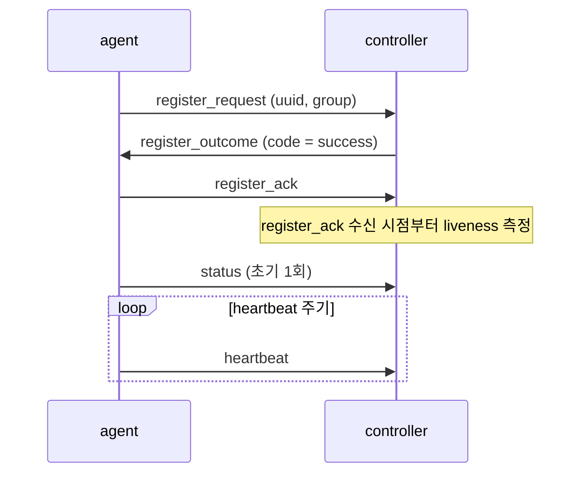

# DDCS Wire Protocol

DDCS는 controller와 agent 사이 TCP 위에서 동작하는 자체 wire protocol로 통신한다.
프로토콜은 `wire::frame`(프레이밍)과 `wire::message`(메시지) 두 계층으로 나뉜다.
프레임 헤더는 **big-endian**, 메시지 body는 **little-endian**으로 의도적으로 다르게 설계하였다.

> 도메인 어휘(Session/Command/Mode 등)는 [GLOSSARY.md](GLOSSARY.md), 전체 구조와 상태기계는 [ARCHITECTURE.md](ARCHITECTURE.md)에 작성하였다.

## Frame (`wire::frame`)

### 레이아웃

```
0       1       2       3       4 ... length + 4
+-------+-------+-------+-------+---------+
|     magic     |    length     | payload |
+-------+-------+-------+-------+---------+
```

### 필드

| 필드     | 크기 (byte) | 바이트 순서 | 의미                          | 비고                      |
| -------- | ----------- | ----------- | ----------------------------- | ------------------------- |
| `magic`  | 2           | big-endian  | DDCS protocol 식별자          | `0xDDC5`로 값 고정        |
| `length` | 2           | big-endian  | payload (= message) 바이트 수 | 헤더 크기는 포함하지 않음 |

### 상수

| 이름               | 값         | 의미                                  |
| ------------------ | ---------- | ------------------------------------- |
| header size        | 4 bytes    | 헤더 크기 (2B magic + 2B length)      |
| magic value        | `0xDDC5`   | 고정 식별자                           |
| max payload length | 1024 bytes | protocol이 허용하는 payload 크기 상한 |

### 계약

- frame 계층은 payload를 **opaque**로 다룬다. 안의 `[type][body]`를 해석하지 않으며, type 디스패치는 app의 몫이다.
- 저수준 `decode()`는 **magic 검증 + length 추출만** 한다(상한 검사를 하지 않아 magic만 맞으면 임의 length를 반환).
- RX 추출(`pull_frame`)은 그 위에 더 한다: 상한 검사(`length > max payload length` -> `too_long`), 완성도 판정(헤더 미도착 / 부분 frame -> `incomplete`), payload 추출과 복사(실패 시 `read_error`)
- 위반을 검출하면 frame 계층은 **결과 코드만 반환**하고, 연결을 끊는 정책은 caller가 수행한다(controller: `reap(protocol_error)` / agent: 재연결).
- 불변식: `header size + max payload length <= rx 버퍼 용량`. 즉 1028 byte가 rx 링에 반드시 들어가야 한다.

| `pull_frame` 결과 | 의미                          | caller 처리                |
| ----------------- | ----------------------------- | -------------------------- |
| (정상)            | 완전한 frame 1개 추출         | `on_frame`으로 디스패치    |
| `incomplete`      | 헤더 미도착 또는 부분 frame   | 더 수신할 때까지 대기      |
| `too_long`        | `length > max payload length` | 프로토콜 위반 -> 연결 종료 |
| `bad_magic`       | magic 불일치                  | 프로토콜 위반 -> 연결 종료 |
| `read_error`      | rx 버퍼 읽기/커밋 실패(손상)  | 프로토콜 위반 -> 연결 종료 |

## Message (`wire::message`)

### 레이아웃

```
0       1 ... length - 1
+-------+------+
| type  | body |
+-------+------+
```

- message type은 body 선두 1바이트이다.
- message body는 little-endian이다(프레임 헤더의 big-endian과 반대).

### Type

type은 고위 nibble로 그룹을 나눈다(문서 규약일 뿐, 코드가 nibble로 그룹을 강제하지는 않는다):

| 값     | 그룹      |
| ------ | --------- |
| `0x0x` | Register  |
| `0x1x` | Telemetry |
| `0x2x` | Command   |

같은 그룹 내 확장은 저위 nibble 안에서 추가한다:

| 값     | 이름               | 방향 | body name:type(byte)                                         |
| ------ | ------------------ | ---- | ------------------------------------------------------------ |
| `0x00` | `invalid`          | -    | -                                                            |
| `0x01` | `register_request` | A->C | `uuid`:uuid(16), `group`:str                                 |
| `0x02` | `register_outcome` | C->A | `code`:enum(1)                                               |
| `0x03` | `register_ack`     | A->C | empty                                                        |
| `0x10` | `heartbeat`        | A->C | empty                                                        |
| `0x11` | `status`           | A->C | `mode`:u8(1), `load`:f64(8), `temp`:f64(8)                   |
| `0x20` | `command_request`  | C->A | `command_id`:u64(8), `command_type`:u8(1), `payload`:command |
| `0x21` | `command_ack`      | A->C | `command_id`:u64(8)                                          |
| `0x22` | `command_outcome`  | A->C | `command_id`:u64(8), `code`:enum(1)                          |

### 인코딩 규약

- `uuid`: raw 16 byte (길이 prefix 없음)
- `str`: 2 byte length prefix(little-endian) + UTF-8 raw bytes(null terminator 없음). 길이는 0 이상이며 frame payload 한계 안에서 임의
- `f64`: IEEE-754 double. 비트를 그대로 u64 little-endian으로 싣는다.
- `code`: `success = 0`, `failed = 1`. `register_outcome`과 `command_outcome`이 **각자의 enum**으로 갖되, wire 바이트(u8)는 공통이다.
- `command`: length prefix 없이 body의 나머지 전부를 차지한다.

### 디코딩 규칙

- decode는 **구조적 검증만** 한다. wire 바이트가 schema 길이 요건과 정확히 부합(부족/trailing 바이트 없음)하는지만 본다.
- enum 값 유효성, 의미 제약은 호출자가 책임진다.
- `message_type()`은 payload 선두 바이트를 그대로 `MessageType`으로 읽는다(검증/소비 없음). 빈 payload면 `invalid`.
- app dispatch 단계에서 카탈로그에 없거나 방향이 어긋난(예: C->A 전용을 controller가 수신) type은 프로토콜 위반으로 보고 연결을 종료한다. 별도 카탈로그 자료구조는 없고, 세션 상태별 dispatch switch가 방향/유효성을 암묵 강제한다.

## Command body (2단 discriminator)

`command_request`(`0x20`)는 2단계로 종류를 가린다.

1. message type(`command_request`): message가 명령임을 결정
2. `command_type`: 뒤따르는 `payload`의 해석을 결정

- `payload`는 length prefix 없이 body의 나머지 전부이며, `CommandType`에 따라 디코드한다.
- wire codec은 `command_type`도 검증하지 않는다(raw u8로 저장). 미지/무효 `command_type`은 app decode 단계에서만 걸린다.

### CommandType

| 값     | 이름       | payload           |
| ------ | ---------- | ----------------- |
| `0x00` | `invalid`  | -                 |
| `0x01` | `set_mode` | `mode` : enum(u8) |

`status.mode`와 `set_mode.mode` enum(u8) 값:

| 값  | 이름          |
| --- | ------------- |
| `0` | `safe`        |
| `1` | `normal`      |
| `2` | `performance` |

- mode 어휘와 wire byte 간 매핑은 `device` 커널이 소유한다(`device::encode_mode`/`decode_mode`).
- wire codec은 raw u8만 싣고, 어휘 유효성 검증은 수신측(`device::decode_mode`)이 한다.
- `set_mode` payload는 정확히 1 byte(mode)다. trailing 바이트가 붙으면 구조적 decode 실패로 거부된다.

## 의미론

### 등록 (3-way handshake)

등록은 3-way handshake다: `register_request`(A->C) -> `register_outcome`(C->A) -> `register_ack`(A->C)



- controller는 `register_ack` 수신 시점부터 liveness를 측정한다. 등록 왕복(outcome 전달 + ack 회신) 지연이 liveness 시한을 잠식하지 않게 하기 위함이며, 등록 구간(요청 대기 / ack 대기)은 단계별로 별도 시한이 걸린다.
- agent는 success `register_outcome`을 받으면 즉시 `register_ack`을 보내고, 곧바로 초기 `status`를 1회 게시한 뒤 `heartbeat` 주기를 무장한다(첫 `heartbeat`는 주기 만료 이후 송신).
- 등록 완료 전 유효한 A->C 메시지는 단계당 하나다: 요청 전엔 `register_request`, 판정 송신 후엔 `register_ack`만 유효하며, 그 외는 프로토콜 위반으로 연결을 종료한다.
- `register_outcome`은 상대를 식별한 뒤에만 송신한다.
  - 식별이 불가능하면(`register_request` decode 실패) 응답 없이 연결을 종료한다.
  - `code = failed`면 판정 송신 후 연결을 종료한다(`register_ack`을 기대하지 않는다).
  - 판정 사유는 로컬 로그로만 남으며, 실패 판정 전달은 best-effort다(송신 직후 종료라 tx가 flush되지 않을 수 있다). success 판정의 송신/인코딩 실패도 등록을 재시작시킨다.

### Liveness

- liveness는 active 세션에서 수신한 **모든 정상 메시지**로 갱신한다.
- `heartbeat`는 body 없는 keepalive다.
- controller는 liveness 타임아웃 시 연결을 강제 종료한다(eviction).

### 식별과 kick-old

- TCP 연결이 곧 transport 식별 단위다. controller 내부 식별자는 wire에 별도로 싣지 않으며, `register_request.uuid`가 재접속을 가로질러 등록 주체를 식별한다(DeviceId = uuid).
- **kick-old**: 같은 `register_request.uuid`로 새 연결이 등록하면 controller가 옛 연결을 강제 종료하고 새 연결을 바인딩한다. "device당 live 세션 1개" 불변식을 지킨다.

### 명령 RPC (상관 / 재전송 / supersede)

- **명령 상관은 `(device, command_id)`이다.**
  - controller는 미결 명령에 타임아웃을 두고, 응답(`command_ack`/`command_outcome`)을 그 device의 현재 등록 연결에서 받아 상관한다.
  - `command_ack`는 슬롯을 닫지 않고 deadline만 연장한다(in-flight 유지). 종결은 `command_outcome`이 한다.
  - 재접속 후 새 연결로 온 늦은 `command_outcome`도 수용한다(같은 device면 유효, 중복 실행 방지에 유리). 이는 disconnect 시 미결 슬롯(`CommandService.pending_`)을 비우지 않기 때문에 성립한다 -- 세션 종료는 Policy belief만 폐기하고 명령 슬롯은 보존한다.
- **재전송은 동일 `command_id`로 한다.**
  - 무응답(timeout) 또는 실패 `command_outcome` 시 controller가 지수 backoff 후 같은 id로 재전송한다.
  - agent는 중복 수신 시 **재실행하지 않는다**. 직전 명령(`last_command_id`) 단건 dedup으로 apply를 건너뛰고, 캐시된 `command_ack` + `command_outcome`을 재송신한다.
    - dedup 창은 한 칸(직전 `command_id`)뿐이며, `command_id = 0`은 dedup에서 제외되어 항상 apply된다.
  - 닫히거나 대체된 `command_id`로 오는 늦은 응답은 stale로 무시한다.
- **supersede (최신 의도 우선)**:
  - 같은 device의 같은 명령 계열(`command_type`)에 새 명령이 발급되면 controller는 옛 미결을 폐기하고 새 명령(새 `command_id`)으로 교체한다.
  - TCP 순서 보장 덕에 agent는 항상 최신을 마지막으로 적용한다.
