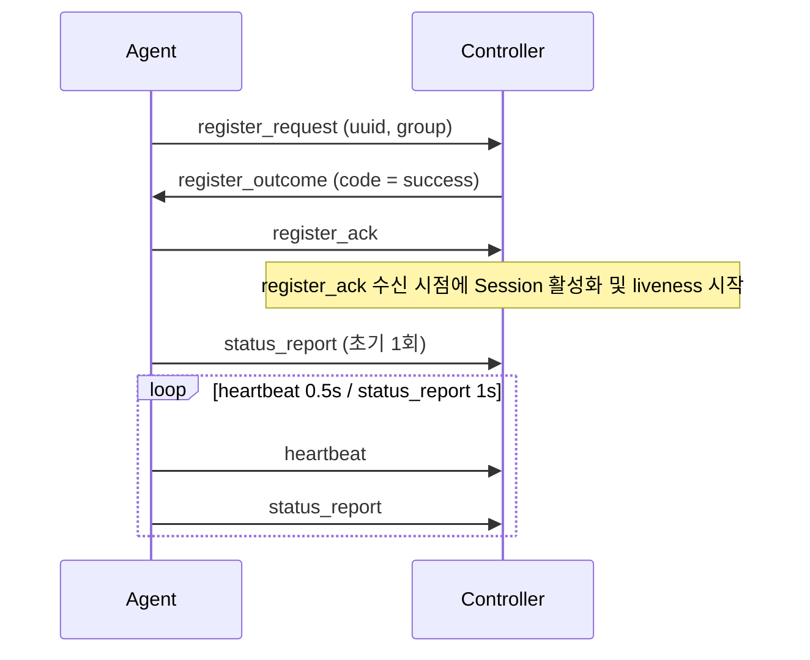

# DDCS Wire Protocol

DDCS의 Controller와 Agent는 TCP 위에서 동작하는 자체 wire 프로토콜로 통신합니다.
프로토콜은 frame(`wire::frame`), message(`wire::message`), command(`wire::command`) 세 계층으로 나뉘고, 하위 계층은 상위 계층의 바이트를 해석하지 않고 전달만 합니다.
wire 포맷과 그 의미론은 이 문서를 기준으로 하며, 구현이 지키는 불변식과 설계 근거는 [ARCHITECTURE](ARCHITECTURE.md)에서 다룹니다.

## 목차

- [Frame](#frame)
- [Message](#message)
- [Command](#command)
- [의미론](#의미론)
  - [등록 (3-way 핸드셰이크)](#등록-3-way-핸드셰이크)
  - [Liveness](#liveness)
  - [식별과 kick-old](#식별과-kick-old)
  - [명령 RPC](#명령-rpc)

## Frame

frame은 바이트 스트림에서 payload의 경계를 구분합니다.
헤더는 **big-endian**을 사용합니다.

```text
0               2               4          4 + length
+---------------+---------------+---------------+
|  magic (u16)  | length (u16)  |    payload    |
+---------------+---------------+---------------+
```

|필드|크기(byte)|의미|
|---|---|---|
|`magic`|2|DDCS 프로토콜 식별자, `0xDDC5` 고정|
|`length`|2|payload(= message) 크기, 헤더 제외|

`length`는 u16이지만 payload는 1024 byte로 제한합니다.
연결별 rx 버퍼(`transport.rx_buffer_size`, 기본 4096)가 frame 하나를 항상 담을 수 있어야 하기 때문이며(불변식: `rx 버퍼 용량 >= 헤더 4 + payload 상한 1024`), 설정값을 올림 보정하는 방식은 [ARCHITECTURE 4절](ARCHITECTURE.md#4-전송과-프로토콜)에서 다룹니다.

frame 계층은 payload를 **불투명한 바이트열(opaque)**로 다루고(디스패치는 app 계층 담당), 위반을 검출하면 **결과 코드만 반환**하며, 연결을 끊을지는 caller가 결정합니다(Controller: `schedule_reap(frame_error)`, Agent: 재접속).

|`decode_frame` 결과|의미|caller 처리|
|---|---|---|
|성공|완전한 frame 1개 추출|`on_frame`으로 디스패치|
|`incomplete`|헤더 미도착 또는 부분 frame|더 수신할 때까지 대기|
|`too_long`|`length > payload 상한`|프로토콜 위반 -> 연결 종료|
|`bad_magic`|magic 불일치|프로토콜 위반 -> 연결 종료|
|`read_error`|rx 버퍼 읽기/커밋 실패 (버퍼 상태 손상)|프로토콜 위반 -> 연결 종료|

## Message

frame 헤더와 달리 message는 **little-endian**을 사용합니다.

```text
0       1                    length
+-------+--------------------+
| type  |        body        |
+-------+--------------------+
```

`length`는 frame 헤더의 `length`와 같으며, body 크기는 `length - 1`입니다.

`MessageType`은 상위 4비트(nibble)로 그룹을 나누고, 같은 그룹의 새 타입은 하위 nibble에 추가합니다:

|값|그룹|
|---|---|
|`0x00`~`0x0F`|register|
|`0x10`~`0x1F`|telemetry|
|`0x20`~`0x2F`|command|

|값|이름|방향|body|
|---|---|:---:|---|
|`0x00`|`invalid`|-|사용 안 함|
|`0x01`|`register_request`|`A→C`|`uuid`:uuid(16), `group`:str|
|`0x02`|`register_outcome`|`C→A`|`code`:enum(1)|
|`0x03`|`register_ack`|`A→C`|empty|
|`0x10`|`heartbeat`|`A→C`|empty|
|`0x11`|`status_report`|`A→C`|`mode`:u8(1), `load`:f64(8), `temp`:f64(8)|
|`0x20`|`command_request`|`C→A`|`command_id`:u64(8), `command_type`:u8(1), `payload`:command|
|`0x21`|`command_ack`|`A→C`|`command_id`:u64(8)|
|`0x22`|`command_outcome`|`A→C`|`command_id`:u64(8), `code`:enum(1)|

body는 `이름:타입(byte)` 형식이며, `str`과 `command`는 가변 길이라 byte를 표기하지 않습니다.

body 타입 규약:

- `uuid`: 길이 접두어 없이 raw 16 byte
- `str`: 2 byte 길이 접두어 + UTF-8 바이트 (null terminator 없음). codec은 길이만 검증하며 UTF-8 유효성은 확인하지 않습니다.
- `f64`: IEEE-754 double. 비트 패턴을 u64 little-endian으로 전송합니다.
- `code`: wire 표현은 u8로 동일하나 message마다 enum이 다릅니다. `register_outcome`은 `success = 0`, `failed = 1` 두 값이고, `command_outcome`은 실패 사유까지 담아 [Command](#command) 절의 표와 같습니다.
- `command`: 길이 접두어 없이 body의 나머지 전부

message 디코딩은 **구조적 검증만** 합니다.
wire 바이트가 schema의 길이 요건과 정확히 일치하는지만 확인하고, enum 값 유효성과 의미 제약은 caller가 책임집니다.
`decode_message()`는 빈 payload, 정의되지 않은 type, 구조 불일치를 모두 거부하며, 방향이 어긋난 message(예: `C→A` 전용을 Controller가 수신)는 수신측 app이 프로토콜 위반으로 판단해 연결을 종료합니다.

## Command

command는 `command_request`(`0x20`)에 담기는 제어 단위이며, 판별자 `command_type`과 body로 구성됩니다.
`command_type`은 message의 필드로 전송되지만 command는 message의 하위 개념이 아닙니다.
하위 계층이 상위 계층의 판별자를 담는 방식은 Ethernet의 EtherType이나 IP의 protocol 필드와 같으며, 판별자가 어디에 실리는지로 계층 소속이 정해지지는 않습니다.

명령의 해석은 두 단계입니다.
message type(`command_request`)이 message가 명령임을, `command_type`이 뒤따르는 `payload`의 해석을 결정합니다.
wire codec은 `command_type`을 검증하지 않으므로, Agent는 `command_request` 구조 디코딩에 성공하면 `command_type`의 유효성과 무관하게 `command_ack`을 먼저 보내고, 수행 결과를 `command_outcome`으로 응답합니다.

`command_outcome`의 `code` enum(u8) 값은 다음과 같습니다:

|값|이름|뜻|
|---|---|---|
|`0`|`success`|명령 수행 성공|
|`1`|`failed`|아래 사유로 갈리지 않는 실패|
|`2`|`apply_failed`|Device의 적용 거부|
|`3`|`bad_mode`|`mode` 어휘 밖의 wire byte 수신|
|`4`|`bad_payload`|command body 디코딩 실패|
|`5`|`unknown_type`|미지 `command_type` 수신|

실패 사유는 Agent만 아는 정보이므로 Agent가 `code`로 전달해, Controller의 로그(`command.reject`의 `code`)와 정책이 같은 값을 공유합니다.
정의 밖의 값은 codec이 통과시키고 수신측 app이 해석하며, 로그에는 이름이 아니라 byte를 그대로 기록합니다(정의 밖의 값은 문자열로 변환하면 사라지는데, 디버깅에 필요한 것이 바로 그 값이기 때문입니다).

정의된 `CommandType`과 `mode` enum(u8) 값은 다음과 같습니다:

|값|이름|body (name:type(byte))|
|---|---|---|
|`0x00`|`invalid`|-|
|`0x01`|`set_mode`|`mode`:enum(u8)|

|값|이름|
|---|---|
|`0`|`safe`|
|`1`|`normal`|
|`2`|`performance`|

Mode와 wire byte 간 매핑은 `device` 모듈이 소유하고, wire codec은 raw u8만 전송하며, 값 유효성 검증은 수신측(`device::decode_mode`)이 담당합니다.
`set_mode` body는 정확히 1 byte(mode)이며, 남는 바이트가 붙으면 구조적 디코딩 실패로 거부됩니다.

## 의미론

### 등록 (3-way 핸드셰이크)

등록은 Agent가 `register_request`로 Device 신원을 제시하고, Controller가 `register_outcome`으로 결과를 회신하며, Agent가 `register_ack`로 수신을 확인하는 세 단계입니다.
Session 상태의 내부 표현과 제한 시간 감시는 [Session 생명주기](ARCHITECTURE.md#5-session-생명주기)에서 다룹니다.



_그림 1. 등록 3-way 핸드셰이크_

- **등록 구간은 단계별 message만 허용합니다**: `handshaking`은 `register_request`만, `confirming`은 `register_ack`만 받고, 그 외 message는 프로토콜 위반으로 연결을 종료합니다.
- **Controller는 신원을 식별한 뒤에만 결과를 송신합니다**: `register_request` 디코딩에 실패해 신원을 알 수 없으면 응답 없이 연결을 종료하고, 실패 사유는 wire로 보내지 않고 로컬 로그에만 남깁니다.
  실패 결과(`code = failed`)의 전달은 best-effort라 송신 큐가 비기 전에 연결이 닫히면 Agent는 결과를 받지 못하며, 성공 결과의 송신이나 인코딩에 실패하면 등록 미완료로 간주하고 연결을 종료합니다.
- **Agent는 `code`에 따라 다음 단계를 결정합니다**: `success`면 즉시 `register_ack`를 보내고, 초기 `status_report`를 1회 보낸 뒤 heartbeat 타이머를 시작합니다(첫 `heartbeat`는 주기 만료 이후).
  `failed`면 연결을 종료합니다.
- **liveness는 `register_ack` 수신 시점부터 시작합니다**: 등록 구간에는 liveness 제한 시간이 아니라 단계별 등록 제한 시간(`handshaking`/`confirming` 각각)을 적용하므로, 핸드셰이크에 걸린 시간이 liveness 제한 시간에서 차감되지 않습니다.

### Liveness

- **수신에 성공한 모든 message는 liveness를 갱신합니다**: `status_report`, `command_ack` 등이 모두 신호이며, `heartbeat`는 보낼 message가 없을 때도 신호가 끊기지 않게 하는 keepalive입니다.
- **제한 시간 내에 신호가 없으면 Session을 축출합니다**: 검사는 sweep 주기(기본 1초)마다 수행하므로, 실제 축출은 `session.liveness_timeout_ms` 경과 후 최대 1초까지 지연될 수 있습니다.
  연결이 끊긴 Agent는 다시 접속해 등록 핸드셰이크부터 다시 시작합니다.

### 식별과 kick-old

- **전송 계층의 식별 단위는 TCP 연결입니다**: Controller 내부 연결 식별자는 wire로 전송하지 않으며, 연결이 바뀌어도 유지되는 등록 주체 식별은 `register_request.uuid`가 담당합니다.
- **kick-old**: 같은 `register_request.uuid`로 새 연결이 등록되면 Controller는 기존 연결을 강제 종료하고 새 연결을 해당 Device에 바인딩합니다.
  이 규칙이 "Device당 바인딩된 연결은 최대 1개" 불변식을 유지합니다.

TCP 연결은 현재 통신 경로를, `register_request.uuid`는 재접속 이후에도 유지되는 Device의 논리적 신원을 식별합니다.

### 명령 RPC

명령은 Controller가 요청하고 Agent가 응답하는 원격 프로시저 호출(RPC)입니다.
재전송과 supersede(대체)의 설계 근거는 [ARCHITECTURE 명령 RPC](ARCHITECTURE.md#7-명령-rpc)에서 다룹니다.

- **대응 키(correlation key)는 `(DeviceId, CommandId)`입니다**: Controller는 발행한 명령을 제한 시간이 걸린 미결 슬롯으로 보관하고, 해당 Device의 현재 등록 연결에서 수신한 응답만 이 키로 대응시킵니다.
  `command_ack`는 슬롯을 닫지 않고 제한 시간만 연장해 명령을 미결(in-flight) 상태로 유지하며, 종결은 `command_outcome`이 담당합니다.
  Session이 끝나도 미결 슬롯(`CommandService::pending_`)은 유지하므로(폐기 대상은 정책의 명령 기억뿐), 재접속 후 새 연결로 도착한 늦은 `command_outcome`도 같은 키에 대응하면 처리합니다.
- **재전송은 동일 `command_id`로 합니다**: 응답 없이 제한 시간을 초과하거나 실패 `command_outcome`을 수신하면, Controller는 지수 백오프 후 같은 `command_id`로 재전송합니다.
  Agent는 직전 명령(`last_command_id_`) 한 건을 보관하는 단일 슬롯 중복 제거로 중복을 판정해, 적용을 건너뛰고 캐시된 `command_ack`와 `command_outcome`을 다시 송신합니다.
  `command_id`는 Controller가 1부터 단조 증가로 발급하고 0은 invalid 예약값이므로, `command_id = 0`은 중복 제거 대상에서 제외하며 항상 적용합니다.
- **supersede**: Controller가 같은 Device의 같은 명령 계열(`command_type`)에 새 명령을 발행하면, 기존 미결 명령을 폐기하고 새 `command_id`로 교체합니다.
  동일 연결에서는 TCP가 순서를 보장하므로 Agent가 새 명령을 받은 뒤에 이전 명령을 적용하는 일은 없으며, 이미 닫혔거나 대체된 `command_id`로 도착한 늦은 응답은 무효(stale)로 보고 무시합니다.
