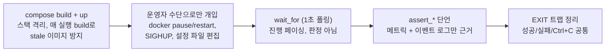

# DDCS 검증 시나리오

`scripts/scenario.sh`는 DDCS의 핵심 동작 다섯 가지를 각각 격리해 검증하는 러너입니다.
시나리오마다 독립된 docker 스택을 기동하고, Controller의 실제 출력(raw 메트릭 `:9000` + JSON 이벤트 로그)만 근거로 PASS/FAIL을 판정한 뒤 종료 코드로 결과를 반환합니다.
Grafana 같은 관측 스택 없이 동작하므로 CI에서도 그대로 돌릴 수 있습니다.

```sh
scripts/scenario.sh thermal            # 과열된 Device만 safe로, 식으면 복귀
scripts/scenario.sh agent-reconnect    # 재시작한 Device에 현재 Mode 재명령
scripts/scenario.sh regime-transition  # 부하 밴드에 따라 busy와 idle을 오가는 전환
scripts/scenario.sh liveness-eviction  # 침묵 축출과 자동 재접속
scripts/scenario.sh policy-reload      # 정책 리로드와 잘못된 형식 거부
scripts/scenario.sh all                # 다섯 시나리오 순차 실행
```

## 목차

- [한눈에 보기](#한눈에-보기)
- [공통 동작 원리](#공통-동작-원리)
- [thermal: 과열된 Device만 보호 Mode로](#thermal-과열된-device만-보호-mode로)
- [agent-reconnect: 재접속한 Device에 재명령](#agent-reconnect-재접속한-device에-재명령)
- [regime-transition: 부하 밴드 전환](#regime-transition-부하-밴드-전환)
- [liveness-eviction: 침묵 축출과 자동 복구](#liveness-eviction-침묵-축출과-자동-복구)
- [policy-reload: 정책 리로드](#policy-reload-정책-리로드)
- [환경 변수](#환경-변수)
- [알려진 한계](#알려진-한계)

## 한눈에 보기

|시나리오|검증하는 주장|스택|대략 소요|
|---|---|---|---|
|`thermal`|thermal 트립은 Group이 아니라 **Device 단위**로 동작한다|zone 4개 × 5대 (scale)|약 3분|
|`agent-reconnect`|재접속한 Device는 **반드시 현재 정책 Mode로 재명령**받는다|Agent 4대|약 2분|
|`regime-transition`|Group 평균 부하가 **히스테리시스 밴드**로 busy/idle을 전환한다|Agent 4대|약 2.5분|
|`liveness-eviction`|응답이 멎은 Agent를 **Controller가 liveness로 축출**하고, 재개하면 다시 접속한다|Agent 4대|약 1.5분|
|`policy-reload`|SIGHUP으로 **재시작 없이 정책을 교체**하고, 잘못된 형식의 편집은 거부한다|Agent 4대|약 2분|

소요 시간은 이미지가 캐시된 경우 기준입니다.
각 시나리오가 검증하는 설계 자체는 ARCHITECTURE의 [정책 엔진](ARCHITECTURE.md#6-정책-엔진), [Session 생명주기](ARCHITECTURE.md#5-session-생명주기), [Agent 재접속](ARCHITECTURE.md#8-agent-재접속) 절에서 서술합니다.

## 공통 동작 원리

다섯 시나리오는 `scripts/scenario-lib.sh`의 같은 골격을 공유합니다:



_그림 1. 시나리오 공통 골격_

- **판정과 페이싱의 분리**: `wait_for`가 제한 시간을 초과해도 시나리오는 계속 진행되고, 마지막에 `assert_*`가 실제 관측값으로 판정하며, 단언이 하나라도 실패하면 종료 코드가 0이 아닙니다.
- **공허한 통과 방지**: 측정 후에야 알 수 있는 수치를 기대값으로 박아두지 않고, 전환의 발생·공존·증가분 같은 정성 명제를 단언합니다.
  단언이 의미를 갖도록 사전 조건(예: 재명령 검증의 "첫 명령 수신")을 먼저 만들어 둡니다.

전제 조건: docker, docker compose v2, curl. 호스트 포트 8080(wire)/9000(메트릭)이 비어 있어야 합니다.

## thermal: 과열된 Device만 보호 Mode로

**주장.** 과열 트립은 Device 단위로 동작합니다.
같은 zone에서 과열된 Device만 safe로 빠지고, `cool_temp` 아래로 식으면 Base Mode로 복귀합니다.

**증거 논리.** 같은 zone의 Device들은 같은 Policy를 공유하므로, 트립이 Group 단위라면 어느 순간이든 zone 전체가 같은 Mode여야 합니다.
따라서 **한 스냅샷 안에 performance와 safe가 공존**하는 것 자체가 Device 단위 분기의 증거이며, 공존은 두 값이 같은 순간에 있었다는 주장이므로 반드시 한 번의 scrape 응답 안에서 두 값을 함께 읽습니다.
발열 시점이 어긋나는 개체차는 Agent가 만듭니다(초기 load/temp 랜덤, load rate ±10% jitter, Device별 noise 시드).

**진행.**

1. scale compose로 zone 4개 × `DDCS_SCENARIO_PER_ZONE`(기본 5)대를 기동하고 전 대수 연결을 기다립니다.
2. 70초 동안 대기합니다. performance 구간의 발열(+6°/s)이 `hot_temp`(65°)에 도달하면서 트립이 누적됩니다.
3. 약 28초간 2초 간격으로 `ddcs_group_devices`를 14회 샘플링해, zone별 (performance, safe) 공존과 safe 수의 감소(= 회복)를 찾습니다.
4. Controller 로그에서 `policy.thermal.update`(thermal=hot)의 distinct Device 수를 셉니다.

**PASS 기준.**

|단언|의미|
|---|---|
|distinct hot Device ≥ 전 대수|모든 Device가 저마다의 시점에 개별 트립했다|
|한 스냅샷에 performance·safe 공존 ≥ 1회|트립이 Group이 아니라 Device 단위다|
|zone의 safe 수 감소 ≥ 1회|과열 Device가 식어서 Base Mode로 복귀했다|

## agent-reconnect: 재접속한 Device에 재명령

**주장.** 재시작한 Device가 같은 DeviceId로 다시 접속하면, 다음 정책 평가에서 반드시 현재 목표 Mode를 다시 명령받습니다.
Controller는 Device마다 마지막으로 명령한 Mode의 기억(코드의 commanded belief)을 보관해 기억이 목표와 같으면 명령을 생략하는데, Session이 끊기면 이 기억을 폐기하기 때문입니다.
폐기하지 않으면 Controller가 옛 기억을 근거로 명령을 생략해, normal로 부팅한 Device가 그대로 방치됩니다.

**증거 논리.** 명령 기억이 없으면 이 단언은 공허하게 통과합니다(어차피 첫 명령이 나가므로).
그래서 재시작 전에 해당 Device가 정책 Mode로 한 번 이상 명령받기를 기다려 기억을 만들어 두고, 그다음 재시작이 dispatch를 증가시키는지 봅니다.

**진행.**

1. 고정 `DDCS_DEVICE_ID`를 가진 Agent 4대를 기동합니다.
2. agent-01의 Device가 첫 `command.dispatch`를 받을 때까지 기다립니다(명령 기억 형성).
3. `docker restart`로 agent-01을 재시작합니다. SimulatedDevice는 normal로 부팅됩니다.
4. 재등록(`session.connection.register.accept`)을 기다린 뒤, 재시작 전후의 dispatch/register 횟수를 비교하고 해당 Device의 타임라인 로그를 출력합니다.

**PASS 기준.**

|단언|의미|
|---|---|
|register 횟수 +1 이상|같은 DeviceId로 재등록됐다|
|dispatch 횟수 +1 이상|재접속 후 재명령이 나갔다|

## regime-transition: 부하 밴드 전환

**주장.** Group 평균 부하가 히스테리시스 밴드를 넘나들면 Regime이 busy(performance)와 idle(normal)로 전환됩니다.

**증거 논리.** 시뮬레이션은 Mode에 따라 부하가 변하는 폐루프입니다.
performance는 부하를 깎고(-4/s) normal은 쌓으므로(+2/s), 정책이 정상 동작하면 부하가 limit cycle로 진동하며 `busy_load` 초과와 `idle_load` 미만을 번갈아 지납니다.
따라서 양방향 전환이 모두 발생하는 것 자체가 밴드 판정과 폐루프가 함께 동작한다는 증거입니다.
zone당 1대 구성을 쓰는 이유는 Group 평균이 곧 그 Device의 부하가 되어 진동이 선명해지기 때문입니다.

**진행.**

1. Agent 4대(zone당 1대)를 기동합니다.
2. 90초 동안 대기해, 부하가 밴드 양끝을 교차할 시간을 줍니다.
3. Controller 로그의 `policy.regime.update`에서 busy/idle 전환 횟수를 세고, 최근 전환 로그와 현재 `ddcs_group_load_avg`를 출력합니다.

**PASS 기준.**

|단언|의미|
|---|---|
|busy 전환 ≥ 1|평균 부하가 `busy_load`를 넘어 busy로 판정됐다|
|idle 전환 ≥ 1|평균 부하가 `idle_load` 아래로 내려가 idle로 판정됐다|

전환 횟수의 상한(잦은 전환 억제)은 밴드 설계의 몫이므로([설계 결정](ARCHITECTURE.md#9-설계-결정)) 단언하지 않고, 전환이 양방향으로 실제 발생하는지만 확인합니다.

## liveness-eviction: 침묵 축출과 자동 복구

**주장.** liveness 상실 감지는 Controller가 구동합니다(Agent에는 자체 liveness 타이머가 없습니다).
heartbeat가 끊기면 Controller가 Session을 축출하고, Agent가 재개되면 다시 접속합니다.

**증거 논리.** `docker stop`은 FIN이 나가 즉시 감지되므로 liveness 경로를 지나지 않습니다.
`docker pause`는 프로세스를 얼려 소켓은 열려 있는데 아무것도 보내지 않는 half-open과 같은 상황을 만들므로, 이때 발생하는 축출은 오직 liveness 타이머(`liveness_timeout_ms` 1.5초, sweep 1초 해상도)의 결과입니다.
unpause 후에는 Agent가 끊긴 연결에서 hangup을 관측하고 3-way 핸드셰이크로 다시 접속합니다.

**진행.**

1. Agent 4대를 기동하고 잠시 정상 운영합니다.
2. `docker pause`로 agent-01을 얼린 뒤, 연결 수가 3으로 줄고 `ddcs_agents_evicted_total`이 오르기를 기다립니다.
3. `docker unpause`로 재개한 뒤, 연결 수 4 복구와 해당 Device의 재등록을 기다립니다.

**PASS 기준.**

|단언|의미|
|---|---|
|정지 중 evicted_total +1 이상|무신호를 liveness로 감지해 축출했다|
|정지 중 연결 수 = 3 (정확히)|축출된 것은 얼린 그 Agent 하나뿐이다|
|재개 후 연결 수 ≥ 4|fleet이 원상 복구됐다|
|해당 Device register +1 이상|재접속이 재등록으로 이어졌다|

## policy-reload: 정책 리로드

**주장.** 운영자가 `config/controller.json`을 고치고 SIGHUP을 보내면 Controller는 재시작 없이 새 정책을 적용하고, 명령 기억을 비운 뒤 동작 중인 fleet에 다시 명령합니다.
반면 잘못된 형식의 편집은 적용 전에 걸러 거부하고 옛 정책을 유지합니다.

**증거 논리.** "재적용 + 재명령"을 결정적으로 관측하려고 zone_a의 busy/idle Mode를 둘 다 safe로 강제하는 정책을 씁니다.
load 임계만 바꾸면 limit cycle 때문에 결과 Mode가 흔들려 단언이 비결정적이 되고, busy와 idle에 같은 Mode를 넣어도 GroupRule 불변식은 low < high만 강제하므로 유효한 편집입니다.
부팅 정책에서도 zone_a는 진동 중에 safe를 스칠 수 있으므로, 단발 관측이 아니라 6초간 3회 연속 safe를 요구해 우연을 배제합니다.
성공 로드(`policy.load`)와 거부(`policy.load.fail`)는 별개 이벤트라 각각 따로 셉니다.

**진행.**

1. Agent 4대를 기동하고, fleet이 정책 Mode로 첫 명령을 받아 명령 기억을 갖게 합니다.
2. PHASE 1(유효한 편집): zone_a를 safe로 강제하는 정책으로 파일을 바꾸고 SIGHUP을 보낸 뒤, `trigger=reload` 처리와 `policy.load` 재발생, zone_a의 safe 정착(3회 연속)을 확인합니다.
3. PHASE 2(잘못된 형식): 깨진 JSON으로 바꾸고 SIGHUP을 보낸 뒤, `policy.load.fail(reason=parse)` 발생과 성공 로드 수 불변, 연결 수 유지를 확인합니다.
4. 원본 설정은 시작 시 백업해 두었다가 EXIT 트랩에서 복원합니다.

**PASS 기준.**

|단언|의미|
|---|---|
|`trigger=reload` ≥ 1|SIGHUP이 리로드 경로를 탔다|
|`policy.load` +1 이상|새 정책이 재시작 없이 적용됐다|
|zone_a safe 3회 연속|재적용이 명령 기억을 비우고 fleet에 실제로 다시 명령했다|
|`reason=parse` ≥ 1|잘못된 형식의 편집이 적용 전에 거부됐다|
|성공 load 수 불변|거부된 편집이 성공으로 잘못 집계되지 않았다|
|연결 수 ≥ 4 유지|잘못된 편집에도 fleet이 죽지 않았다|

## 환경 변수

|변수|기본값|용도|
|---|---|---|
|`DDCS_SCENARIO_SOAK`|시나리오별|안정화/누적 대기 시간(초). 느린 장비에서 늘릴 수 있습니다|
|`DDCS_SCENARIO_PER_ZONE`|5|thermal에서 zone당 Agent 수|
|`DDCS_METRICS_URL`|`http://localhost:9000/metrics`|메트릭 주소|
|`DDCS_CONTROLLER_CONTAINER`|`ddcs-controller`|로그를 읽을 컨테이너 이름|
|`DDCS_SIM_NOISE` / `DDCS_SIM_JITTER`|1.0 / 0.10|Device 동역학 노브. **compose 파일의 agent `environment`에 적어야** 컨테이너에 전달됩니다|

`DDCS_SCENARIO_SOAK`의 기본값은 기본 동역학(rate·임계)에 맞춘 값이므로, `DDCS_SIM_*`로 동역학을 바꾸면 대기 시간도 함께 조정해야 합니다.

## 알려진 한계

- **agent-reconnect의 재명령 단언은 창이 겹칠 수 있습니다**: 판정 창 안에 자연스러운 정책 전환이 우연히 겹치면 그 dispatch도 증가분으로 집계됩니다. 함께 출력되는 타임라인으로 교차 확인할 수 있습니다.
- **policy-reload는 repo의 `config/controller.json`을 직접 편집합니다**: EXIT 트랩이 원본을 복원하지만, SIGKILL로 죽이면 복원이 건너뛰어질 수 있습니다(백업은 mktemp 파일에 남습니다).
- **비정상 종료 후 잔존 스택은 로그를 오염시킬 수 있습니다**: compose가 기존 컨테이너를 재사용해 이전 실행의 로그가 집계에 섞일 수 있으므로, `docker compose down`으로 정리 후 실행하십시오.
- **판정은 시간 의존적입니다**: soak과 대기 제한 시간은 기본 동역학 기준의 여유값이라, 극단적으로 느린 환경에서는 거짓 FAIL이 날 수 있습니다(거짓 PASS 방향이 아니라 보수적 방향입니다).
