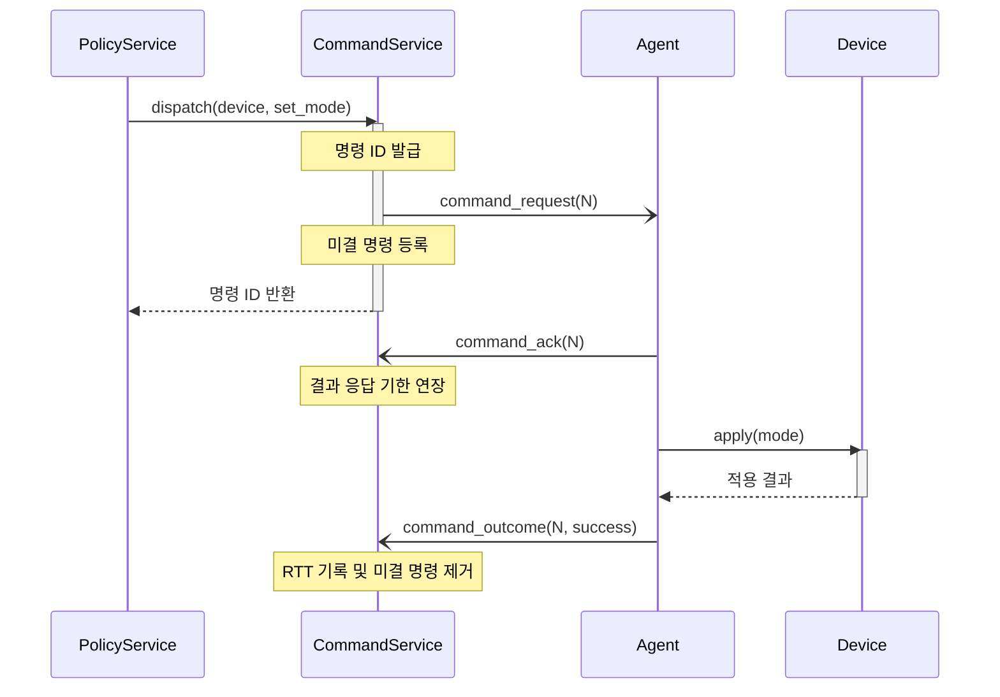
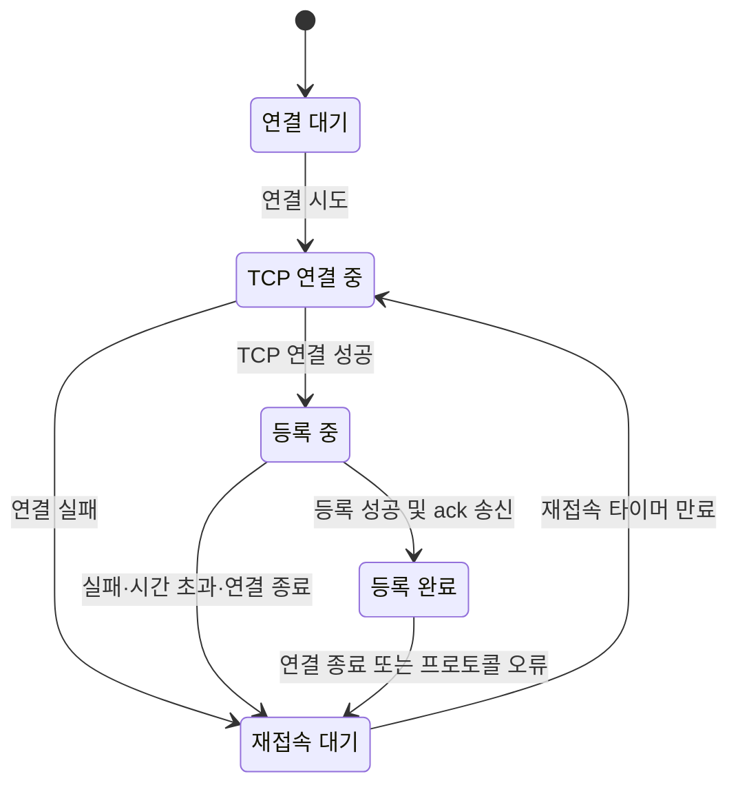

# DDCS 아키텍처

여러 장치의 상태를 바탕으로 제어하려면 연결이 끊기거나 응답이 늦어져도 장치의 신원, 관측 상태, 진행 중인 명령을 구분할 수 있어야 합니다.
DDCS는 이들을 각각 DeviceId, DeviceShadow, 미결 명령으로 관리하고, 연결과 도메인 처리를 분리해 재접속 이후에도 제어를 이어갑니다.

## 목차

- [시스템 구성](#시스템-구성)
- [런타임 모델](#런타임-모델)
- [전송과 버퍼](#전송과-버퍼)
- [연결과 등록](#연결과-등록)
- [명령 처리](#명령-처리)
- [재접속](#재접속)
- [코드 구조](#코드-구조)
- [한계](#한계)

## 시스템 구성

하나의 Controller가 여러 Agent와 통신하며, 각 Agent는 장치 하나의 상태를 조회하고 명령을 적용합니다.
Controller의 정책 엔진은 보고받은 상태로 목표 동작 모드를 결정합니다. 사람이 직접 명령을 발행하는 API는 없으며, 운영자는 설정 파일의 정책을 변경해 제어 기준을 조정합니다.

그림 1은 Controller 내부의 역할과 외부 인터페이스를 보여줍니다.

*그림 1. Controller의 구성 요소와 외부 인터페이스*

|구성 요소|책임과 수명|
|---|---|
|Agent와 Device|Agent가 Device의 상태를 조회하고 명령을 적용합니다. 현재 제공하는 Device 구현은 모의 장치입니다.|
|Session|TCP 연결을 DeviceId에 바인딩합니다. 연결이 종료되면 사라집니다.|
|DeviceShadow|Controller가 DeviceId별로 보관하는 관측 상태입니다. 연결이 종료되어도 같은 Controller 프로세스 안에서는 남습니다.|
|PolicyService|구역별 부하와 장치별 온도로 목표 동작 모드를 결정합니다.|
|CommandService|명령의 발행, 응답 대기, 재전송과 종결을 담당합니다.|

*표 1. 상태 조회부터 명령 전달까지의 책임 구분*

Controller는 통신 상대를 별도의 Agent 엔티티로 보관하지 않고 Session과 DeviceShadow로 표현합니다.
장치 상태의 원본은 Agent 쪽 Device에 있으므로, Shadow는 다음 상태 보고로 갱신할 수 있는 사본입니다.
이를 메모리에만 보관하면 오래된 영속 스냅샷과 새 보고의 우선순위를 조정하거나 DB 접근 실패를 처리할 필요가 없습니다.
대신 Controller가 재시작하면 Shadow와 미결 명령이 사라지며, 재접속과 재보고가 이루어질 때까지 제어를 재구성해야 합니다.

정책의 판단 기준과 명령 발행 조건은 [정책 엔진](policy.md)에, 운영 설정은 [설정](config.md)에 정리했습니다.

## 런타임 모델

### 하나의 이벤트 루프

다수의 연결마다 스레드를 두면 연결 수에 따라 실행 자원과 동기화 지점이 늘어납니다.
DDCS의 각 프로세스는 싱글 스레드 edge-triggered epoll 리액터 하나에서 소켓과 타이머를 처리합니다.
상태 접근이 한 스레드 안에서 순차적으로 이루어지므로 도메인 처리에 락을 두지 않습니다.
대신 콜백 하나가 오래 실행되면 다른 연결과 정책 평가도 함께 지연되며, 여러 코어를 자동으로 활용하지 못합니다.

멀티스레드 리액터는 Group 집계에 동기화를 다시 요구하고, io_uring으로 전환하려면 readiness 중심 구조를 completion 중심으로 바꿔야 합니다.
현재 구조에서는 단일 루프의 처리량과 지연을 함께 측정해 감당 가능한 규모를 판단합니다. 측정 절차는 [성능 측정](performance.md)에 정리했습니다.

`Reactor`는 `epoll_wait`로 준비된 fd를 받고 소유 `Channel`의 핸들러를 호출합니다.
소켓, 타이머, 신호, 메트릭 HTTP 서버가 같은 경로로 디스패치됩니다.
`TimerScheduler`는 하나의 timerfd와 deadline 최소힙으로 여러 논리 타이머를 관리하고, `SignalSource`는 SIGINT·SIGTERM 및 Controller의 SIGHUP을 받습니다.
edge-triggered 모드에서는 각 I/O 핸들러가 처리 가능한 데이터를 `EAGAIN`까지 소비해야 남은 데이터를 놓치지 않습니다.
파일 설정 로드·재로드, DNS 조회와 로그 출력 같은 작업은 루프를 지연시킬 수 있으므로 모든 경로가 논블로킹인 것은 아닙니다.

AgentFleet도 같은 구조에서 여러 Device의 Connector와 SessionService를 조립합니다.
각 연결과 장치 상태는 독립적이며 Reactor, TimerScheduler, SignalSource와 메시지 풀을 공유합니다.
모든 Agent가 같은 Group에 등록되며, 실행 방법과 부하 생성 범위는 [성능 측정](performance.md)에 정리했습니다.

### 주기 작업과 수명 관리

Controller는 하나의 sweep 타이머에서 **명령 재전송 → 만료 Session 종료 → 정책 평가** 순서로 처리합니다.
작업마다 타이머를 나누면 발화 시각에 따라 순서가 달라지지만, 이 구조에서는 연결 종료와 발행 기록 정리가 다음 정책 평가에 미치는 영향을 한 tick 안에서 추적할 수 있습니다.

첫 실행은 시작 시각에 설정 주기(코드 기본값 1초)를 더해 예약하고, 이후에는 이전 예약 시각을 기준으로 다음 시각을 정합니다.
작업 종료 시 이미 지난 주기는 건너뛰어 밀린 평가를 연속 실행하지 않습니다.
제한 시간 검출은 sweep 주기와 이벤트 루프 지연의 영향을 받으며, 정확한 시각이나 최대 지연을 보장하지 않습니다.
시작 지연·소요 시간·건너뛴 주기는 [메트릭](metrics.md)으로 관측합니다.

한 스레드에서도 fd 재사용과 콜백 안의 재진입은 객체 수명을 복잡하게 만듭니다.
epoll 토큰에는 포인터 대신 generation과 fd를 넣어, 이미 닫힌 fd의 이벤트가 새 Channel에 전달되는 것을 막습니다.
연결 해제는 reap 큐에 넣고 안전한 지점에서 수행하며, frame 추출 루프는 콜백 이후에도 연결이 남아 있는지 다시 확인합니다.
리액터에 등록된 Channel을 해제 없이 닫거나, 발급한 핸들이 남은 ObjectPool을 먼저 파괴하면 `std::terminate`가 호출됩니다. 등록 해제와 객체 선언 순서도 이 수명 규약을 따라야 합니다.

## 전송과 버퍼

TCP는 메시지 경계 없이 바이트를 전달하므로, 한 번의 수신에서 메시지가 잘리거나 여러 개가 함께 올 수 있습니다.
양측 transport는 공통 `wire::frame`으로 완전한 frame만 추출하고, message 해석은 app에 넘깁니다.
바이트 형식과 오류 처리 계약은 [프로토콜](protocol.md)에 정리했습니다.

그림 2는 상태 보고와 명령이 버퍼·코덱·서비스를 거치는 경로를 보여줍니다.

*그림 2. 상태 보고와 명령 전달의 데이터 파이프라인*

수신 루프는 rx 링버퍼에서 완전한 frame을 추출해 풀에서 확보한 메시지 버퍼로 전달합니다.
송신 시에는 메시지 앞에 확보해 둔 헤드룸에 길이 헤더를 써서, frame을 만들기 위한 별도 payload 복사를 피합니다.

rx 링버퍼는 2의 거듭제곱 크기이면서 최대 frame인 1028 byte(헤더 4 + payload 1024) 이상이어야 합니다.
한 frame을 통째로 담지 못하면 추가 수신과 frame 완성 대기가 서로 막힐 수 있습니다.
양측 transport는 `wire::frame::fit_rx_capacity()`로 설정값을 보정하며, 보정된 경우 `transport.rx_buffer.adjust`에 요청값과 실효값을 기록합니다.

짧은 제어 메시지를 연속 송신하는 경로에서는 Nagle의 묶음 대기를 피하도록 양측 소켓에 `TCP_NODELAY`를 설정합니다.
Agent의 ack와 outcome은 별도 메시지로 송신됩니다. 이를 `writev`로 묶는 방법도 있지만 송신 큐의 부분 소비 처리가 달라집니다.
현재 선택은 짧은 메시지의 전송을 우선하며, 그에 따라 패킷 수가 늘어날 수 있습니다.

## 연결과 등록

연결이 새로 생겼다는 사실만으로 어느 장치인지 알 수는 없습니다.
Controller는 등록 요청의 UUID와 Group으로 장치를 식별한 뒤, 결과를 Agent가 확인해야 Session을 활성화합니다.
등록 메시지의 순서는 [프로토콜의 등록 절](protocol.md#등록)에 정리했습니다.

|Session 상태|대기하는 입력|제한 시간 기준|
|---|---|---|
|`handshaking`|`register_request`|연결 등록 시각|
|`confirming`|`register_ack`|Device 바인딩 시각|
|`active`|heartbeat·상태 보고·명령 응답|마지막 유효 메시지 수신 시각|

*표 2. Controller의 Session 상태와 제한 시간 기준*

`SessionRegistry`는 연결을 기본 키로, DeviceId를 역색인으로 관리해 장치당 바인딩된 연결을 최대 하나로 제한합니다.
등록 요청을 받아 바인딩한 시점에는 아직 `confirming`이며, `register_ack` 수신 후 `active`가 되어 liveness 측정을 시작합니다.
등록 단계의 제한 시간은 상태가 전이할 때만 갱신하므로 무관한 메시지를 보내 대기를 연장할 수 없습니다.
허용되지 않은 타입·방향이나 디코딩 실패는 연결 종료로 처리합니다.

같은 UUID로 새 연결이 등록되면 기존 연결을 종료하고 새 연결을 채택합니다(kick-old).
기존 연결이 이미 끊겼지만 아직 감지하지 못했더라도 liveness 만료를 기다리지 않고 복귀할 수 있습니다.
기존 연결을 우선하거나 신규 등록을 거부하면 이 복귀가 지연되고, 두 연결을 모두 두면 장치당 하나라는 규약이 깨집니다.
다만 UUID는 Agent가 신고하는 값이므로 이 규칙만으로 정당한 장치인지 인증할 수는 없습니다.

활성 Session에서는 허용된 heartbeat, 상태 보고, 명령 응답이 모두 `last_seen`을 갱신합니다.
상태 보고를 디코딩한 뒤에는 `StatusService`가 부하와 온도의 유한성을 검사합니다.
NaN이나 Inf가 포함된 샘플은 Shadow에 반영하지 않고 직전 유효값을 유지하지만, 메시지를 수신했으므로 liveness는 갱신합니다.
샘플의 유효성과 연결의 생존 여부를 구분하는 것입니다.

## 명령 처리

정책이 목표를 결정했더라도 요청 송신만으로 장치에 적용됐다고 판단할 수는 없습니다.
`CommandService`는 요청마다 ID와 응답 기한을 보관하고, 수신 확인(ack)과 적용 결과(outcome)를 나누어 처리합니다.
ack는 요청 구조를 읽었다는 뜻이며 성공을 뜻하지 않습니다. 미결 상태를 유지한 채 결과를 기다릴 기한만 연장합니다.

그림 3은 정책 판단 이후 명령이 완료되는 정상 경로를 보여줍니다.

*그림 3. 명령의 수신 확인과 적용 결과 처리*

명령 ID는 Controller 프로세스에서 1부터 증가하며 재접속으로 초기화되지 않습니다.
응답은 현재 등록 연결이 가리키는 DeviceId와 CommandId로 대응시킵니다.
연결이 종료되어도 `CommandService`의 미결 명령은 남으므로, 새 연결에서 같은 키로 수신한 응답은 아직 명령이 유효한 경우 처리할 수 있습니다.
이 기록은 연결 종료 시 지우는 **정책의 마지막 발행 목표**와 별개입니다.

### 재전송과 대체

응답 기한을 넘기거나 실패 outcome을 받으면 시도 횟수를 확인하고 지수 백오프 후 같은 ID로 재전송합니다.
첫 전송이 불가능하면 발행 실패로 끝나며, 재전송 시 offline 또는 인코딩 실패가 발생해도 최종 실패로 처리합니다.
코드 기본값과 배포 설정은 최대 3회 시도, 백오프 기준 500ms입니다. `max_attempts = 1`이면 같은 논리 명령을 재전송하지 않습니다.

그 사이 목표가 바뀌면 같은 장치·명령 계열의 기존 미결 명령을 폐기하고 새 ID로 대체합니다(supersede).
새 명령의 첫 송신이 실패하더라도 이전 명령을 되살리지 않습니다.
이미 완료되었거나 대체된 ID의 늦은 응답은 오류로 연결을 끊지 않고 stale 응답으로 집계해 무시합니다.

Agent는 직전 명령 ID와 결과 한 건만 기억하고, 같은 ID를 다시 받으면 Device에 재적용하지 않고 응답을 재송신합니다.
현재 `set_mode`는 목표 상태를 지정하는 멱등 연산이며, TCP 순서와 같은 계열 명령의 대체 규칙을 바탕으로 이 제한된 캐시를 사용합니다.
연결이 바뀌면 캐시는 초기화됩니다. 따라서 영속적인 exactly-once 처리를 보장하지 않으며, 비멱등 명령을 추가한다면 중복 제거 범위를 다시 설계해야 합니다.

각 명령은 시도 횟수가 제한되므로 최소 한 번의 전달도 무조건 보장하지 않습니다.
최종 실패는 정책에 통지되고, 정책은 다음 평가에서 현재 목표에 대한 새 논리 명령을 발행할 수 있습니다.
지속적인 실패에서는 정책 주기마다 새 시도가 생길 수 있으므로, 한 명령의 재전송 한도와 정책의 재발행을 구분해야 합니다.
발행을 생략하거나 다시 시작하는 조건은 [정책 엔진](policy.md#명령-발행)에 정리했습니다.

## 재접속

장애 뒤 모든 Agent가 즉시 재접속하면 Controller가 복구되는 순간 연결 요청이 몰릴 수 있습니다.
Agent의 `Connector`는 연결 실패나 종료를 한 재접속 경로로 모으고 지수 백오프에 jitter를 더해 재시도 시점을 분산합니다.

그림 4는 TCP 연결부터 등록 완료까지의 상태와 실패 경로를 보여줍니다.

*그림 4. Agent의 연결과 재접속 흐름*

백오프는 `base × 2^attempt`에 상한을 적용한 뒤 ±25% jitter를 더합니다.
코드 기본값인 기준 1초·상한 30초에서는 jitter 적용 전 대기가 1, 2, 4, 8, 16, 30초로 증가합니다.
상한 적용 뒤 jitter가 붙으므로 실제 대기는 약 37.5초까지 늘어날 수 있습니다. 배포 설정의 기준·상한은 0.2초·5초이며 실행 설정에 따라 달라집니다.
난수 생성기는 결정적 xorshift32여서 같은 seed의 수열을 테스트에서 재현할 수 있습니다.

백오프 초기화 시점은 TCP 연결 성공이 아니라 등록 성공입니다.
연결만 수락하고 등록에 응답하지 못하는 Controller에 대해서도 재시도 간격이 계속 늘어납니다.
끊긴 연결의 fd·버퍼·타이머를 정리한 뒤, 재연결에서는 등록 절차 전체를 다시 수행합니다.
Agent 자체에는 활성 연결의 liveness 타이머가 없으므로, 응답 없이 멈춘 Controller의 감지는 TCP나 상대의 연결 종료에 의존합니다.

## 코드 구조

소켓 처리와 정책 판단이 서로의 구현에 의존하면 전송 방식을 바꿀 때 도메인 코드도 함께 바뀝니다.
DDCS는 app 계층이 필요한 전송·시계·장치 접근을 port 계약으로 정의하고, infra가 이를 구현하도록 구성했습니다.
Controller와 Agent는 각각 domain, app, infra를 가지며 공개 facade가 실행에 필요한 객체를 조립합니다.

그림 5는 모듈 사이의 의존 관계를 보여줍니다.

*그림 5. 공통 모듈과 Controller·Agent 계층의 의존 관계*

|모듈|담당 내용|
|---|---|
|`common`|strong id, UUID, 버퍼, object pool, 시계, endian 처리|
|`json`, `logger`, `config`|JSON 코덱, JSONL 로깅, 단일 JSON 파일 설정 로드|
|`io`, `net`|epoll 리액터, timerfd·signalfd, fd 수명 관리, 소켓 I/O|
|`device`|공유 동작 모드와 wire byte 변환|
|`wire`|frame·message·command 코덱|
|`ctrl/domain`, `agent/domain`|장치 상태·정책과 Device 구현|
|`ctrl/app`, `agent/app`|등록, 상태 보고, 정책 평가, 명령 처리와 port 계약|
|`ctrl/infra`, `agent/infra`|서버·Connector·메트릭 HTTP 서버 등 어댑터|
|`ctrl`, `agent`|공개 facade와 의존성 조립; infra 의존성은 CMake PRIVATE로 숨김|
|`profile`|선택적 계측과 프로파일 데이터 처리|

*표 3. 라이브러리 모듈의 책임*

전송 port가 제공하는 계약은 연결별로 크기가 제한된 메시지를 주고받는 것입니다.
프레이밍은 이 계약을 구현하는 내부 방식이며, app은 소켓이나 frame 헤더를 직접 다루지 않습니다.
wire 코덱 역시 Device의 동작 모드를 알지 못합니다. `device::encode_mode`와 `decode_mode`가 도메인 값과 raw `u8` 사이를 변환하고 app이 양쪽을 연결합니다.

라이브러리 외의 진입점은 `apps/ctrl`, `apps/agent`, `apps/agent-fleet`와 프로파일 도구입니다.
`config/`에는 실행 설정, `docker/`에는 컨테이너 구성, `cmake/`에는 빌드 옵션, `test/e2e/`에는 Controller와 Agent 사이의 통합 검증이 있습니다.
`scripts/`는 시나리오·성능 측정·프로파일링과 공통 측정 도구를 나누어 관리합니다. 실행 결과는 `var/result/` 아래에 생성되며 저장소의 소스와 구분합니다.

## 한계

### 신뢰 경계

현재 구현은 모의 장치로 제어와 복구를 검증하며, wire 포트에 접근하는 상대를 신뢰합니다.
인증과 암호화가 없으므로 임의의 클라이언트가 다른 장치의 UUID를 신고해 기존 Session을 대체할 수 있습니다.
메트릭 HTTP 포트에도 인증과 접속 제한이 없습니다. 신뢰할 수 없는 네트워크에서 사용하려면 전송 암호화, 등록 인증과 포트 접근 제어가 별도로 필요합니다.

### 제약과 개선 방향

표 4는 현재 구조의 제약과 이를 해소할 때 필요한 변경을 정리합니다.

|제약|현재 영향|개선 시 필요한 변경|
|---|---|---|
|단일 Controller|프로세스 종료 시 전체 제어 중단|복구 주체·상태 복원 및 필요 시 Device 파티셔닝; 같은 프로세스 내 리액터 분할만으로 가용성은 개선되지 않음|
|메모리 상태|재시작 후 Shadow와 미결 명령 유실|스냅샷 또는 이벤트 복원과 새 보고의 우선순위 정의|
|단일 루프와 전체 sweep|긴 콜백과 Session·명령 수 증가가 전체 지연에 영향|작업 분할, 만료 대상 색인 또는 루프 분할|
|송신 큐 상한 없음|느린 수신자가 메모리를 계속 점유할 수 있음|큐 상한과 초과 시 연결 종료 정책; 현재 큐 길이는 메트릭으로 관측|
|메트릭 포트 자원 제한 없음|접속마다 전체 응답 생성|접속 제한과 응답 캐시|
|프로토콜 버전 협상 없음|스키마 변경 시 양측 배포 조정 필요|버전 필드와 등록 시 협상|
|Agent 자체 liveness 없음|무응답 Controller 감지가 늦어질 수 있음|응답 확인 메시지와 Agent 측 제한 시간|

*표 4. 현재 제약과 개선 방향*

[README로 돌아가기](../README.md)
