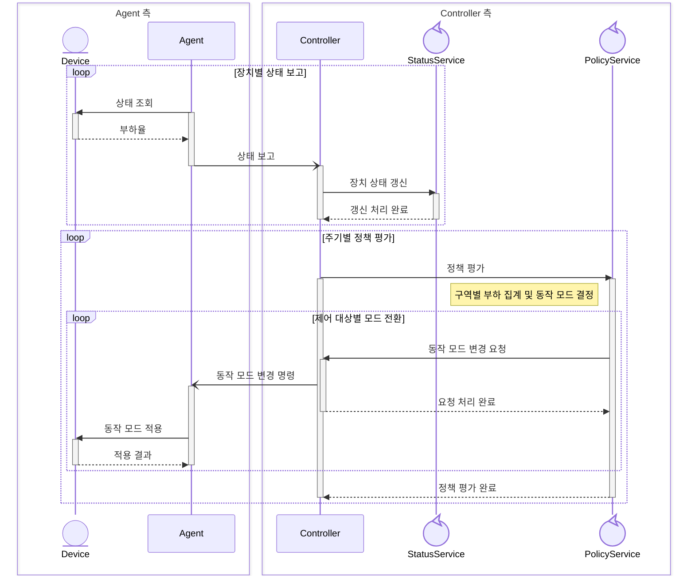
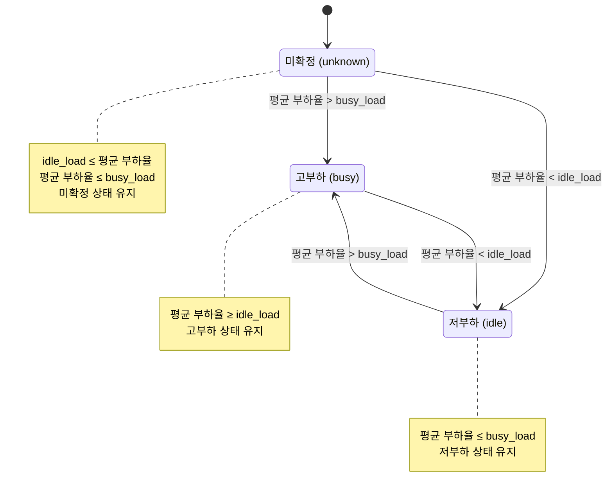
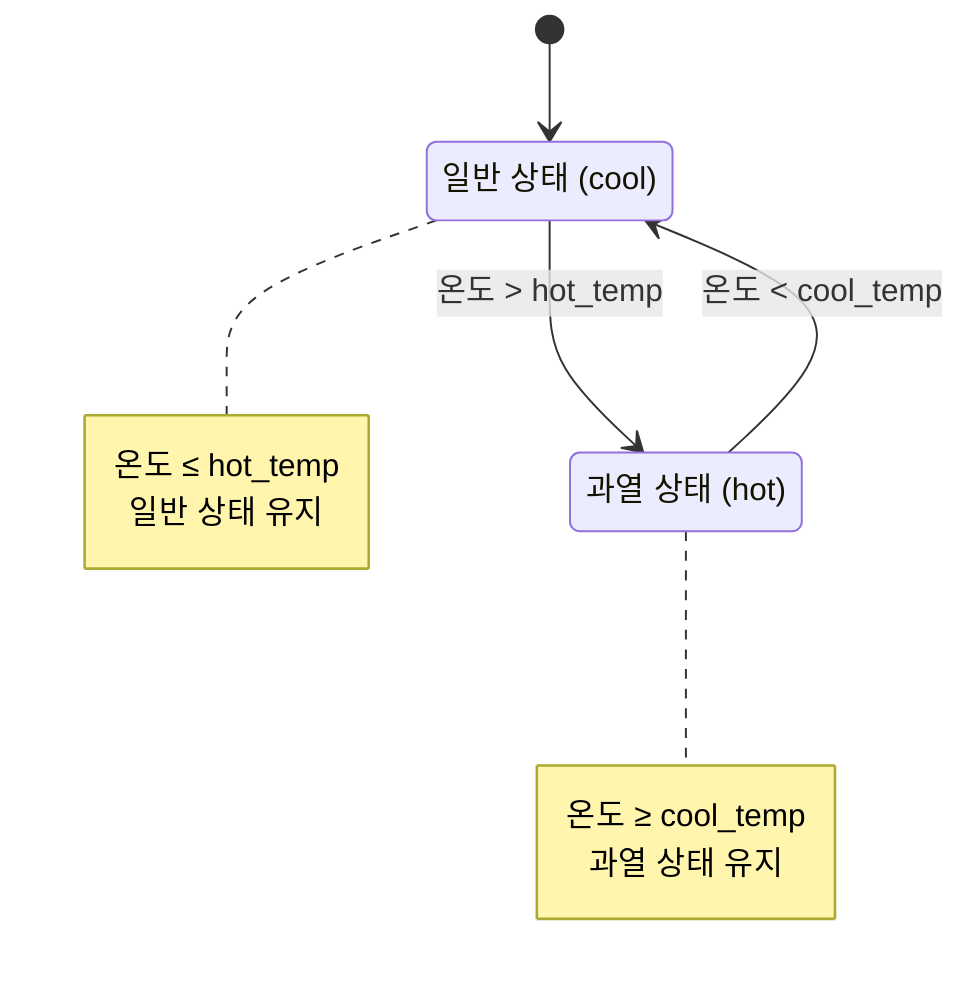

# 정책 엔진

## 목차

- [개요](#개요)
- [구역별 부하 대응](#구역별-부하-대응)
- [개별 장치 보호](#개별-장치-보호)
- [명령 발행](#명령-발행)
- [정책 변경](#정책-변경)

## 개요

작업 구역의 상황은 수시로 달라집니다.
관리자는 장치 상태를 파악하고 적절한 조치를 취할 수 있지만, 관리 대상이 늘어날수록 문제 상황에 일일이 대응하기 어려워집니다.

이를 해결하기 위해 DDCS의 정책 엔진은 장치가 보고한 상태와 미리 정한 정책을 바탕으로 판단과 제어를 자동화해 관리자의 대응 부담을 줄입니다.

## 구역별 부하 대응

작업 부하가 증가하면 장치의 처리 성능을 높여 밀린 작업을 처리해야 합니다.
하지만 부하가 줄어든 뒤에도 높은 성능을 유지하면 불필요한 전력 소모와 발열이 발생합니다.
따라서 작업량의 변화에 맞춰 성능을 높이거나 낮출 필요가 있습니다.

각 Agent는 담당 장치 상태를 Controller에 주기적으로 보고합니다.
정책 엔진은 보고받은 정보를 토대로 구역별 평균 부하율을 계산하고, 해당 구역에 설정된 정책에 따라 동작 모드를 결정합니다.
Controller는 해당 결정을 명령으로 만들어 각 Agent를 통해 제어 대상 장치에 전달합니다.

그림 1은 상태 보고부터 정책 판단, 명령 전달까지의 흐름을 보여줍니다.

*그림 1. 구역별 부하에 따른 장치 동작 모드 제어 흐름*

부하율에 따라 동작 모드를 조정할 때, 하나의 임계값만 사용하면 경계 부근의 작은 변화에도 모드가 반복해서 바뀔 수 있습니다.
이를 줄이기 위해 고부하 모드로 전환하는 임계값과 저부하 모드로 복귀하는 임계값을 다르게 설정했습니다.

평균 부하율이 상단 임계값(`busy_load`)을 넘으면 고부하 상태인 `busy`로, 하단 임계값(`idle_load`) 아래로 내려가면 저부하 상태인 `idle`로 판단합니다.
두 임계값 사이에서는 경계값을 포함해 이전 상태를 유지하므로, 이 범위 안의 부하 변동만으로는 새로운 모드 변경 명령을 발행하지 않습니다.
따라서 같은 부하율이라도 이전에 고부하 상태였는지 저부하 상태였는지에 따라 판단 결과가 달라지며, 이러한 특성을 히스테리시스라고 합니다.

전환 후 일정 시간 기다리는 방식은 필요한 전환까지 늦출 수 있습니다.
DDCS의 출력은 연속적인 제어량이 아닌 세 가지 동작 모드이므로, 연속 제어기 대신 부하 판단에 두 임계값을 사용했습니다.
다만 부하율이 두 임계값 사이에 머무는 동안에는 이전 판단을 유지합니다.

그림 2는 이 규칙에 따라 구역의 부하 상태가 전환되는 과정을 보여줍니다.

*그림 2. 상승·하강 임계값을 분리한 구역별 부하 판단*

구역마다 고부하로 판단할 기준과 그때 필요한 동작 모드는 다를 수 있습니다.
따라서 부하를 판단하는 임계값과 각 상태에 적용할 모드를 구역별로 설정할 수 있도록 했습니다.
그림 2에서 고부하(`busy`)로 판단하면 `busy_mode`를, 저부하(`idle`)로 판단하면 `idle_mode`를 기본 동작 모드로 선택합니다.
각 모드는 `safe`, `normal`, `performance` 중에서 지정합니다.

표 1은 `config/controller.json`의 구역별 설정을 보여줍니다.
예를 들어 `zone_a`는 평균 부하율이 70을 넘어야 고부하로 전환하지만, `zone_b`는 60을 넘으면 전환합니다.
두 구역 모두 고부하에서는 `performance`, 저부하에서는 `normal`을 사용합니다.

|구역|상단 임계값 `busy_load`|하단 임계값 `idle_load`|고부하 모드 `busy_mode`|저부하 모드 `idle_mode`|
|---|---|---|---|---|
|`zone_a`|70|30|`performance`|`normal`|
|`zone_b`|60|45|`performance`|`normal`|
|`zone_c`|80|20|`performance`|`normal`|
|`zone_d`|75|40|`performance`|`normal`|

*표 1. 기본 설정의 구역별 부하 임계값과 동작 모드*

이전 상태를 유지할 구간이 생기도록 하단 임계값은 반드시 상단 임계값보다 작게 설정해야 합니다.
처음 평가한 부하율이 두 임계값 사이에 있으면 유지할 이전 판단이 없으므로 미확정 상태를 유지합니다.
이때는 부하에 따른 기본 모드를 결정하지 않으며, 상단을 넘거나 하단 아래로 내려간 뒤부터 정책을 적용합니다.

판단 기준뿐 아니라 집계 대상도 중요합니다.
연결이 끊긴 장치의 과거 상태까지 평균에 포함하면 구역의 부하를 잘못 판단할 수 있습니다.
따라서 상태 보고 기록이 있는 활성 장치만 집계하며, 첫 보고 전에는 부하·온도 판단 모두에서 제외합니다.

장치를 구역별로 집계하기 위해 같은 정책을 적용받는 장치들을 Group으로 묶고, Agent가 등록할 때 소속 Group을 보고하도록 했습니다.
Group을 지정하지 않았거나 해당 Group의 정책이 없으면 집계와 제어 대상에서 제외합니다.
정책이 없는 Group도 등록은 허용하되 경고를 남기며, 집계할 장치가 없는 구역은 평가를 건너뜁니다.

부하에 따른 전환 동작은 [부하 전환 검증 시나리오](scenario.md#regime-transition)를 참고하시기 바랍니다.

## 개별 장치 보호

같은 구역에서 동작하더라도 장치별 온도는 다를 수 있습니다.
구역의 작업 부하가 높다는 이유로 모든 장치에 같은 모드를 적용하면, 이미 과열된 장치에도 높은 성능을 요구하게 됩니다.
따라서 온도 보호는 장치별로 판단하고, 구역의 기본 동작 모드보다 우선 적용하도록 설계했습니다.

정책 엔진은 각 장치가 보고한 온도를 기준으로 과열 여부를 판단합니다.
온도가 과열 임계값(`hot_temp`)을 넘으면 해당 장치에만 보호 모드(`hot_mode`)를 적용합니다.
기본 설정에서는 전 구역 과열 임계값을 65도로, 보호 모드를 `safe`로 지정합니다.
다른 장치는 평소대로 각자 온도와 구역 정책에 따라 제어합니다.

과열 임계값 바로 아래로 내려왔다는 이유만으로 복귀시키면, 온도가 다시 올라 보호 모드로 재진입할 수 있습니다.
따라서 충분히 냉각된 뒤 복귀할 수 있도록 별도의 복귀 임계값(`cool_temp`)을 두고, 그 아래로 내려갈 때 보호를 해제해 잦은 모드 변경을 미연에 방지할 수 있도록 하였습니다.
기본값은 50이며, 복귀 임계값은 과열 임계값보다 작아야 하며 마찬가지로 두 임계값 사이와 경계값에서는 이전 온도 상태를 유지하도록 설계했습니다.

그림 3은 장치 온도에 따른 과열 진입과 보호 해제 조건을 보여줍니다.

*그림 3. 장치별 과열 판단과 보호 해제 조건*

그림 3에서 보호가 해제되면 그 시점의 구역 정책에 맞는 기본 모드로 복귀합니다.
과열을 해결했지만 구역 부하 상태가 아직 미확정이라면, 마지막으로 보호 모드를 명령했던 장치에는 `idle_mode`로 전환하도록 명령합니다.

과열 보호와 냉각 후 복귀는 [과열 보호 검증 시나리오](scenario.md#thermal)를 참고하시기 바랍니다.

## 명령 발행

장치에 이미 지시한 동작 모드가 바뀌지 않았다면 같은 명령을 반복해서 보낼 필요가 없습니다.
정책 엔진은 불필요한 명령 발행을 줄이기 위해 장치별로 마지막에 지시한 동작 모드를 기억합니다.

정책 엔진은 결정한 동작 모드를 장치별로 마지막에 지시한 모드와 비교합니다.
목표가 같고 이전 명령이 실패하지 않았다면, 응답을 기다리는 중이어도 새 명령을 발행하지 않습니다.

다만 연결이 끊기거나 명령이 최종 실패한 경우에는 같은 목표라도 다시 전달해야 합니다.
재접속 후에는 현재 정책에 맞는 명령을 보내고, 명령이 최종 실패하면 다음 정책 평가에서 다시 발행합니다.

표 2는 이러한 발행 조건을 정리한 것입니다.

|평가 시점의 조건|정책 엔진의 동작|
|---|---|
|목표가 이전 발행 목표와 같고 실패 기록이 없음|새 명령 생략|
|목표가 변경됨|새 목표로 명령 발행|
|발행 기록이 없고 목표를 결정할 수 있음|명령 발행|
|이전 명령이 최종 실패했고 목표를 결정할 수 있음|같은 목표라도 새 명령 발행|
|목표를 결정할 근거가 없음|명령 발행 보류|

*표 2. 장치별 목표와 발행 기록에 따른 명령 발행 조건*

정책 엔진은 새 명령을 발행할지 판단하고, CommandService는 발행된 명령의 전달과 응답 대기·재전송을 담당합니다.

자세한 내용은 [명령 처리](architecture.md#명령-처리)를, 재접속 후 명령 재발행은 [Agent 재접속 검증 시나리오](scenario.md#agent-reconnect)를 참고하시기 바랍니다.

## 정책 변경

운영 기준이 달라질 때마다 Controller를 재시작하면 장치와 연결이 끊기고 제어가 중단됩니다.
이를 피하기 위해 실행 중에도 정책을 변경할 수 있도록 설계했습니다.

설정 파일을 수정한 뒤 Controller에 SIGHUP을 보내면 새 정책을 읽고 유효한지 검증합니다.
유효한 정책은 다음 평가부터 적용하며, 파일을 읽을 수 없거나 설정이 잘못된 경우에는 기존 정책을 유지해 잘못된 정책을 반영하는 상황을 방지하도록 설계했습니다.

새 정책을 적용하면 장치별 명령 발행 기록을 초기화해 다음 평가에서 새 기준으로 명령합니다.
구역의 부하 상태와 장치별 과열 상태는 유지하되, 이후 판단에는 새 임계값을 사용합니다.
온도 보호 규칙을 제거한 경우에는 해당 장치의 과열 상태도 다음 평가에서 해제합니다.

설정 항목과 변경 방법은 [설정 가이드](config.md#정책)를, 정책 적용과 잘못된 설정 거부 검증은 [정책 변경 시나리오](scenario.md#policy-reload)를 참고하시기 바랍니다.

[아키텍처로 돌아가기](architecture.md)
