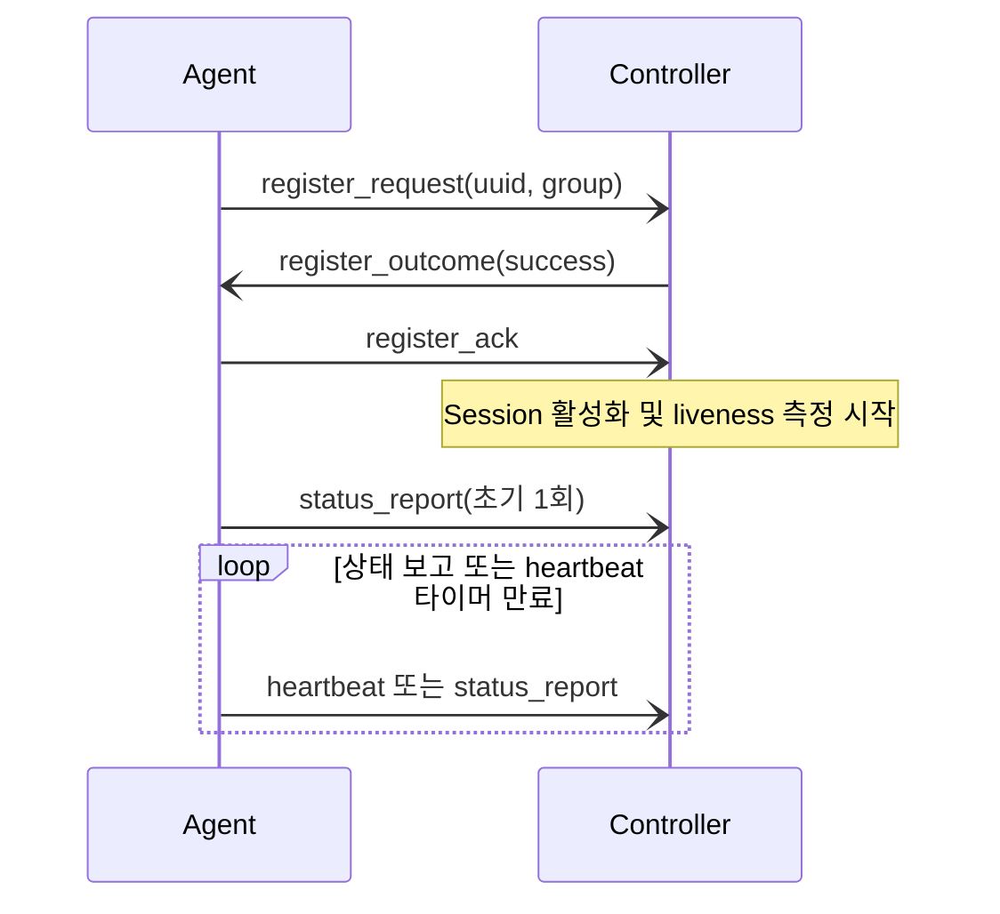
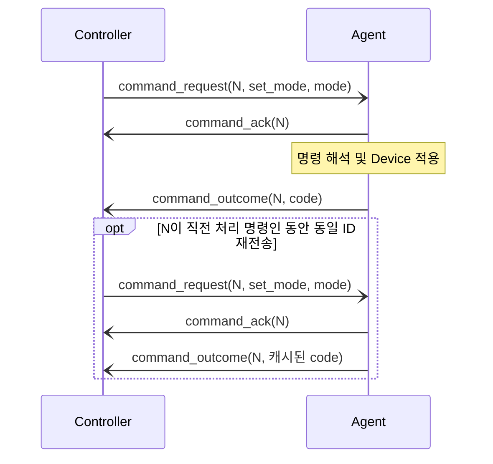

# DDCS 프로토콜

TCP로 메시지를 주고받으려면 수신 바이트에서 경계를 찾고, 메시지의 종류와 교환 순서를 양측이 동일하게 해석해야 합니다.
DDCS는 길이 기반 frame 위에 등록·상태 보고·명령 메시지를 정의합니다. 이 문서는 통신 상대가 지켜야 하는 바이트 형식과 교환 규칙을 다룹니다.

## 목차

- [계층과 적용 범위](#계층과-적용-범위)
- [Frame 형식](#frame-형식)
- [Message 형식](#message-형식)
- [명령 형식](#명령-형식)
- [등록](#등록)
- [상태 보고와 생존 확인](#상태-보고와-생존-확인)
- [명령 교환](#명령-교환)

## 계층과 적용 범위

`wire::frame`은 메시지 경계, `wire::message`는 메시지 타입과 본문, `wire::command`는 명령 payload를 해석합니다.
하위 코덱은 상위 payload를 바이트열로 전달하고, 의미 검증과 상태별 허용 여부는 수신측 app이 판단합니다.

작고 정해진 메시지의 프레이밍과 코덱을 직접 구현하는 것은 이 프로젝트의 구현 범위입니다.
protobuf를 사용해도 TCP 프레이밍은 별도로 필요하고 코드 생성이 추가되며, gRPC를 사용하면 HTTP/2 기반 통신 스택이 추가됩니다.
현재 프로토콜에는 버전 협상과 인증·암호화가 없으므로 스키마를 변경할 때 양측 배포를 함께 고려해야 합니다.
내부 버퍼와 서비스의 책임은 [아키텍처](architecture.md)에 정리했습니다.

## Frame 형식

frame은 바이트 스트림에서 payload의 경계를 구분합니다.
헤더는 **big-endian**을 사용하며, 그림 1과 같이 식별자와 길이 뒤에 payload를 배치합니다.

```text
0               2               4          4 + length
+---------------+---------------+---------------+
|  magic (u16)  | length (u16)  |    payload    |
+---------------+---------------+---------------+
```

*그림 1. Frame의 바이트 배치*

|필드|크기 (B)|의미|
|---|---|---|
|`magic`|2|DDCS 프로토콜 식별자, `0xDDC5` 고정|
|`length`|2|payload(= message) 크기, 헤더 제외|

*표 1. Frame 헤더 필드*

`length`는 u16이지만 payload는 1024 byte로 제한합니다.
연결별 rx 버퍼(`transport.rx_buffer_size`, 기본 4096)는 이 상한의 frame 하나를 항상 담을 수 있어야 하며(불변식: `rx 버퍼 용량 >= 헤더 4 + payload 상한 1024`), 설정값을 올림 보정하는 방식은 [전송과 버퍼](architecture.md#전송과-버퍼)에서 다룹니다.

frame 계층은 payload를 **불투명한 바이트열(opaque)**로 다루고(디스패치는 app 계층 담당), 위반을 검출하면 **결과 코드만 반환**하며, 연결을 끊을지는 caller가 결정합니다(Controller: `schedule_reap(frame_error)`, Agent: 재접속).

|`decode_frame` 결과|의미|호출 측 처리|
|---|---|---|
|성공|완전한 frame 1개 추출|`on_frame`으로 디스패치|
|`incomplete`|헤더 미도착 또는 부분 frame|더 수신할 때까지 대기|
|`too_long`|`length > payload 상한`|연결 종료|
|`bad_magic`|magic 불일치|연결 종료|
|`read_error`|rx 버퍼 읽기/커밋 실패 (버퍼 상태 손상)|연결 종료|

*표 2. Frame 디코딩 결과와 처리*

## Message 형식

frame 헤더와 달리 message는 **little-endian**을 사용합니다. 그림 2는 타입 1 byte 뒤에 본문을 배치하는 구조를 보여줍니다.

```text
0       1                    length
+-------+--------------------+
| type  |        body        |
+-------+--------------------+
```

*그림 2. Message의 바이트 배치*

`length`는 frame 헤더의 `length`와 같으며, body 크기는 `length - 1`입니다.

`MessageType`은 상위 4비트(nibble)로 그룹을 나누고, 같은 그룹의 새 타입은 하위 nibble에 추가합니다:

|값|그룹|
|---|---|
|`0x00`~`0x0F`|register|
|`0x10`~`0x1F`|telemetry|
|`0x20`~`0x2F`|command|

*표 3. 메시지 타입의 범위*

|값|이름|방향|본문 필드: 타입 (B)|
|---|---|:---:|---|
|`0x00`|`invalid`|-|사용 안 함|
|`0x01`|`register_request`|Agent → Controller|`uuid`: uuid (16)</br>`group`: str (가변)|
|`0x02`|`register_outcome`|Controller → Agent|`code`: u8 (1)|
|`0x03`|`register_ack`|Agent → Controller|없음|
|`0x10`|`heartbeat`|Agent → Controller|없음|
|`0x11`|`status_report`|Agent → Controller|`mode`: u8 (1)</br>`load`: f64 (8)</br>`temp`: f64 (8)|
|`0x20`|`command_request`|Controller → Agent|`command_id`: u64 (8)</br>`command_type`: u8 (1)</br>`payload`: command (가변)|
|`0x21`|`command_ack`|Agent → Controller|`command_id`: u64 (8)|
|`0x22`|`command_outcome`|Agent → Controller|`command_id`: u64 (8)</br>`code`: u8 (1)|

*표 4. 메시지별 방향과 본문*

표 4의 괄호 안은 바이트 수(B)입니다. `str`과 `command`는 가변 길이입니다.

body 타입 규약:

- `uuid`: 길이 접두어 없이 raw 16 byte
- `str`: 2 byte 길이 접두어 + UTF-8 바이트 (null terminator 없음). codec은 길이만 검증하며 UTF-8 유효성은 확인하지 않습니다.
- `f64`: IEEE-754 double. 비트 패턴을 u64 little-endian으로 전송합니다.
- `code`: wire 표현은 u8로 동일하나 message마다 enum이 다릅니다. `register_outcome`은 `success = 0`, `failed = 1` 두 값이고, `command_outcome`은 실패 사유까지 담아 [명령 형식](#명령-형식) 절의 표와 같습니다.
- `command`: 길이 접두어 없이 body의 나머지 전부

message 디코딩은 **구조적 검증만** 합니다.
wire 바이트가 schema의 길이 요건과 정확히 일치하는지만 확인하고, enum 값 유효성과 의미 제약은 caller가 책임집니다.
`decode_message()`는 빈 payload, 정의되지 않은 type, 구조 불일치를 모두 거부하며, 방향이 어긋난 message(예: `C→A` 전용을 Controller가 수신)는 수신측 app이 프로토콜 위반으로 판단해 연결을 종료합니다.

## 명령 형식

`command_request`의 `command_type`은 뒤따르는 명령 payload의 형식을 지정합니다. 현재 정의된 동작은 `set_mode`입니다.

wire codec은 `command_type`을 검증하지 않으므로, Agent는 `command_request` 구조 디코딩에 성공하면 `command_type`의 유효성과 무관하게 `command_ack`을 먼저 보내고, 수행 결과를 `command_outcome`으로 응답합니다.

`command_outcome`의 `code` enum(u8) 값은 다음과 같습니다:

|값|이름|뜻|
|---|---|---|
|`0`|`success`|명령 수행 성공|
|`1`|`failed`|아래 사유로 갈리지 않는 실패|
|`2`|`apply_failed`|Device의 적용 거부|
|`3`|`bad_mode`|`mode` 어휘 밖의 wire byte 수신|
|`4`|`bad_payload`|command body 디코딩 실패|
|`5`|`unknown_type`|미지 `command_type` 수신|

*표 5. 명령 결과 코드*

실패 사유는 Agent가 `code`로 전달하며, Controller는 `command.reject` 로그에 이 값을 기록합니다. 정책에는 명령의 최종 실패 여부가 전달됩니다.
정의 밖의 결과 코드도 코덱은 통과시키며, Controller는 성공 코드가 아니면 실패로 처리합니다. 로그에는 수신한 byte 값을 남겨 미정의 코드도 확인할 수 있습니다.

정의된 `CommandType`과 `mode` enum(u8) 값은 다음과 같습니다:

|값|이름|본문 필드: 타입 (B)|
|---|---|---|
|`0x00`|`invalid`|-|
|`0x01`|`set_mode`|`mode`: u8 (1)|

*표 6. 명령 타입과 본문*

|값|이름|
|---|---|
|`0`|`safe`|
|`1`|`normal`|
|`2`|`performance`|

*표 7. 동작 모드의 wire 값*

동작 모드와 wire byte 간 매핑은 `device` 모듈이 소유하고, wire codec은 raw u8만 전송하며, 값 유효성 검증은 수신측(`device::decode_mode`)이 담당합니다.
`set_mode` body는 정확히 1 byte(mode)이며, 남는 바이트가 붙으면 구조적 디코딩 실패로 거부됩니다.

## 등록

Agent는 TCP 연결 후 `register_request`로 UUID와 Group을 전송합니다.
Controller가 결과를 반환하고 Agent가 성공 결과의 수신을 확인하면 상태 보고와 명령 교환을 시작할 수 있습니다.
그림 3은 이 세 단계와 최초 상태 보고를 보여줍니다.



*그림 3. 등록 교환과 상태 보고의 시작*

Controller는 요청 대기 중에는 `register_request`, 결과 확인 대기 중에는 `register_ack`만 허용합니다.
구조 디코딩에 실패하면 응답 없이 연결을 종료합니다. 식별된 요청을 거부하는 경우의 실패 결과 송신은 best-effort이며, 연결이 먼저 닫히면 Agent가 결과를 받지 못할 수 있습니다.
성공 결과를 인코딩할 수 없으면 등록을 완료하지 않고 연결을 종료합니다.
Agent는 `success` 외의 결과를 받으면 연결을 종료하고 재접속 절차를 시작합니다.

성공 결과를 받은 Agent는 등록 제한 시간 타이머를 취소하고 `register_ack`와 초기 `status_report`를 보냅니다.
첫 heartbeat는 설정 주기가 지난 뒤 송신합니다. Controller의 liveness는 ack 수신 시점부터 계산하며, 그 전에는 각 등록 단계의 제한 시간을 적용합니다.

TCP 연결이 바뀌어도 장치의 논리적 신원은 등록 UUID로 식별합니다.
같은 UUID의 새 등록은 기존 연결을 종료하고 새 연결로 대체합니다(kick-old). 따라서 장치당 바인딩된 연결은 최대 하나입니다.
정의되지 않은 Group도 등록은 허용하지만, Controller가 경고를 남기며 해당 Group에는 정책을 적용하지 않습니다.
연결 식별자 자체는 wire로 전송하지 않습니다.

## 상태 보고와 생존 확인

Agent는 등록 직후와 설정된 주기마다 동작 모드·부하·온도를 보고합니다.
heartbeat는 본문 없는 생존 신호이며, 상태 보고와 명령 응답도 Controller의 마지막 수신 시각을 갱신합니다.
연결의 활성 상태에서 허용되는 입력과 방향이 맞아야 하며, 잘못된 타입이나 구조는 연결 종료로 처리합니다.

부하와 온도는 wire에서 임의의 f64 비트 패턴을 전달할 수 있습니다.
NaN이나 Inf를 포함한 보고는 수신 신호로 인정하되 상태 샘플은 버려 직전 유효값을 유지합니다.
상태 보고의 미정의 동작 모드 값은 `safe`로 해석합니다. 이는 명령에 포함된 미정의 모드를 `bad_mode`로 거부하는 것과 다릅니다.
이 처리는 frame 손상이나 메시지 구조 오류와 구분합니다.

제한 시간 동안 유효 메시지가 없으면 Controller는 다음 sweep 검사에서 연결을 종료합니다.
검사 주기와 이벤트 루프 지연이 더해질 수 있으므로 제한 시간은 정확한 종료 시각을 뜻하지 않습니다.
Agent는 연결 종료를 감지한 뒤 백오프로 재접속하고 처음부터 등록합니다. 설정 항목은 [설정](config.md), 내부 상태 전이는 [연결과 등록](architecture.md#연결과-등록)에 정리했습니다.

## 명령 교환

Controller는 `command_request`를 보내고 Agent는 수신 확인과 적용 결과를 같은 TCP 연결로 반환합니다.
그림 4는 새 요청과 재전송의 차이를 보여줍니다.



*그림 4. 명령 요청·응답과 직전 명령의 중복 처리*

응답의 대응 키는 등록 연결이 가리키는 DeviceId와 메시지의 CommandId입니다.
`command_ack`는 적용 성공이 아니라 요청 구조의 수신 확인입니다. Controller는 미결 명령을 유지하고 결과 응답 기한을 연장합니다.
`command_outcome`이 성공이면 명령을 종결하며, 실패이면 시도 한도에 따라 재전송을 예약하거나 최종 실패로 끝냅니다.

응답 기한 초과 또는 실패 outcome 이후의 재전송은 같은 ID를 사용합니다.
Agent는 직전의 0이 아닌 명령 ID와 결과 한 건을 기억하며, 같은 ID이면 재적용 없이 ack와 캐시된 outcome을 돌려줍니다.
Controller는 ID를 1부터 증가시켜 발급하고 0을 사용하지 않습니다. Agent가 0을 수신한 경우에는 중복 제거를 적용하지 않습니다.
연결이 종료되면 Agent의 중복 기록은 초기화됩니다.

같은 장치의 같은 명령 계열에 새 요청이 발행되면 이전 미결 명령은 새 ID로 대체됩니다.
대체되거나 이미 끝난 ID의 응답은 stale로 집계하고 무시합니다.
Controller의 연결 종료는 미결 명령을 즉시 없애지 않으므로, 재접속한 장치의 응답도 아직 유효한 키와 일치하면 처리합니다.
이것은 Agent가 이전 연결의 응답을 영속 보관하거나 자동 재생한다는 뜻은 아닙니다.

현재 명령은 멱등적인 `set_mode`이며 전달과 적용을 영속적으로 보장하는 프로토콜은 아닙니다.
재시도 한도와 명령 대체의 내부 처리는 [명령 처리](architecture.md#명령-처리)에, 실패 후 정책의 새 명령 발행은 [정책 엔진](policy.md#명령-발행)에 정리했습니다.

[README로 돌아가기](../README.md)
