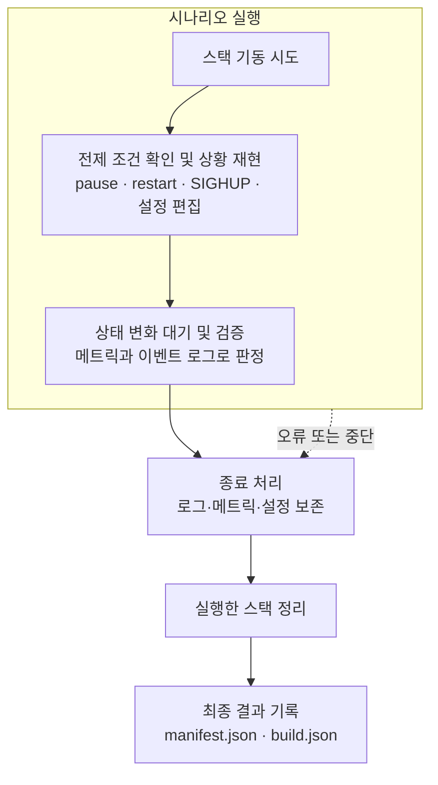
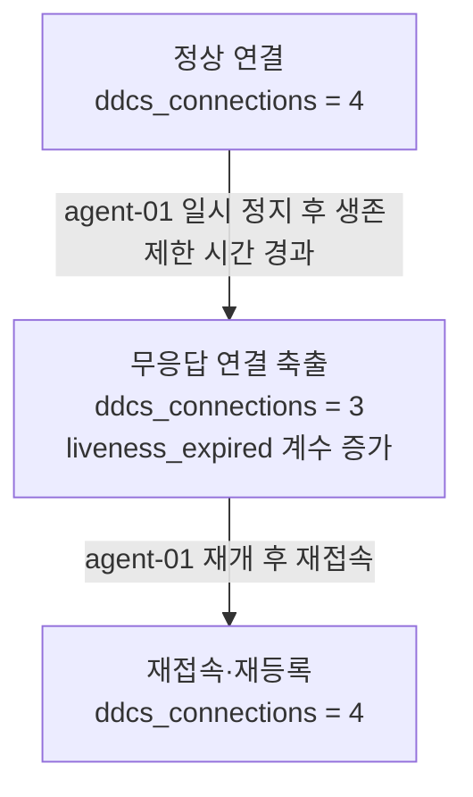

# 검증 시나리오

정상 연결만 확인해서는 과열 보호와 장애 후 복구가 제대로 동작하는지 알 수 없습니다.
DDCS는 부하 변화, 과열, 재접속, 무응답, 정책 변경을 각각 발생시키고 Controller의 메트릭과 이벤트 로그로 결과를 판정합니다.
시나리오마다 별도 Docker 스택을 기동하며, Grafana 없이도 실행할 수 있습니다.

## 목차

- [실행](#실행)
- [모의 장치](#모의-장치)
- [thermal](#thermal)
- [agent-reconnect](#agent-reconnect)
- [regime-transition](#regime-transition)
- [liveness-eviction](#liveness-eviction)
- [policy-reload](#policy-reload)
- [실행 기록과 정리](#실행-기록과-정리)
- [실행 옵션](#실행-옵션)
- [검증의 한계](#검증의-한계)
- [수동 장애 주입](#수동-장애-주입)

## 실행

저장소 루트에서 다음 명령을 실행합니다. Docker와 Docker Compose v2, Bash, curl, jq, Git 및 Linux 기본 명령 도구가 필요합니다.
호스트의 8080·9000 포트와 DDCS 컨테이너 이름이 다른 스택에서 사용 중이지 않아야 합니다.

```sh
scripts/scenario/run.sh thermal
scripts/scenario/run.sh agent-reconnect
scripts/scenario/run.sh regime-transition
scripts/scenario/run.sh liveness-eviction
scripts/scenario/run.sh policy-reload
scripts/scenario/run.sh all
```

`all`은 다섯 시나리오를 순서대로 실행합니다. 표 1은 각 시나리오의 관측 대상과 기본 구성을 보여줍니다.

|시나리오|관측 대상|구성|
|---|---|---|
|[thermal](#thermal)|같은 구역의 서로 다른 동작 모드와 과열 보호 후 회복 징후|4개 구역 × 5대|
|[agent-reconnect](#agent-reconnect)|재등록 뒤 새 명령의 발행·완료와 목표 모드 보고|Agent 4대|
|[regime-transition](#regime-transition)|고부하·저부하 양방향 전환|Agent 4대|
|[liveness-eviction](#liveness-eviction)|무응답 연결의 축출과 재접속|Agent 4대|
|[policy-reload](#policy-reload)|유효한 정책 적용과 잘못된 JSON 거부|Agent 4대|

*표 1. 시나리오별 관측 대상과 기본 구성*

## 모의 장치

시나리오는 실제 장비 대신 `SimulatedDevice`를 사용합니다.
동작 모드별 초당 변화율을 보고 주기마다 적분해 부하율과 온도를 바꿉니다.
`performance`는 부하를 줄이는 대신 온도를 높이고, `safe`는 냉각합니다.
장치마다 초기값과 잡음이 달라 같은 구역에서도 과열 시점이 달라집니다.
검증 범위는 이 모의 환경의 제어·복구 동작이며, 실제 장비의 전력 절감이나 고장 예방 성과를 뜻하지 않습니다.

## thermal

같은 구역에 있어도 장치마다 온도가 다르므로 과열 보호는 개별적으로 적용되어야 합니다.
이 시나리오는 과열된 장치의 `safe` 전환과 냉각 후 복귀를 관측합니다.

같은 구역의 **한 메트릭 응답 안에 `performance`와 `safe`가 공존**하는지 확인하고, 장치별 과열 로그를 함께 읽습니다.
초기 부하·온도와 부하 변화율의 편차(기본 ±10%), 장치별 잡음 때문에 과열 시점이 달라집니다.
다만 상태 보고가 비동기이므로 집계값만으로 개별 장치의 전체 전환 순서를 증명하지는 않습니다.

### 진행

1. scale Compose 구성으로 구역 4개 × `DDCS_SCENARIO_PER_ZONE`(기본 5)대를 기동하고 전 대수 연결을 기다립니다.
2. 70초 동안 대기합니다. performance 구간의 발열(+6°/s)이 `hot_temp`(65°)를 넘으면서 Device가 저마다의 시점에 하나씩 보호 상태로 전환합니다.
3. 약 28초간 2초 간격으로 `ddcs_group_devices`를 14회 샘플링해, 구역별 (`performance`, `safe`) 공존과 safe 수의 감소를 찾습니다.
4. Controller 로그에서 `policy.thermal.update`(thermal=hot)의 서로 다른 Device 수를 셉니다.

### 판정 기준

아래 조건을 모두 만족해야 통과합니다.

|검증|의미|
|---|---|
|과열이 기록된 Device 수 ≥ 전 대수|모든 Device가 개별 시점에 과열 보호 상태로 전환했다|
|한 스냅샷에 performance·safe 공존 ≥ 1회|같은 구역 안에 서로 다른 동작 모드가 보고됐다|
|구역의 safe 수 감소 ≥ 1회|집계상 safe 상태가 감소했다. 개별 hot→safe→cool→복귀의 전체 타임라인은 별도 검증이 필요하다|

*표 2. 과열 보호 판정 기준*

## agent-reconnect

재시작한 Device가 같은 DeviceId로 다시 접속하면, 목표를 결정할 수 있는 다음 정책 평가에서 현재 목표 동작 모드를 다시 명령받습니다.
Controller는 마지막에 명령한 목표가 그대로이면 같은 명령을 생략하며, Session이 끊기면 해당 장치의 발행 기록을 지웁니다.
기록이 남아 있으면 Controller가 이전 목표와 같다는 이유로 명령을 생략해, `normal`로 부팅한 장치가 목표 모드로 돌아가지 못할 수 있습니다.

재시작 전에 명령을 받은 적이 없다면, 첫 명령이 나간 것만으로 재접속 후 복구가 검증된 것처럼 보일 수 있습니다.
그래서 Controller의 임시 설정 사본에서 zone_a의 busy·idle·hot 목표를 모두 safe로 고정합니다.
재시작 전에 첫 명령의 성공과 safe 보고를 확인해 발행 기록을 만든 뒤, 재등록 이후의 발행과 동일 명령의 성공을 순서대로 확인합니다.
목표가 고정되어 자연스러운 부하·온도 전환이 추가 명령의 원인이 되는 경우를 배제합니다.

### 진행

1. 고정 `DDCS_DEVICE_ID`를 가진 Agent 4대를 기동합니다.
2. agent-01의 첫 등록 이후 `command.dispatch`와 동일 `command_id`의 `command.complete`, 실제 safe 보고를 기다립니다.
3. `docker restart`로 agent-01을 재시작합니다. SimulatedDevice는 normal로 부팅됩니다.
4. 새 등록(`session.connection.register.accept`) 이후 같은 Device의 dispatch→complete를 확인합니다. 두 사건의 `command_id`가 같아야 합니다.
5. zone_a의 유일 Device가 다시 safe를 보고하는지 메트릭으로 확인합니다.

### 판정 기준

아래 조건을 모두 만족해야 통과합니다.

|검증|의미|
|---|---|
|register 횟수 +1 이상|같은 DeviceId로 재등록됐다|
|새 등록 이후 dispatch→complete, 동일 command_id|재접속 후 발행한 명령이 성공으로 종결됐다|
|zone_a safe=1, normal=0, performance=0|해당 Device가 목표 동작 모드를 실제 상태 보고에 반영했다|

*표 3. 재접속 후 명령 복구 판정 기준*

## regime-transition

부하가 증가할 때 성능을 높이는 것뿐 아니라, 감소한 뒤 기본 성능으로 돌아오는지도 확인해야 합니다.
이 시나리오는 구역별 평균 부하에 따라 `busy`와 `idle` 판단이 모두 발생하는지 검사합니다.

기본 모의 장치는 `performance`에서 부하가 초당 4만큼 줄고 `normal`에서는 2만큼 늘어납니다.
정책의 모드 전환이 다시 부하에 영향을 주므로, 시간을 두고 두 임계값을 교차하는지 관측합니다.
구역당 장치 1대를 사용해 구역 평균이 해당 장치의 부하와 같도록 합니다. 기본 정책의 목표는 `busy`일 때 `performance`, `idle`일 때 `normal`입니다.

### 진행

1. Agent 4대(구역당 1대)를 기동합니다.
2. 90초 동안 대기해, 부하가 밴드 양끝을 교차할 시간을 줍니다.
3. Controller 로그의 `policy.regime.update`에서 busy/idle 전환 횟수를 세고, 최근 전환 로그와 현재 `ddcs_group_load_ratio`(0–1)를 출력합니다.

### 판정 기준

아래 조건을 모두 만족해야 통과합니다.

|검증|의미|
|---|---|
|busy 전환 ≥ 1|평균 부하가 `busy_load`를 넘어 busy로 판정됐다|
|idle 전환 ≥ 1|평균 부하가 `idle_load` 아래로 내려가 idle로 판정됐다|

*표 4. 부하 상태 전환 판정 기준*

이 시나리오는 전환이 양방향으로 발생하는지 확인하며, 잦은 전환 억제나 임계값과 정확히 같은 경우의 판단까지 검증하지는 않습니다. 전환 조건은 [정책 엔진](policy.md#구역별-부하-대응)에 정리했습니다.

## liveness-eviction

소켓이 닫히지 않은 채 Agent가 응답하지 않으면 연결 종료 통지만으로 장애를 감지할 수 없습니다.
이 시나리오는 Controller의 liveness 검사가 무응답 Session을 축출하고, Agent가 재개된 뒤 다시 접속하는지 확인합니다. Agent에는 별도 liveness 타이머가 없습니다.

`docker stop`은 소켓 종료로 장애가 감지될 수 있어 무응답 검증에 적합하지 않습니다.
대신 `docker pause`로 소켓을 열어 둔 채 송신을 멈춥니다. 기본 liveness 제한 시간은 1.5초이며 검사는 1초 주기의 sweep에서 수행합니다.
종료 원인은 `liveness_expired` 카운터로 확인합니다. 정지를 해제하면 Agent가 끊긴 연결을 감지하고 다시 연결·등록합니다.

### 진행

1. Agent 4대를 기동하고 잠시 정상 운영합니다.
2. `docker pause`로 agent-01을 일시 정지한 뒤, 연결 수가 3으로 줄고 `ddcs_connections_closed_total{reason="liveness_expired"}`가 오르기를 기다립니다.
3. `docker unpause`로 재개한 뒤, 연결 수 4 복구와 해당 Device의 재등록을 기다립니다.

### 판정 기준

아래 조건을 모두 만족해야 통과합니다.

|검증|의미|
|---|---|
|정지 중 `liveness_expired` 종료 +1 이상|무신호를 liveness로 감지해 축출했다|
|정지 중 연결 수 = 3 (정확히)|정지 전보다 연결이 한 개 감소했다|
|재개 후 연결 수 ≥ 4|연결 수가 복구됐다|
|해당 Device register +1 이상|재접속이 재등록으로 이어졌다|

*표 5. 무응답 축출과 재접속 판정 기준*

## policy-reload

운영 중 정책을 바꾸면 새 기준이 적용되어야 하지만, 잘못 편집한 파일이 기존 제어까지 중단시켜서는 안 됩니다.
이 시나리오는 SIGHUP으로 유효한 정책을 적용한 뒤, 깨진 JSON을 거부하고 연결을 유지하는지 확인합니다.

정책 로드와 변경 후 동작 모드를 확인하려고 zone_a의 busy/idle 동작 모드를 둘 다 safe로 강제하는 정책을 씁니다.
부하 임계값만 바꾸면 자연스러운 부하 전환과 정책 변경의 효과를 구분하기 어렵습니다.
고부하·저부하의 목표 모드를 같게 지정하는 것은 허용되므로, 두 목표를 모두 `safe`로 설정해 결과를 관측합니다.
기존 정책에서도 과열 보호로 `safe`가 잠깐 나타날 수 있으므로, 2초 간격의 세 차례 관측에서 모두 `safe`여야 통과합니다. 이 집계만으로 reload에 의한 특정 명령의 발행·완료 인과까지 확정하지는 않습니다.
성공 로드(`policy.load`)와 거부(`policy.load.fail`)는 별개 이벤트라 각각 따로 셉니다.

### 진행

1. Agent 4대를 기동하고, 장치가 정책에 따른 첫 명령을 받도록 기다립니다.
2. 유효한 편집: zone_a를 safe로 강제하는 정책으로 파일을 바꾸고 SIGHUP을 보낸 뒤, `trigger=reload` 처리와 `policy.load` 재발생, zone_a의 safe 정착(3회 연속)을 확인합니다.
3. 잘못된 편집: 깨진 JSON으로 바꾸고 SIGHUP을 보낸 뒤, `policy.load.fail(reason=parse)` 발생과 성공 로드 수 불변, 연결 수 유지를 확인합니다.
4. 설정은 시작 시 임시 디렉터리에 복사하고 Controller에 읽기 전용으로 마운트합니다.
   정책 편집은 이 사본에만 적용하며, 스택 정리 성공 뒤 사본을 제거합니다. 원본은 수정하지 않습니다.

### 판정 기준

아래 조건을 모두 만족해야 통과합니다.

|검증|의미|
|---|---|
|`trigger=reload` ≥ 1|SIGHUP이 리로드 경로를 탔다|
|`policy.load` +1 이상|새 정책이 재시작 없이 적용됐다|
|zone_a safe 3회 연속|정책 적용 뒤 해당 장치가 목표 동작 모드를 연속 보고했다|
|`reason=parse` ≥ 1|잘못된 형식의 편집이 적용 전에 거부됐다|
|성공 load 수 불변|거부된 편집이 성공으로 잘못 집계되지 않았다|
|연결 수 ≥ 4 유지|잘못된 편집에도 연결이 유지됐다|

*표 6. 정책 변경 판정 기준*

## 실행 기록과 정리

그림 1은 스택 기동 시도 이후의 실행과 정리 순서를 보여줍니다.



*그림 1. 시나리오 실행과 결과 기록*

- **판정과 대기의 분리**: 연결·첫 명령 같은 전제 조건의 대기 실패는 실행을 중단합니다. 전제 조건 이후 일부 관측 대기는 제한 시간을 초과해도 계속 진행하며, 마지막에 `assert_*`가 실제 관측값으로 판정합니다. 검증이 하나라도 실패하면 종료 코드가 0이 아닙니다.
- **공허한 통과 방지**: 측정 후에야 알 수 있는 수치를 기대값으로 박아두지 않고, 전환의 발생·공존·증가분 같은 정성 명제를 확인합니다.
  검증이 의미를 갖도록 사전 조건(예: 재명령 검증의 "첫 명령 수신")을 먼저 만들어 둡니다.

공용 `scripts/lib/scenario.sh`는 실행마다 별도 Compose 프로젝트(`ddcs-test-<PID>-<timestamp>`)를 지정합니다.
`COMPOSE_PROJECT_NAME`을 물려받아도 이 프로젝트를 사용하며, 같은 실행의 모든 기동·조회·정리는
동일한 프로젝트를 대상으로 합니다. 이 동작은 공용 헬퍼를 사용하는 `scripts/performance/measure-scalability.sh`에도 적용됩니다.
고정 `container_name`이 이미 존재하면 정지된 컨테이너도 포함해 실행을 중단합니다.
프로젝트 분리는 기존 스택의 재사용·삭제를 방지하며, 고정 컨테이너 이름과 호스트 포트 때문에
여러 DDCS 스택의 동시 실행을 지원하는 것은 아닙니다.

기동 전 검사·빌드·결과 초기화에 실패하면 정리 명령을 실행하지 않습니다.
`compose up`을 시도한 이후에는 일부 기동 실패나 SIGINT/SIGTERM에도 해당 프로젝트만 정리합니다.
정리에 실패하면 오류와 프로젝트 이름을 출력하며 성공 종료로 처리하지 않습니다.
이 수명주기는 실제 Docker를 조작하지 않는 `ddcs_scenario_lifecycle_test`로 검증합니다.

시나리오는 stdout과 종료 코드로 판정 과정을 보여주며, 실행 근거를
`var/result/<build-key>/scenario/<scenario>/<실행 프로젝트>/`에 보존합니다.
같은 build를 다시 실행해도 이전 실행 디렉터리를 덮어쓰지 않습니다.

|파일|내용|
|---|---|
|`manifest.json`|시작·종료 시각, 소스 revision·dirty, 실행 설정 해시, 환경 재정의, 검증 수, 최종 종료 코드|
|`compose.json`, `up-arguments.txt`|해석된 Compose 설정과 실제 기동 인자|
|`controller-start.json`, `controller-final.json`|실행 Controller의 컨테이너·이미지·시작 시각 등 Docker 식별 정보|
|`controller.log`, `compose.log`|스택 삭제 전 Controller 및 전체 서비스 원본 로그|
|`metrics/`|대기·검증에 사용한 각 HTTP 응답과 요청 시각, 종료 코드, stderr|
|`timeline.jsonl`|단계 설명, 대기 성공·제한 시간 초과, PASS/FAIL 검증|
|`config-start/`, `config-final/`|실제로 마운트한 Controller 설정의 시작·종료 사본|
|`build-start.json`|실행 시작 때의 build 식별·검증 상태 사본|

*표 7. 실행별로 보존하는 근거 파일*

`policy-reload`는 유효·잘못된 편집을 각각 `config-valid-reload/`, `config-invalid-reload/`에도 저장합니다.
`agent-reconnect`는 재시작 전후의 등록→발행→성공 사건을 `reconnect-before.json`, `reconnect-after.json`에 저장합니다.
콘솔 stdout 전체를 별도 파일로 복제하지는 않으며, 판정의 구조화 기록은 `timeline.jsonl`입니다.

이미지와 runtime config를 포함해 계산한 build key의 `build.json`에서 해당 scenario 상태를
`pass` 또는 `fail`로 갱신하고, `scenario_runs`에 실행 manifest 경로를 추가합니다.
로그·식별 정보 보존 실패도 성공 결과로 처리하지 않으며, 근거 수집 실패와 관계없이 스택 정리를 시도합니다.
build identity를 만들기 전의 Docker build 실패처럼 실행 자체가 시작되지 못한 경우에는 상태를 기록할 수 없습니다.
성능 측정 절차는 [성능 측정](performance.md)에, 프로파일 산출물과 보존 규칙은 [프로파일링](profiling.md)에 정리했습니다.

## 실행 옵션

|변수|기본값|용도|
|---|---|---|
|`DDCS_SCENARIO_SOAK`|`thermal`: 70초</br>`regime-transition`: 90초</br>`liveness-eviction`: 8초|각 시나리오의 초기 안정화·누적 대기 시간(초). agent-reconnect와 policy-reload에는 적용되지 않음|
|`DDCS_SCENARIO_PER_ZONE`|5대|thermal에서 구역당 Agent 수. 선행 0 없는 1..25 정수(총 100대 이하)|
|`DDCS_METRICS_URL`|`http://localhost:9000/metrics`|메트릭 주소|
|`DDCS_CONTROLLER_CONTAINER`|`ddcs-controller`|로그를 읽을 컨테이너 이름|
|`DDCS_SIM_NOISE`|1.0|모의 장치의 부하 변화 잡음. Compose의 Agent `environment`로 전달|
|`DDCS_SIM_JITTER`|0.10|장치별 부하 변화율 편차. Compose의 Agent `environment`로 전달|

*표 8. 실행 옵션*

`DDCS_SCENARIO_SOAK`의 기본값은 기본 동역학(rate·임계)에 맞춘 값이므로, `DDCS_SIM_*`로 동역학을 바꾸면 대기 시간도 함께 조정해야 합니다.

## 검증의 한계

검증 요약은 중간 결과이며, `build.json`의 최종 상태는 EXIT 처리에서 스택 정리까지 마친 뒤
기록합니다. 검증 실패·중단·후속 실행 오류·정리 실패 중 하나라도 있으면 `fail`을 기록합니다.
`thermal`은 모드별 장치 수가 누락되거나 유효하지 않으면 해당 구역의 연속 비교를 끊어, 잘못된 샘플을 회복으로 세지 않습니다.

- **agent-reconnect의 실제 동작 모드 확인은 구역당 장치 1대 구성에 의존합니다**: zone_a에 agent-01만 있으므로 모드별 장치 수를 해당 Device의 보고로 해석합니다. zone_a 대수를 늘리려면 Device별 상태 근거로 바꿔야 합니다.
- **임시 설정이 남을 수 있습니다**: SIGKILL이나 스택 정리 실패 시 `/tmp/ddcs-policy-reload.*`, `/tmp/ddcs-reconnect.*`가 남습니다. 잔존 스택을 먼저 정리한 뒤 해당 디렉터리를 제거하십시오. 원본 `config/controller.json`은 변경되지 않습니다.
- **SIGKILL이나 Docker 오류로 스택이 남을 수 있습니다**: 다음 실행은 고정 컨테이너 이름 충돌로 중단합니다. `docker compose ls`에서 잔존 프로젝트를 확인하고, 해당 Compose 파일에 `--project-name <잔존 프로젝트>`를 지정해 정리하십시오.
- **판정은 시간 의존적입니다**: soak과 대기 제한 시간은 기본 동역학 기준의 여유값이라, 극단적으로 느린 환경에서는 정상 동작도 대기 시간 부족으로 FAIL이 될 수 있습니다.

## 수동 장애 주입

자동 시나리오와 별도로 Grafana에서 복구 과정을 보려면 기본 스택을 실행합니다.

```sh
docker compose -f docker/docker-compose.yml up --build -d
```

실행 중인 스택에는 Compose의 `pause`와 `unpause`로 장애를 주입합니다.
Agent 하나를 멈춰 축출을 확인한 뒤, 정지를 해제해 복구를 확인합니다.

```sh
docker compose -f docker/docker-compose.yml pause agent-01
# 메트릭과 Grafana에서 축출을 확인한 뒤 재개
docker compose -f docker/docker-compose.yml unpause agent-01
```

그림 2는 Agent 4대 구성에서 일시 정지와 재개로 확인할 연결 수 변화를 보여줍니다.



*그림 2. 일시 정지·재개 시 확인할 연결 수 변화*

이 그림은 실측 그래프가 아니라 검증에서 기대하는 상태 변화입니다.
연결이 4→3→4로 바뀌는 동안, 같은 DeviceId를 다시 사용하므로 `ddcs_devices`는 4를 유지해야 합니다.
축출 원인은 `ddcs_connections_closed_total`의 `reason="liveness_expired"` 증가로 확인합니다.

관측을 마치면 이 스택을 정리합니다. 자동 시나리오와 동시에 실행하지 않습니다.

```sh
docker compose -f docker/docker-compose.yml down
```
